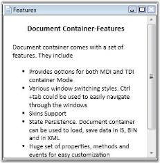

# Setting Header in WPF DocumentContainer

Using the `Header` property, user can set the header for the DocumentContainer elements. Use the following code snippet, to set the header for the DocumentContainer element.



<!-- Adding Document Container -->

<syncfusion:DocumentContainer Name="DocContainer"  Mode="MDI">

<FlowDocumentScrollViewer x:Name="flow" syncfusion:DocumentContainer.Header="Features">

</FlowDocumentScrollViewer>

…....

…....

</syncfusion:DocumentContainer>



## Setting header programmatically

Header of the DocumentContainer elements can be set by `SetHeader` method. 





//Set the Header of the DocumentContainer

DocumentContainer.SetHeader(flow, "Features");





