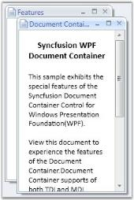

# Setting MDIBounds in WPF DocumentContainer

## Assembly Deployment

Refer to the [control dependencies](https://help.syncfusion.com/wpf/control-dependencies#documentcontainer) section to get the list of assemblies or NuGet package that needs to be added as a reference to use the control in any application.

The `MDIBounds` attached property helps the DocumentContainer place its elements within the container in MDI mode. The property is set on each child element, not on the DocumentContainer itself.

The general syntax of the `MDIBounds` attached property is given below.

```
Syncfusion:DocumentContainer.MDIBounds="x,y,width,height"
```

where:

* The first two values (`x` and `y`) stand for the X and Y coordinates of the MDI bounds.
* The next two values (`width` and `height`) stand for the width and height of the element in the DocumentContainer.

To set the MDI bounds, use the following code snippet.



<syncfusion:DocumentContainer Name="DocContainer" Mode="MDI">
    <FlowDocumentScrollViewer syncfusion:DocumentContainer.MDIBounds="0,0,200,300" />
    <!-- additional child windows -->
</syncfusion:DocumentContainer>


FlowDocumentScrollViewer flow = new FlowDocumentScrollViewer();
DocumentContainer.SetMDIBounds(flow, new Rect(0, 0, 200, 300));
DocContainer.Items.Add(flow);





## See Also

* [Getting Started](Getting-Started.md)
* [Setting Mode for Document Container](Setting-Mode-for-Document-Container.md)
* [Setting Header of the DocumentContainer](Setting-Header-of-the-Document-container.md)
* [MDI Resize](MDI-Resize.md)


