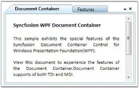
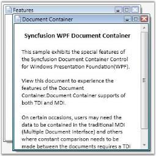

# Setting Mode in WPF DocumentContainer

The DocumentContainer supports the following two modes:

* **TDI** - Tabbed Document Interface (default)
* **MDI** - Multiple Document Interface

You can change the mode using the [Mode](https://help.syncfusion.com/cr/wpf/Syncfusion.Windows.Tools.Controls.DocumentContainer.html#Syncfusion_Windows_Tools_Controls_DocumentContainer_Mode) property of the DocumentContainer, which uses the `Syncfusion.Windows.Tools.Controls.DocumentContainerMode` enum.

## Setting the Mode to TDI



<syncfusion:DocumentContainer Name="DocContainer" Mode="TDI">
    <!-- child elements -->
</syncfusion:DocumentContainer>



// Creating an instance of DocumentContainer
DocumentContainer docContainer = new DocumentContainer();
// Set the mode to TDI
docContainer.Mode = DocumentContainerMode.TDI;
// Add the control to the window
this.Content = docContainer;



## Setting the Mode to MDI



<syncfusion:DocumentContainer Name="DocContainer" Mode="MDI">
    <!-- child elements -->
</syncfusion:DocumentContainer>



// Creating an instance of DocumentContainer
DocumentContainer docContainer = new DocumentContainer();
// Set the mode to MDI
docContainer.Mode = DocumentContainerMode.MDI;
// Add the control to the window
this.Content = docContainer;



