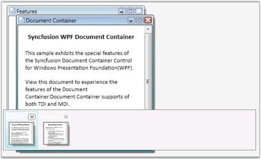
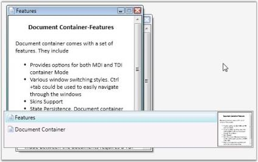

# Setting Window Switchers

Document Container enables the users to switch between the windows using keyboard keys. This feature facilitates easy navigation between the documents. By using CTRL + TAB combination of keys in the keyboard, user can navigate between windows. Window switchers are available for the Document Container for this purpose.

Currently five modes of window switchers are supported. They are as follows.

* Immediate 
* List
* QuickTabs 
* VS2005 
* VistaFlip 

To set the Quick Tab Mode for the window switchers, use the following code.



<!-- Adding Document Container -->
<syncfusion:DocumentContainer Name="DocContainer" SwitchMode="QuickTabs" Mode="MDI">  …....  …....
</syncfusion:DocumentContainer>



//Creating instance of Document Container
DocumentContainer DocContainer = new DocumentContainer();
//Set mode as MDIDocContainer.
Mode = DocumentContainerMode.MDI;
//Set switch modeDocContainer.SwitchMode = SwitchMode.QuickTabs;  ….......….......
//Adding control to the window this.
Content = DocContainer;



