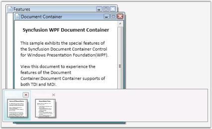
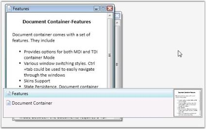
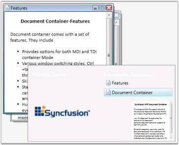

# Setting Window Switchers in WPF Document Container

The WPF Document Container enables the user to switch between the open windows using the keyboard. The `CTRL + TAB` keyboard shortcut opens the window switcher, which the user can then navigate through to switch to another window. The window switcher style is controlled by the [SwitchMode](https://help.syncfusion.com/cr/wpf/Syncfusion.Windows.Tools.Controls.DocumentContainer.html#Syncfusion_Windows_Tools_Controls_DocumentContainer_SwitchMode) property, which uses the `Syncfusion.Windows.Tools.Controls.SwitchMode` enum.

## Supported Switcher Modes

| Value | Description |
|---|---|
| `Immediate` | Switches immediately to the next window when `CTRL + TAB` is pressed (no switcher UI). |
| `List` | Displays a list-style switcher showing all open windows. |
| `QuickTabs` | Displays a thumbnail-style switcher with previews of each window. |
| `VS2005` | Mimics the Visual Studio 2005 style of switcher. |
| `VistaFlip` | Mimics the Windows Vista Flip 3D switcher. |

## Setting the Switcher to QuickTabs



<syncfusion:DocumentContainer Name="DocContainer" SwitchMode="QuickTabs" Mode="MDI">
    <!-- child elements -->
</syncfusion:DocumentContainer>



// Creating an instance of DocumentContainer
DocumentContainer docContainer = new DocumentContainer();
// Set the mode to MDI
docContainer.Mode = DocumentContainerMode.MDI;
// Set the switcher to QuickTabs
docContainer.SwitchMode = SwitchMode.QuickTabs;
// Add the control to the window
this.Content = docContainer;



