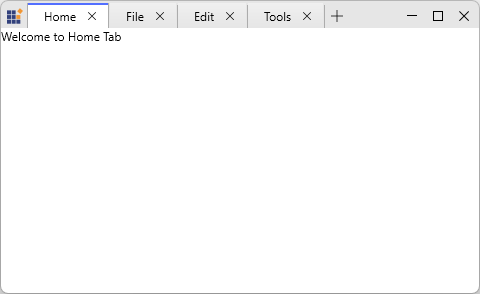

# About Syncfusion® WPF Tabbed Window Control

This control is a powerful combination of [WPF SfChromeless Window](https://help.syncfusion.com/cr/wpf/Syncfusion.Windows.Controls.SfChromelessWindow.html) and [WPF Tabbed Window](https://help.syncfusion.com/cr/wpf/Syncfusion.Windows.Controls.SfTabControl.html) that enables you to create professional document-based applications with advanced tab management. It provides a modern, browser-style interface with features like drag-drop reordering, tear-off floating windows, and cross-window tab merging.

## Key Features

* **Drag-and-Drop Reordering** - Users can intuitively reorder tabs by dragging them within the tab bar or between windows.
* **Tear-Off Windows** - Create floating windows by dragging tabs outside the main window boundaries, enabling flexible multi-window layouts.
* **Tab Merging** - Move tabs between multiple WPF Tabbed Window instances with event validation and cross-window organization via the `PreviewTabMerge` event.
* **Flexible Tab Management** - Add, remove, and select tabs dynamically with close buttons and new tab creation buttons.
* **Data Binding Support** - Full MVVM support through `ItemsSource` binding for data-driven tab scenarios.
* **Window Type Modes** - Two distinct modes are available on `SfChromelessWindow.WindowType`:
  - **Tabbed Mode** (default) - Integrates tabs into the chromeless window chrome for a browser-like interface.
  - **Normal Mode** - Displays tabs as content within the window for traditional UI layouts.
* **Content Customization** - Customize tab headers, icons, and content using templates.
* **Modern Styling** - Built-in Syncfusion themes and comprehensive styling support.
* **Event-Driven Architecture** - Comprehensive events for tab operations, merging, selection changes, and adding new tabs.
* **Custom Tear-Off Window** - Customize the window created when a tab is torn off using the `NewWindowCreating` event.

