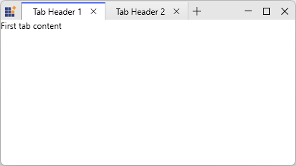
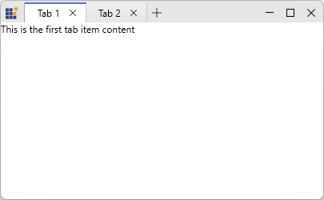

# Data Binding in WPF Tabbed Window

This section explains how to bind tabs to a collection in a WPF tabbed window by using the `ItemsSource` property of [SfTabControl](https://help.syncfusion.com/cr/wpf/Syncfusion.Windows.Controls.SfTabControl.html) and defining templates for tab headers and content.

## Adding Tab Items using Data Binding

You can bind the `ItemsSource` property of [SfTabControl](https://help.syncfusion.com/cr/wpf/Syncfusion.Windows.Controls.SfTabControl.html) to a collection in the ViewModel to generate tabs automatically. Each item in the bound collection creates a corresponding tab.





// TabModel.cs
public class TabModel
{
    public string Header { get; set; }
    public string Content { get; set; }
}

// MainViewModel.cs
public class MainViewModel : NotificationObject
{
    public ObservableCollection<TabModel> TabItems { get; } = new ObservableCollection<TabModel>();

    public MainViewModel()
    {
        TabItems.Add(new TabModel { Header = "Tab 1", Content = "First tab content" });
        TabItems.Add(new TabModel { Header = "Tab 2", Content = "Second tab content" });
    }
}





<Window.DataContext>
    <local:MainViewModel />
</Window.DataContext>

<syncfusion:SfTabControl ItemsSource="{Binding TabItems}" x:Name="MainTabControl">
    <syncfusion:SfTabControl.ItemContainerStyle>
        
    </syncfusion:SfTabControl.ItemContainerStyle>

    <syncfusion:SfTabControl.ContentTemplate>
        <DataTemplate>
            <TextBlock Text="{Binding Content}" />
        </DataTemplate>
    </syncfusion:SfTabControl.ContentTemplate>
</syncfusion:SfTabControl>





## Tab Item Header

You can define the tab item header by using the `HeaderTemplate` property in `ItemContainerStyle` or by using the `ItemTemplate` property. This keeps the header content bound to the underlying data object for each generated tab.





<Window.DataContext>
    <local:MainViewModel />
</Window.DataContext>

<syncfusion:SfTabControl ItemsSource="{Binding TabItems}" x:Name="MainTabControl">
    <syncfusion:SfTabControl.ItemContainerStyle>
        
    </syncfusion:SfTabControl.ItemContainerStyle>
</syncfusion:SfTabControl>





## Tab Item Content

You can define the tab item content by using the `ContentTemplate` property of [SfTabControl](https://help.syncfusion.com/cr/wpf/Syncfusion.Windows.Controls.SfTabControl.html). This allows the content area of each generated tab to display bound values from the data object.





<Window.DataContext>
    <local:MainViewModel />
</Window.DataContext>

<syncfusion:SfTabControl ItemsSource="{Binding TabItems}" x:Name="MainTabControl">
    <syncfusion:SfTabControl.ContentTemplate>
        <DataTemplate>
            <TextBlock Text="{Binding Content}" />
        </DataTemplate>
    </syncfusion:SfTabControl.ContentTemplate>
</syncfusion:SfTabControl>





