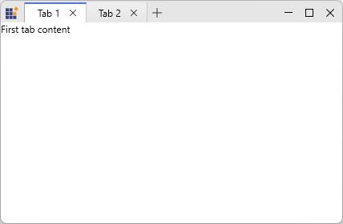
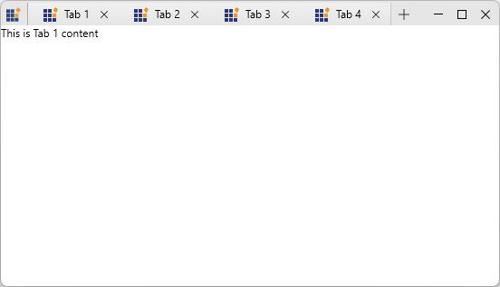

# WPF Tabbed Window - Data Binding

## Overview

The Tabbed Window provides full MVVM support through data binding. You can bind tabs to a collection using the `ItemsSource` property, enabling data-driven tab creation and dynamic content updates.

## ItemsSource Binding

Bind the `ItemsSource` property to a collection in your ViewModel. Each item automatically generates a corresponding tab:




// TabModel.cs
public class TabModel {
  public string Header { get; set; }
  public string Content { get; set; }
}

// MainViewModel.cs
public class MainViewModel : NotificationObject {
  public ObservableCollection<TabModel> TabItems { get; } = new ObservableCollection<TabModel>();

  public MainViewModel() {
    TabItems.Add(new TabModel { Header = "Tab 1", Content = "First tab content" });
    TabItems.Add(new TabModel { Header = "Tab 2", Content = "Second tab content" });
  }
}



<Window.DataContext>
  <local:MainViewModel />
</Window.DataContext>

<syncfusion:SfTabControl ItemsSource="{Binding TabItems}" x:Name="MainTabControl">
  <!-- Header template via ItemContainerStyle -->
  <syncfusion:SfTabControl.ItemContainerStyle>
    
  </syncfusion:SfTabControl.ItemContainerStyle>

  <!-- Content template -->
  <syncfusion:SfTabControl.ContentTemplate>
    <DataTemplate>
      <TextBlock Text="{Binding Content}" />
    </DataTemplate>
  </syncfusion:SfTabControl.ContentTemplate>
</syncfusion:SfTabControl>





## Customization of TabItems

Use the ItemTemplate to control the visual presentation of each tab, defining separate templates for the tab header and tab content to enable flexible and reusable UI composition.





<DataTemplate x:Key="TabHeaderTemplate">
  <StackPanel Orientation="Horizontal" VerticalAlignment="Center">
    <Image Source="/Images/doc.png" Width="16" Height="16"/>
    <TextBlock Text="{Binding Title}" Margin="6,0,0,0"/>
  </StackPanel>
</DataTemplate>

<DataTemplate x:Key="TabContentTemplate">
  <ContentPresenter Content="{Binding Content}" />
</DataTemplate>

<syncfusion:SfTabControl ItemsSource="{Binding OpenTabs}"
                         ItemTemplate="{StaticResource TabHeaderTemplate}"
                         ContentTemplate="{StaticResource TabContentTemplate}" />




