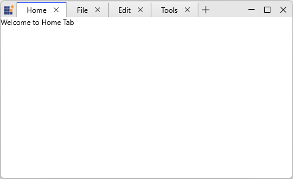
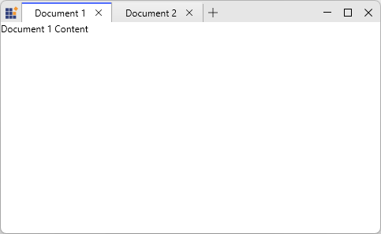

# Getting Started with WPF Tabbed Window

This section explains how to create a tabbed window interface using the [SfChromelessWindow](https://help.syncfusion.com/cr/wpf/Syncfusion.Windows.Controls.SfChromelessWindow.html) and [SfTabControl](https://help.syncfusion.com/cr/wpf/Syncfusion.Windows.Controls.SfTabControl.html) controls. The Tabbed Window provides a browser-style, document-based user interface that integrates tabs directly into the window chrome, similar to modern IDEs and web browsers.

## Assembly Deployment

To integrate the Tabbed Window in you WPF application, add the following required assemblies or NuGet packages:

- Syncfusion.SfChromelessWindow.WPF
- Syncfusion.Shared.WPF

## Adding Tabbed Window via XAML

To add the Tabbed Window manually in XAML, follow these steps:

1. Create a new WPF project in Visual Studio  with required .NET Framework or .NET Core version.

2. Add the required assembly references or NuGet packages mentioned in the Assembly Deployment section.

3. Import the Syncfusion WPF schema **http://schemas.syncfusion.com/wpf** in your XAML file.

4. Create a window that uses [SfChromelessWindow](https://help.syncfusion.com/cr/wpf/Syncfusion.Windows.Controls.SfChromelessWindow.html) and set its [WindowType](https://help.syncfusion.com/cr/wpf/Syncfusion.Windows.Controls.SfChromelessWindow.html#Syncfusion_Windows_Controls_SfChromelessWindow_WindowType) property to `Tabbed`, and include an [SfTabControl](https://help.syncfusion.com/cr/wpf/Syncfusion.Windows.Controls.SfTabControl.html) with the required tab items.





<syncfusion:SfChromelessWindow
    x:Class="TabbedWindowDemo.MainWindow"
    xmlns="http://schemas.microsoft.com/winfx/2006/xaml/presentation"
    xmlns:x="http://schemas.microsoft.com/winfx/2006/xaml"
    xmlns:syncfusion="http://schemas.syncfusion.com/wpf"
    WindowType="Tabbed"
    Height="450"
    Width="800">

    <syncfusion:SfTabControl>
        <syncfusion:SfTabItem Header="Home" Content="Welcome to Home Tab"/>
        <syncfusion:SfTabItem Header="File" Content="Welcome to File Tab"/>
        <syncfusion:SfTabItem Header="Edit" Content="Welcome to Edit Tab"/>
        <syncfusion:SfTabItem Header="Tools" Content="Welcome to Tools Tab"/>
    </syncfusion:SfTabControl>

</syncfusion:SfChromelessWindow>





## Adding WPF Tabbed Window via C#

To add the Tabbed Window control manually in C#, follow these steps:

1. Create a new WPF project in Visual Studio with the required .NET Framework or .NET Core version.

2. Add the required assembly references or NuGet packages mentioned in the Assembly Deployment section.

3. Include the required namespace, create a window that inherits from [SfChromelessWindow](https://help.syncfusion.com/cr/wpf/Syncfusion.Windows.Controls.SfChromelessWindow.html), set its [WindowType](https://help.syncfusion.com/cr/wpf/Syncfusion.Windows.Controls.SfChromelessWindow.html#Syncfusion_Windows_Controls_SfChromelessWindow_WindowType) to `Tabbed`, and include an [SfTabControl](https://help.syncfusion.com/cr/wpf/Syncfusion.Windows.Controls.SfTabControl.html) with the required tab items.





using Syncfusion.Windows.Controls;

public partial class MainWindow : SfChromelessWindow
{
    public MainWindow()
    {
        InitializeComponent();
        WindowType = WindowType.Tabbed;

        var tabControl = new SfTabControl();

        tabControl.Items.Add(new SfTabItem
        {
            Header = "Document 1",
            Content = new TextBlock { Text = "Document 1 Content" }
        });

        tabControl.Items.Add(new SfTabItem
        {
            Header = "Document 2",
            Content = new TextBlock { Text = "Document 2 Content" }
        });

        Content = tabControl;
    }
}





