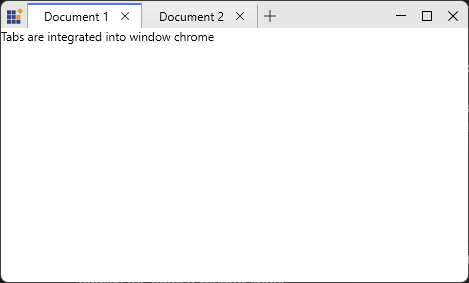
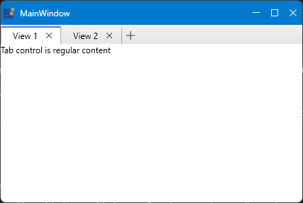

# Getting Started with WPF Tabbed Window

## Creating Your First Tabbed Window

### Step 1: Add References

Ensure you have the required Syncfusion assemblies referenced in your project:
- Syncfusion.SfChromelessWindow.WPF
- Syncfusion.Shared.WPF

### Step 2: Create XAML

Create a window that inherits from `TabbedWindow`:





<syncfusion:SfChromelessWindow xmlns:syncfusion="http://schemas.syncfusion.com/wpf"
                               WindowType="Tabbed"
                               Height="450" Width="800">
  <syncfusion:SfTabControl x:Name="MainTabControl">
    <syncfusion:SfTabItem Header="Home" Content="Welcome to Home Tab"/>
    <syncfusion:SfTabItem Header="File" Content="Welcome to File Tab"/>
    <syncfusion:SfTabItem Header="Edit" Content="Welcome to Edit Tab"/>
    <syncfusion:SfTabItem Header="Tools" Content="Welcome to Tools Tab"/>
  </syncfusion:SfTabControl>
</syncfusion:SfChromelessWindow>





### Step 3: Create Code-Behind

Create the C# code-behind file:





using Syncfusion.Windows.Controls;

public partial class MainWindow : SfChromelessWindow
{
    public MainWindow()
    {
        InitializeComponent();

        this.WindowType = WindowType.Tabbed;

        var tabControl = new SfTabControl();
        var tab = new SfTabItem { Header = "Document 1", Content = new TextBlock { Text = "Doc 1" } };
        tabControl.Items.Add(tab);
        this.Content = tabControl;
    }
}




## Key Properties

| Property | Description |
|----------|-------------|
| `AllowDragDrop` | Enable/disable drag-drop reordering of tabs |
| `EnableNewTabButton` | Show/hide the new tab (+) button |
| `SelectedItem` | Get/set the currently active tab |
| `ItemsSource` | Bind tabs to a collection for data-driven scenarios |
| `WindowType` | Choose between "Tabbed" or "Normal" mode |

## Basic Examples

### With Close Buttons





<syncfusion:SfTabControl>
    <syncfusion:SfTabItem Header="Document 1" CloseButtonVisibility="Visible">
        <TextBlock Text="Content" />
    </syncfusion:SfTabItem>
</syncfusion:SfTabControl>





### With New Tab Handler





<syncfusion:SfTabControl 
    EnableNewTabButton="True"
    NewTabRequested="OnNewTabRequested">
    <!-- Tab items -->
</syncfusion:SfTabControl>









private void OnNewTabRequested(object sender, NewTabRequestedEventArgs e)
{
    var newItem = new SfTabItem { Header = "New Tab" };
    e.Item = newItem;
}





## Window Type Modes

The Tabbed Window supports two distinct modes that control how tabs are integrated into the window layout. Choose the mode that best fits your application's requirements.

### Tabbed Mode

In Tabbed mode, tabs are integrated into the window's chrome area (the title bar area), similar to modern web browsers. This creates a unified interface where tabs and the window controls appear together.

#### When to Use Tabbed Mode

- Building browser-style applications
- Creating document editors (similar to Visual Studio)
- Tabs are the primary navigation method
- Want integrated chrome appearance with tabs

#### Example





<syncfusion:SfChromelessWindow 
    xmlns:syncfusion="http://schemas.syncfusion.com/wpf"
    x:Class="TabbedWindowApp.MainWindow"
    WindowType="Tabbed"
    Height="600" 
    Width="900">
    <syncfusion:SfTabControl AllowDragDrop="True" EnableNewTabButton="True">
        <syncfusion:SfTabItem Header="Document 1" CloseButtonVisibility="Visible"
                            Content="Tabs are integrated into window chrome"/>
        <syncfusion:SfTabItem Header="Document 2" CloseButtonVisibility="Visible"
                            Content="Similar to browser interface"/>
    </syncfusion:SfTabControl>
</syncfusion:SfChromelessWindow>





#### Layout Characteristics

- Tabs appear in the window chrome area
- Window title and tabs share the top area
- Compact layout
- Professional browser-like appearance

### Normal Mode

In Normal mode, the SfTabControl is displayed as regular content within the window. The tabs occupy the content area rather than being integrated into the window chrome, providing a traditional tab navigation interface.

#### When to Use Normal Mode

- Tabs are secondary navigation
- Need additional UI elements above tabs (toolbar, menu)
- Creating traditional MDI applications
- Want flexible layout control





<syncfusion:SfChromelessWindow 
    xmlns:syncfusion="http://schemas.syncfusion.com/wpf"
    x:Class="TabbedWindowApp.MainWindow"
    Title="View Manager"
    WindowType="Normal"
    Height="600" 
    Width="900">
    <Grid>
        <syncfusion:SfTabControl AllowDragDrop="True">
                <syncfusion:SfTabItem Header="View 1" Content="Tab control is regular content"/>
                <syncfusion:SfTabItem Header="View 2" Content="Not integrated into chrome"/>
        </syncfusion:SfTabControl>    
    </Grid>
</syncfusion:SfChromelessWindow>





