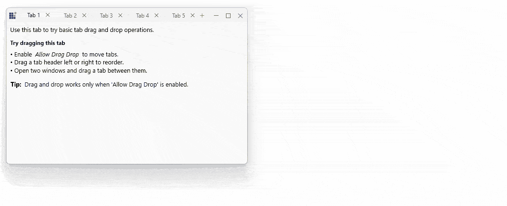

# Merge Tabs Between Windows in WPF Tabbed Window

This section explains how to move tabs between WPF Tabbed Window instances. It covers supported tear‑off functionality and tab merge validation using built‑in drag‑and‑drop capabilities.

These features allow users to detach tabs into floating windows and merge them back into the same or another tabbed window.

## Tear‑Off Windows

The Tabbed Window supports tear‑off functionality, allowing tabs to be detached from an [SfTabControl](https://help.syncfusion.com/cr/wpf/Syncfusion.Windows.Controls.SfTabControl.html) and displayed in independent floating windows. These floating windows can later be merged back into another tabbed window.

### Enabling Tear‑Off Support

You can enable tear‑off support by setting the [AllowDragDrop](https://help.syncfusion.com/cr/wpf/Syncfusion.Windows.Controls.SfTabControl.html#Syncfusion_Windows_Controls_SfTabControl_AllowDragDrop) property of the [SfTabControl](https://help.syncfusion.com/cr/wpf/Syncfusion.Windows.Controls.SfTabControl.html) to True.

When drag‑and‑drop is enabled:

- A tab can be dragged outside the tab control boundary to create a floating window
- The dragged tab is automatically moved into the new window
- The floating window behaves like a regular tabbed window
- If all tabs are removed from a floating window, the window closes automatically

The floating window supports resizing, minimizing, and all standard tab features.





<syncfusion:SfChromeslessWindow Title="Main Window" WindowType="Tabbed">
    <syncfusion:SfTabControl AllowDragDrop="True">
        <syncfusion:SfTabItem Header="Document 1" CloseButtonVisibility="Visible">
            <TextBlock Text="Drag this tab outside to tear it off" />
        </syncfusion:SfTabItem>
        <syncfusion:SfTabItem Header="Document 2" CloseButtonVisibility="Visible">
            <TextBlock Text="Each tab can be independently floated" />
        </syncfusion:SfTabItem>
    </syncfusion:SfTabControl>
</syncfusion:SfChromeslessWindow>





## Detaching a Selected Tab

The Tabbed Window allows users to detach a selected tab from an [SfTabControl](https://help.syncfusion.com/cr/wpf/Syncfusion.Windows.Controls.SfTabControl.html) and open it in a separate WPF window. The detached window preserves the tab state and content context, so users can continue working without losing their place in the workflow.

This feature is helpful in scenarios such as:

- Comparing data side by side
- Moving frequently used tabs to another monitor
- Creating a focused workspace for a specific task
- Working with applications that contain many tabs

The detached window supports the same tab content interaction as the main tabbed window. Users can also dock the tab back into the original tab container when required.

## Controlling Tab Movement with PreviewTabMerge event

You can control and validate tab movement between tabbed windows using the [PreviewTabMerge](https://help.syncfusion.com/cr/wpf/Syncfusion.Windows.Controls.SfTabControl.html#Syncfusion_Windows_Controls_SfTabControl_PreviewTabMerge) event of the [SfTabControl](https://help.syncfusion.com/cr/wpf/Syncfusion.Windows.Controls.SfTabControl.html).

This event is raised before a tab is merged into the target tab control and allows you to:

- Cancel the merge operation
- Validate business rules before allowing a merge
- Modify or replace the item being merged





<syncfusion:SfTabControl 
    AllowDragDrop="True"
    PreviewTabMerge="OnPreviewTabMerge">
    <!-- Tab items -->
</syncfusion:SfTabControl>





private void OnPreviewTabMerge(object sender, TabMergePreviewEventArgs e)
{
    // Get information about the merge operation
    var draggedItem = e.DraggedItem;
    var sourceControl = e.SourceControl;
    var targetControl = e.TargetControl;

    // Validate the merge
    if (draggedItem is Document doc && doc.IsLocked)
    {
        // Cancel the merge
        e.Allow = false;
        MessageBox.Show("Cannot move locked documents");
        return;
    }

    // Optional: Transform the item before merge
    if (draggedItem is Document docItem)
    {
        e.ResultingItem = new Document
        {
            Title = docItem.Title,
            Content = docItem.Content,
            CreatedAt = DateTime.Now
        };
    }

    // Allow the merge
    e.Allow = true;
}





## PreviewTabMergeEventArgs Properties

| Property        |Description                                                       |
|-----------------|------------------------------------------------------------------|
| DraggedItem     | Gets the item being dragged from the source tab control             |
| SourceControl   | Gets the `SfTabControl` where the drag operation originated          |
| TargetControl   | Gets the `SfTabControl` that receives the dragged item              |
| Allow           | Specifies whether the merge operation is allowed                    |
| ResultingItem   | Specifies the item inserted into the target control                 |