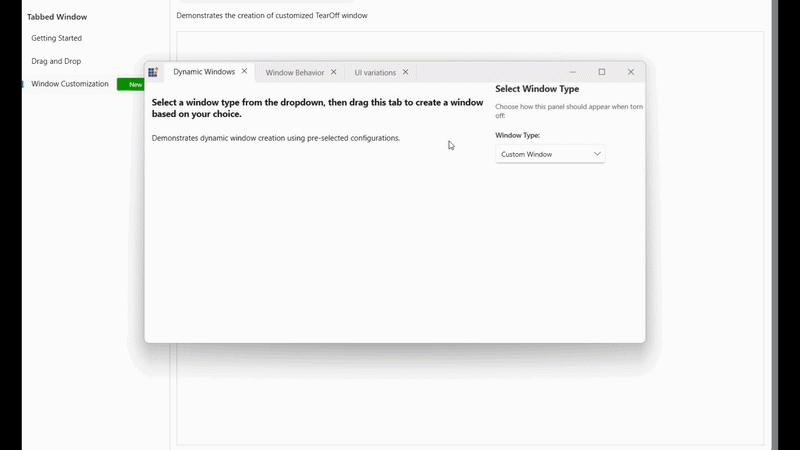

# Tab Management in WPF Tabbed Window

This section explains how to manage tabs in a WPF Tabbed Window interface. It provides an overview of common tab management operations such as closing tabs, creating new tabs, customizing tab buttons, vertical tabs, pin/unpin tabs, and navigating tabs using keyboard shortcuts, and customizing tear‑off behavior including creating and modifying tear‑off windows using the NewWindowCreating event for enhanced control over window creation and appearance.

## Closing Tabs

You can display close buttons on individual tabs using the [CloseButtonVisibility](https://help.syncfusion.com/cr/wpf/Syncfusion.Windows.Controls.SfTabItem.html#Syncfusion_Windows_Controls_SfTabItem_CloseButtonVisibility) property on [SfTabItem](https://help.syncfusion.com/cr/wpf/Syncfusion.Windows.Controls.SfTabItem.html).





<syncfusion:SfTabControl x:Name="maintabcontrol">
    <syncfusion:SfTabItem
        Header="Document 1"
        CloseButtonVisibility="Visible">
        <TextBlock Text="Click the X button to close this tab" />
    </syncfusion:SfTabItem>
    <syncfusion:SfTabItem
        Header="Document 2"
        CloseButtonVisibility="Visible">
        <TextBlock Text="Each tab has its own close button" />
    </syncfusion:SfTabItem>
</syncfusion:SfTabControl>





var tabItem = new SfTabItem
{
    Header = "Document",
    CloseButtonVisibility = Visibility.Visible,
    Content = new TextBlock { Text = "Tab Content" }
};
tabControl.Items.Add(tabItem);





When the user clicks the close button, the corresponding tab is automatically removed from the [SfTabControl](https://help.syncfusion.com/cr/wpf/Syncfusion.Windows.Controls.SfTabControl.html), and the next available tab is selected.

## Adding New Tabs

The [SfTabControl](https://help.syncfusion.com/cr/wpf/Syncfusion.Windows.Controls.SfTabControl.html) provides a built‑in new tab button that allows users to add tabs dynamically at runtime. Set the [EnableNewTabButton](https://help.syncfusion.com/cr/wpf/Syncfusion.Windows.Controls.SfTabControl.html#Syncfusion_Windows_Controls_SfTabControl_EnableNewTabButton) property to True to display this button. Clicking it raises the [NewTabRequested](https://help.syncfusion.com/cr/wpf/Syncfusion.Windows.Controls.SfTabControl.html#Syncfusion_Windows_Controls_SfTabControl_NewTabRequested) event, where a new [SfTabItem](https://help.syncfusion.com/cr/wpf/Syncfusion.Windows.Controls.SfTabItem.html) can be created.





<syncfusion:SfTabControl
    EnableNewTabButton="True"
    NewTabRequested="OnNewTabRequested">
    <syncfusion:SfTabItem Header="Tab 1">
        <TextBlock Text="Content 1" />
    </syncfusion:SfTabItem>
</syncfusion:SfTabControl>





private void OnNewTabRequested(object sender, NewTabRequestedEventArgs e)
{
    var newTabContent = new TextBlock
    {
        Text = $"New Document {DateTime.Now:g}"
    };

    var newTabItem = new SfTabItem
    {
        Header = $"Document {tabControl.Items.Count + 1}",
        Content = newTabContent,
        CloseButtonVisibility = Visibility.Visible
    };

    e.Item = newTabItem;
}





## Customizing the New Tab Button

You can customize the appearance of the new tab button using the [NewTabButtonStyle](https://help.syncfusion.com/cr/wpf/Syncfusion.Windows.Controls.SfTabControl.html#Syncfusion_Windows_Controls_SfTabControl_NewTabButtonStyle) property. This allows you to modify visual properties such as background, border, width, and height.





<syncfusion:SfTabControl EnableNewTabButton="True"
                         x:Name="maintabcontrol">
    <syncfusion:SfTabControl.NewTabButtonStyle>
        
    </syncfusion:SfTabControl.NewTabButtonStyle>
    <syncfusion:SfTabItem Header="Tab 1" Content="Tab 1 Content"/>
    <syncfusion:SfTabItem Header="Tab 2" Content="Tab 2 Content"/>
    <syncfusion:SfTabItem Header="Tab 3" Content="Tab 3 Content"/>
</syncfusion:SfTabControl>





## Customizing the Tear‑Off Windows
The tear‑off window created during the tear‑off operation can be customized by handling the `NewWindowCreating` event of the [SfTabControl](https://help.syncfusion.com/cr/wpf/Syncfusion.Windows.Controls.SfTabControl.html). This event is triggered when a tab is dragged outside the tab control and a new window is created.

This feature allows replacing the default tear‑off window with a custom window by supplying a user‑defined instance and modifying its properties before it is displayed, enabling full control over window creation and appearance at runtime. Additional customization can be achieved by accessing hostWindow properties and applying the required configurations for tear‑off window to meet specific requirements.

By handling the `NewWindowCreating` event:

- Replace the default [SfChromelessWindow](https://help.syncfusion.com/cr/wpf/Syncfusion.Windows.Controls.SfChromelessWindow.html) with a custom window
- Modify window properties such as style, appearance, and behavior
- Access details about the tab item that initiated the tear‑off
- Apply custom configurations or styling the window





<syncfusion:SfChromelessWindow Title="Main Window" WindowType="Tabbed">
    <syncfusion:SfTabControl 
        NewWindowCreating="CustomTab_NewWindowCreating">
        <syncfusion:SfTabItem Header="Document 1" CloseButtonVisibility="Visible">
            <TextBlock Text="Drag this tab outside to tear it off" />
        </syncfusion:SfTabItem>
        <syncfusion:SfTabItem Header="Document 2" CloseButtonVisibility="Visible">
            <TextBlock Text="Each tab can be customized" />
        </syncfusion:SfTabItem>
    </syncfusion:SfTabControl>
</syncfusion:SfChromelessWindow>





private void CustomTab_NewWindowCreating(object sender, NewWindowCreatingEventArgs e)
{
    var tabControl = sender as SfTabControl;
    var defaultWindow = e.NewWindow;
    var sourceTabItem = e.SourceTabItem;

    // Create a custom window
    var customWindow = new CustomWindow("Custom Tear‑Off Window", true, WindowStyle.ToolWindow);

    // Replace the default window with the custom window
    e.NewWindow = customWindow;
}



 

## NewWindowCreatingEventArgs Properties

| Property       | Type                | Description                                              |
|----------------|---------------------|----------------------------------------------------------|
| NewWindow      | Window              | Gets or sets the window to be created for tear‑off       |
| SourceTabItem  | object              | Gets the tab item that initiated the tear‑off operation  |

## Keyboard Shortcuts

The Tabbed Window provides built‑in keyboard and mouse shortcuts for efficient tab navigation and management:

- Ctrl + Tab - Switch to the next tab.
- Ctrl + Shift + Tab - Switch to the previous tab.
- Ctrl + T - Create a new tab.
- Middle mouse click on a tab header - Close the tab.
