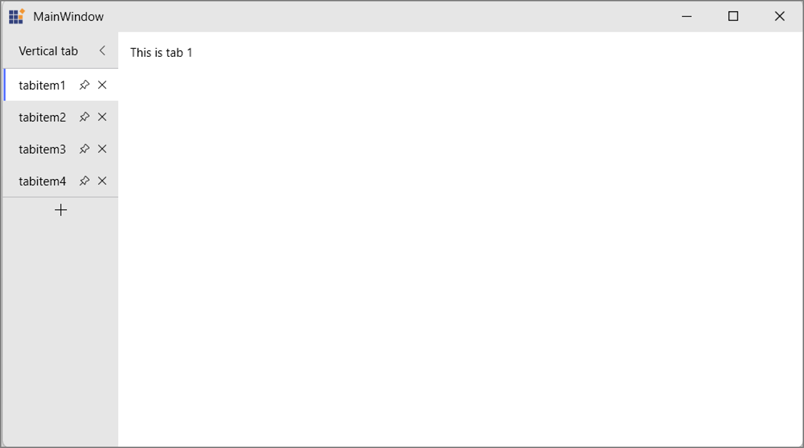
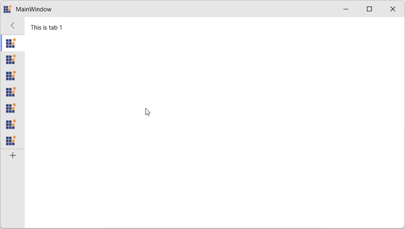
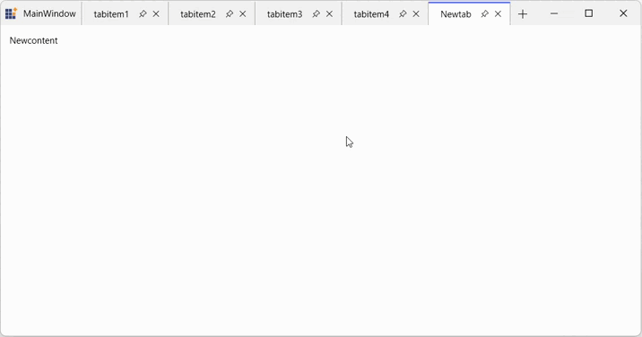

# Tab Management in WPF Tabbed Window

This section explains how to manage tabs in a WPF Tabbed Window interface. It provides an overview of common tab management operations such as closing tabs, creating new tabs, customizing tab buttons, vertical tabs, pin/unpin tabs, and navigating tabs using keyboard shortcuts.

## Closing Tabs

You can display close buttons on individual tabs using the [CloseButtonVisibility](https://help.syncfusion.com/cr/wpf/Syncfusion.Windows.Controls.SfTabItem.html#Syncfusion_Windows_Controls_SfTabItem_CloseButtonVisibility) property on [SfTabItem](https://help.syncfusion.com/cr/wpf/Syncfusion.Windows.Controls.SfTabItem.html).





<syncfusion:SfTabControl x:Name="maintabcontrol">
    <syncfusion:SfTabItem
        Header="Document 1"
        CloseButtonVisibility="Visible">
        <TextBlock Text="Click the X button to close this tab" />
    </syncfusion:SfTabItem>
    <syncfusion:SfTabItem
        Header="Document 2"
        CloseButtonVisibility="Visible">
        <TextBlock Text="Each tab has its own close button" />
    </syncfusion:SfTabItem>
</syncfusion:SfTabControl>





var tabItem = new SfTabItem
{
    Header = "Document",
    CloseButtonVisibility = Visibility.Visible,
    Content = new TextBlock { Text = "Tab Content" }
};
tabControl.Items.Add(tabItem);





When the user clicks the close button, the corresponding tab is automatically removed from the [SfTabControl](https://help.syncfusion.com/cr/wpf/Syncfusion.Windows.Controls.SfTabControl.html), and the next available tab is selected.

## Adding New Tabs

The [SfTabControl](https://help.syncfusion.com/cr/wpf/Syncfusion.Windows.Controls.SfTabControl.html) provides a built‑in new tab button that allows users to add tabs dynamically at runtime. Set the [EnableNewTabButton](https://help.syncfusion.com/cr/wpf/Syncfusion.Windows.Controls.SfTabControl.html#Syncfusion_Windows_Controls_SfTabControl_EnableNewTabButton) property to True to display this button. Clicking it raises the [NewTabRequested](https://help.syncfusion.com/cr/wpf/Syncfusion.Windows.Controls.SfTabControl.html#Syncfusion_Windows_Controls_SfTabControl_NewTabRequested) event, where a new [SfTabItem](https://help.syncfusion.com/cr/wpf/Syncfusion.Windows.Controls.SfTabItem.html) can be created.





<syncfusion:SfTabControl
    EnableNewTabButton="True"
    NewTabRequested="OnNewTabRequested">
    <syncfusion:SfTabItem Header="Tab 1">
        <TextBlock Text="Content 1" />
    </syncfusion:SfTabItem>
</syncfusion:SfTabControl>





private void OnNewTabRequested(object sender, NewTabRequestedEventArgs e)
{
    var newTabContent = new TextBlock
    {
        Text = $"New Document {DateTime.Now:g}"
    };

    var newTabItem = new SfTabItem
    {
        Header = $"Document {tabControl.Items.Count + 1}",
        Content = newTabContent,
        CloseButtonVisibility = Visibility.Visible
    };

    e.Item = newTabItem;
}





## Customizing the New Tab Button

You can customize the appearance of the new tab button using the [NewTabButtonStyle](https://help.syncfusion.com/cr/wpf/Syncfusion.Windows.Controls.SfTabControl.html#Syncfusion_Windows_Controls_SfTabControl_NewTabButtonStyle) property. This allows you to modify visual properties such as background, border, width, and height.





<syncfusion:SfTabControl EnableNewTabButton="True"
                         x:Name="maintabcontrol">
    <syncfusion:SfTabControl.NewTabButtonStyle>
        
    </syncfusion:SfTabControl.NewTabButtonStyle>
    <syncfusion:SfTabItem Header="Tab 1" Content="Tab 1 Content"/>
    <syncfusion:SfTabItem Header="Tab 2" Content="Tab 2 Content"/>
    <syncfusion:SfTabItem Header="Tab 3" Content="Tab 3 Content"/>
</syncfusion:SfTabControl>





## Vertical Tabs

The SfTabControl supports vertical tab arrangement, where tabs are displayed on the left side of the window instead of the top. This is useful for wide screens or when maximizing vertical content space is desired.

Set the [TabArrangement](https://help.syncfusion.com/cr/wpf/Syncfusion.Windows.Controls.SfTabControl.html#Syncfusion_Windows_Controls_SfTabControl_TabArrangement) property to `Vertical` on [SfTabControl](https://help.syncfusion.com/cr/wpf/Syncfusion.Windows.Controls.SfTabControl.html) to display tabs vertically on the left side of the window.





<syncfusion:SfTabControl x:Name="tabControl" TabArrangement="Vertical">
    <syncfusion:SfTabItem Header="Document 1">
        <TextBlock Text="Content 1" />
    </syncfusion:SfTabItem>
    <syncfusion:SfTabItem Header="Document 2">
        <TextBlock Text="Content 2" />
    </syncfusion:SfTabItem>
    <syncfusion:SfTabItem Header="Document 3">
        <TextBlock Text="Content 3" />
    </syncfusion:SfTabItem>
</syncfusion:SfTabControl>





tabControl.TabArrangement = TabArrangement.Vertical;





### Vertical Tab Collapse Behavior

When using vertical tab arrangement, the tab header area can be collapsed to show only icons, helping maximize the content area.

**Collapse Behavior:**

- **Mouse Enter** - When the mouse enters the collapsed vertical tab area, it expands to show the full tab headers.
- **Mouse Leave** - When the mouse leaves the expanded tab area, it collapses back to icon-only view.
- **Pin Toggle Button** - Click the pin button in the vertical tab header to maintain the expanded state. This keeps the vertical tabs expanded until the pin is toggled off again.

## Pin and Unpin Tabs

The SfTabControl supports pin and unpin tabs. Pin tabs to keep them always visible and prevent them from being closed accidentally. Pinned tabs appear first in the tab order and remain in place when other tabs are reordered.

### Showing Pin Button

Display a pin button on individual tabs using the [ShowPinButton](https://help.syncfusion.com/cr/wpf/Syncfusion.Windows.Controls.SfTabItem.html#Syncfusion_Windows_Controls_SfTabItem_ShowPinButton) property on [SfTabItem](https://help.syncfusion.com/cr/wpf/Syncfusion.Windows.Controls.SfTabItem.html).





<syncfusion:SfTabControl x:Name="tabControl">
    <syncfusion:SfTabItem Header="Document 1"
                          ShowPinButton="True">
        <TextBlock Text="Content 1" />
    </syncfusion:SfTabItem>
    <syncfusion:SfTabItem Header="Document 2"
                          ShowPinButton="True">
        <TextBlock Text="Content 2" />
    </syncfusion:SfTabItem>
</syncfusion:SfTabControl>





var tabItem = new SfTabItem
{
    Header = "Document",
    ShowPinButton = true,
    Content = new TextBlock { Text = "Tab Content" }
};
tabControl.Items.Add(tabItem);





### Pinning a Tab

When the pin button is clicked, the tab becomes pinned. Pinned tabs are automatically reordered to appear first in the tab strip.

### Context Menu Pinning

Use the context menu to pin or unpin tabs. Right-click on a tab header to access the pin option.

## Keyboard Shortcuts

The Tabbed Window provides built‑in keyboard and mouse shortcuts for efficient tab navigation and management:

- Ctrl + Tab - Switch to the next tab.
- Ctrl + Shift + Tab - Switch to the previous tab.
- Ctrl + T - Create a new tab.
- Middle mouse click on a tab header - Close the tab.
