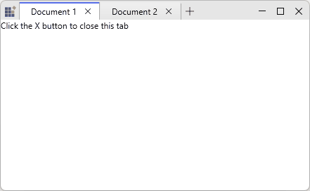
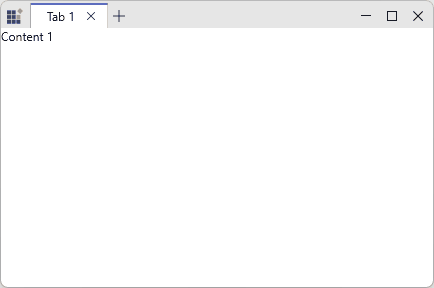
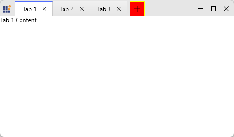

# WPF Tabbed Window - Tab Management

## Overview

The Tabbed Window provides comprehensive tab management capabilities including dynamic tab creation, tab closing, and tab selection. These features enable flexible and responsive tab-based interfaces.

## Close Button Support

Display close buttons on individual tabs using the `CloseButtonVisibility` property on `SfTabItem`:





<syncfusion:SfTabControl>
    <syncfusion:SfTabItem 
        Header="Document 1" 
        CloseButtonVisibility="Visible">
        <TextBlock Text="Click the X button to close this tab" />
    </syncfusion:SfTabItem>
    <syncfusion:SfTabItem 
        Header="Document 2" 
        CloseButtonVisibility="Visible">
        <TextBlock Text="Each tab has its own close button" />
    </syncfusion:SfTabItem>
</syncfusion:SfTabControl>









var tabItem = new SfTabItem 
{ 
    Header = "Document", 
    CloseButtonVisibility = Visibility.Visible,
    Content = new TextBlock { Text = "Tab Content" }
};
tabControl.Items.Add(tabItem);





When a user clicks the close button, the tab is automatically removed and the control selects the next available tab.

## New Tab Button

Enable the new tab button to allow users to dynamically add tabs:





<syncfusion:SfTabControl 
    EnableNewTabButton="True"
    NewTabRequested="OnNewTabRequested">
    <syncfusion:SfTabItem Header="Tab 1">
        <TextBlock Text="Content 1" />
    </syncfusion:SfTabItem>
</syncfusion:SfTabControl>





private void OnNewTabRequested(object sender, NewTabRequestedEventArgs e)
{
    // Create a new tab item when user clicks the + button
    var newTabContent = new TextBlock 
    { 
        Text = $"New Document {DateTime.Now:g}" 
    };
    
    var newTabItem = new SfTabItem 
    { 
        Header = $"Document {tabControl.Items.Count + 1}",
        Content = newTabContent,
        CloseButtonVisibility = Visibility.Visible
    };
    
    e.Item = newTabItem;
}





### Customization of New tab button

`NewTabButtonStyle` targets the internal `Button` used for the new‑tab afford and controls visual properties such as size, background, border and padding without replacing the element tree. 





<syncfusion:SfTabControl EnableNewTabButton="True"
                         x:Name="maintabcontrol">
    <syncfusion:SfTabControl.NewTabButtonStyle>
        
    </syncfusion:SfTabControl.NewTabButtonStyle>
    <syncfusion:SfTabItem Header="Tab 1" Content="Tab 1 Content"/>
    <syncfusion:SfTabItem Header="Tab 2" Content="Tab 2 Content"/>
    <syncfusion:SfTabItem Header="Tab 3" Content="Tab 3 Content"/>
</syncfusion:SfTabControl>





## Keyboard shortcuts

- `Ctrl + Tab` — move to the next tab.
- `Ctrl + Shift + Tab` — move to the previous tab.
- `Ctrl + T` — create a new `SfTabItem` (programmatic shortcut).
- Mouse middle‑click on a `SfTabItem` header — close that tab.

