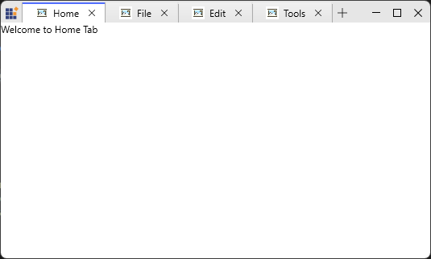
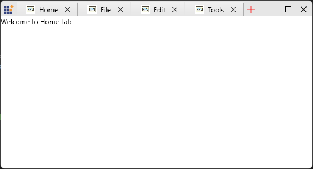

# Customizing Appearance

This page shows how to customize `SfTabItem` header and content templates, style the new‑tab button, and tune tab visual states for the `TabbedWindow` UX.

## Header and Content templates for SfTabItem

Use `ItemTemplate` and `ContentTemplate` to present icons, badges, editable headers, and rich content inside tabs. Keep header templates lightweight to avoid layout overhead when many tabs are open.





<DataTemplate x:Key="TabHeaderTemplate">
  <StackPanel Orientation="Horizontal" VerticalAlignment="Center">
    <Image Source="/Images/doc.png" Width="16" Height="16"/>
    <TextBlock Text="{Binding Title}" Margin="6,0,0,0"/>
  </StackPanel>
</DataTemplate>

<DataTemplate x:Key="TabContentTemplate">
  <ContentPresenter Content="{Binding Content}" />
</DataTemplate>

<syncfusion:SfTabControl ItemsSource="{Binding OpenTabs}"
                         ItemTemplate="{StaticResource TabHeaderTemplate}"
                         ContentTemplate="{StaticResource TabContentTemplate}" />






## Styling the new‑tab button

### NewTabButtonTemplate

Control visibility and appearance of the new‑tab button using `EnableNewTabButton` and `NewTabButtonTemplate`. Provide accessible content and keyboard focus visuals for the button.





<DataTemplate x:Key="NewTabButtonTemplate">
  <Grid>
    <Path Data="M0 6.4H12V5.6H0V6.4Z" StrokeThickness="1" Fill="Red"/>
    <Path Data="M5.6 12H6.4V0H5.6V12Z" StrokeThickness="1" Fill="Red"/>
</Grid>
</DataTemplate>

<syncfusion:SfTabControl NewTabButtonTemplate="{StaticResource NewTabButtonTemplate}"
                         EnableNewTabButton="True" />



### NewTabButtonStyle

`NewTabButtonStyle` targets the internal `Button` used for the new‑tab affordance and controls visual properties such as size, background, border and padding without replacing the element tree. 





<syncfusion:SfTabControl EnableNewTabButton="True"
                         x:Name="maintabcontrol">
    <syncfusion:SfTabControl.NewTabButtonStyle>
        
    </syncfusion:SfTabControl.NewTabButtonStyle>
    <syncfusion:SfTabItem Header="Tab 1" Content="Tab 1 Content"/>
    <syncfusion:SfTabItem Header="Tab 2" Content="Tab 2 Content"/>
    <syncfusion:SfTabItem Header="Tab 3" Content="Tab 3 Content"/>
</syncfusion:SfTabControl>





