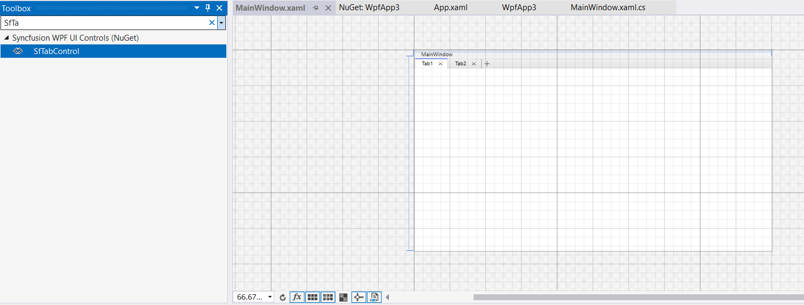
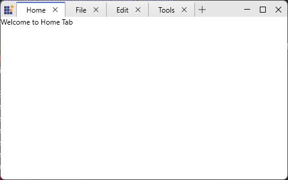

# Getting Started with WPF TabbedWindow

This guide shows how to add the `TabbedWindow` to a WPF application, create tabs, and configure common behaviors.

## Structure of TabbedWindow

The `TabbedWindow` combines two main pieces:

- `SfChromelessWindow` — the shell that can operate in `Normal` or `Tabbed` mode.
- `SfTabControl` — the tab host; tabs are `SfTabItem` instances that contain arbitrary content.

## Assembly deployment

Add the NuGet package `Syncfusion.SfChromelessWindow.WPF` to your project. This package contains `SfChromelessWindow`, `SfTabControl` and `SfTabItem`.

Refer to the Control Dependencies and NuGet documentation for additional packaging details.

## Adding TabbedWindow via designer

Drag `SfChromelessWindow` (or the Syncfusion window shell) from the toolbox onto your window in Visual Studio; the required assemblies will be added automatically when using Syncfusion toolbox integration.

Typical dependent assemblies:

- `Syncfusion.SfChromelessWindow.WPF`
- `Syncfusion.Shared.WPF`

## Adding TabbedWindow via XAML

To create a TabbedWindow in XAML set `WindowType="Tabbed"` on `SfChromelessWindow`. The following example shows the minimal setup.





<syncfusion:SfChromelessWindow xmlns:syncfusion="http://schemas.syncfusion.com/wpf"
                               WindowType="Tabbed"
                               Height="450" Width="800">
  <syncfusion:SfTabControl x:Name="MainTabControl">
    <syncfusion:SfTabItem Header="Home" Content="Welcome to Home Tab"/>
    <syncfusion:SfTabItem Header="File" Content="Welcome to File Tab"/>
    <syncfusion:SfTabItem Header="Edit" Content="Welcome to Edit Tab"/>
    <syncfusion:SfTabItem Header="Tools" Content="Welcome to Tools Tab"/>
  </syncfusion:SfTabControl>
</syncfusion:SfChromelessWindow>





## Adding TabbedWindow via C#

To create the tabbed window and add tabs in code:





using Syncfusion.Windows.Controls;

public partial class MainWindow : SfChromelessWindow
{
    public MainWindow()
    {
        InitializeComponent();

        this.WindowType = WindowType.Tabbed;

        var tabControl = new SfTabControl();
        var tab = new SfTabItem { Header = "Document 1", Content = new TextBlock { Text = "Doc 1" } };
        tabControl.Items.Add(tab);
        this.Content = tabControl;
    }
}



## New tab button

Enable the new‑tab button with `SfTabControl.EnableNewTabButton` and customize it with `NewTabButtonTemplate`. Handle `NewTabRequested` to supply default content.





tabControl.EnableNewTabButton = true;

tabControl.NewTabRequested += TabControl_NewTabRequested;

private void TabControl_NewTabRequested(object sender, NewTabRequestedEventArgs e)
{
  e.Item = new SfTabItem { Header = "Untitled", Content = new TextBlock { Text = "New" } };
}





## Theme

TabbedWindow supports various built-in themes. Refer to the below links to apply themes for the TabbedWindow,

- [Apply theme using SfSkinManager](https://help.syncfusion.com/wpf/themes/skin-manager)
- [Create a custom theme using ThemeStudio](https://help.syncfusion.com/wpf/themes/theme-studio#creating-custom-theme)

