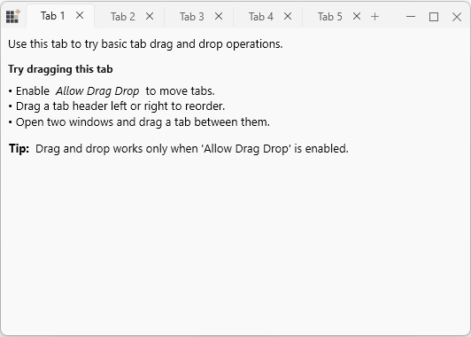
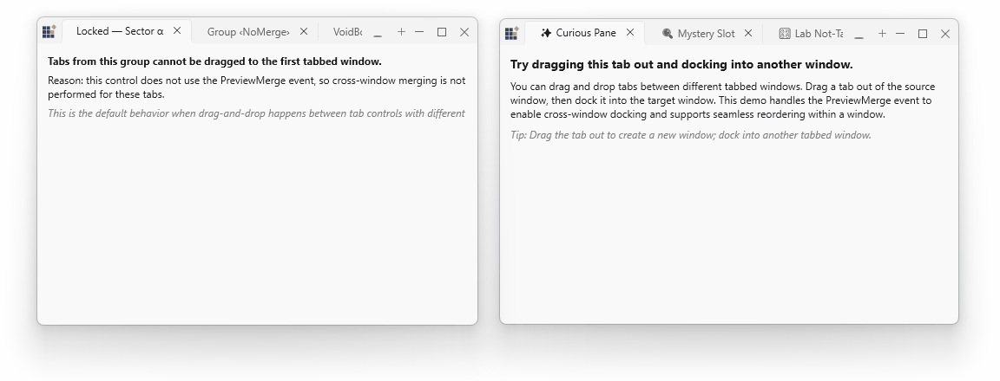

# Drag‑and‑Drop & Window Merging

Drag‑and‑drop and window merging enable intuitive tab management: users can reorder tabs within a tab strip, tear off a tab to create a standalone window, and merge tabs across tab controls. This page describes the built‑in behaviors, the events you can handle to customize them, and recommendations for a good user experience.

## Reorder tabs

Reordering is supported out of the box when `SfTabControl.AllowDragDrop` is `true` (default). Users drag a tab header along the strip and drop it at the new position.

N> No code is required to enable basic reorder behavior — it works when `AllowDragDrop` is enabled.

## Detach tabs into standalone ChromelessWindow

The control supports tearing off a tab into its own window. Drag a tab away from the tab strip to create a detached `SfChromelessWindow` that hosts the tab's content.

## Merge tabs

Merging occurs when a tab is dropped onto another `SfTabControl`.

- Normal intra-window merges (tabs moved between tab controls in the same process) are handled automatically by the control and require no special event handling.
- When merging tabs from different windows or when you need to validate incoming content, handle the `PreviewMerge` event to accept, transform, or reject the merge.

Preview merge example:




MainTabControl.PreviewMerge += MainTabControl_PreviewMerge;

private void MainTabControl_PreviewMerge(object sender, MergePreviewEventArgs e)
{
	// e.ResultingItem is the incoming tab item. Validate and decide.
	if (!IsMergeAllowed(e.ResultingItem))
		e.Allow = false; // deny merge
}



## Input & Interaction

This page describes the primary input patterns for `TabbedWindow`: keyboard shortcuts, mouse drag & tear‑off, and RTL support.

### Keyboard shortcuts

- `Ctrl + Tab` — move to the next tab.
- `Ctrl + Shift + Tab` — move to the previous tab.

### RTL (Right‑to‑Left) flow support

`TabbedWindow` respects WPF `FlowDirection`. To enable RTL layouts, set `FlowDirection="RightToLeft"` on the window or the `SfTabControl`.

