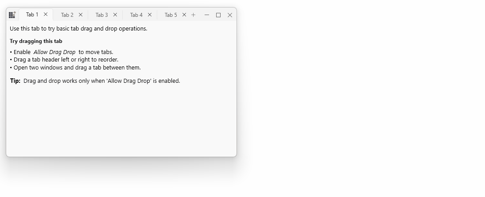

# Tab Reordering

Drag‑and‑drop enable intuitive tab management: users can reorder tabs within a tab strip and tear off a tab to create a standalone window. This page describes those built‑in behaviors.

## Reorder tabs

Reordering is supported out of the box when `SfTabControl.AllowDragDrop` is `true` (default). Users drag a tab header along the strip and drop it at the new position.

N> No code is required to enable basic reorder behavior — it works when `AllowDragDrop` is enabled.

## Detach tabs into standalone ChromelessWindow

The control supports tearing off a tab into its own window. Drag a tab away from the tab strip to create a detached `SfChromelessWindow` that hosts the tab's content.

## Keyboard shortcuts

- `Ctrl + Tab` — move to the next tab.
- `Ctrl + Shift + Tab` — move to the previous tab.
- `Ctrl + T` — create a new `SfTabItem` (programmatic shortcut).
- Mouse middle‑click on a `SfTabItem` header — close that tab.
