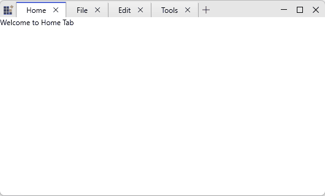

# Working With Tabs

This page explains common tab operations for `TabbedWindow`: adding, creating via the new‑tab flow, closing, selecting, and lifecycle management.

## Adding tabs

You can add tabs declaratively in XAML or at runtime in code. When using MVVM prefer `ItemsSource` with a view model collection.





<syncfusion:SfTabControl x:Name="MainTabControl">
  <syncfusion:SfTabItem Header="Home"> <TextBlock Text="Home"/> </syncfusion:SfTabItem>
</syncfusion:SfTabControl>




var tab = new SfTabItem { Header = "Notes", Content = new NotesView() };
MainTabControl.Items.Add(tab);
MainTabControl.SelectedItem = tab;



Use `ItemsSource` to bind a collection of tab view models and provide `ItemTemplate`/`ContentTemplate` to render headers and content.



<syncfusion:SfTabControl ItemsSource="{Binding OpenTabs}"
             ItemTemplate="{StaticResource TabHeaderTemplate}"
             ContentTemplate="{StaticResource TabContentTemplate}"
             SelectedItem="{Binding ActiveTab, Mode=TwoWay}" />


// ViewModel (simplified)
public class MainViewModel
{
  public ObservableCollection<TabViewModel> OpenTabs { get; } = new ObservableCollection<TabViewModel>();
  public TabViewModel ActiveTab { get; set; }
}

// Add a tab in view model
OpenTabs.Add(new TabViewModel { Title = "Notes", Content = new NotesViewModel() });



## Creating new tabs (AddingNewTab)

The control raises `AddingNewTab` (type `AddingNewTabEventArgs`) when the user invokes the new‑tab action (new‑tab button or programmatic request). Handle this event to supply default content, set headers, or cancel creation.



MainTabControl.AddingNewTab += MainTabControl_AddingNewTab;

private void MainTabControl_AddingNewTab(object sender, AddingNewTabEventArgs e)
{
  e.Item = new SfTabItem { Header = "Untitled", Content = new TextBlock { Text = "New" } };
}



## Closing tabs

Tabs are closed by removing the corresponding `SfTabItem` from `SfTabControl.Items`. You can expose close UI in headers or use built‑in close affordances.

### Example: Programmatic close and per‑item close control



// close programmatically
MainTabControl.Items.Remove(tabToClose);

// hide close affordance on a specific tab
tabToClose.CloseButtonVisibility = false;



## Selection and events

Use `SelectedItem` / `SelectedIndex` to set selection in code. Handle selection change events to lazy‑load content or save state.




MainTabControl.SelectedItemChanged += MainTabControl_SelectedItemChanged;

private void MainTabControl_SelectedItemChanged(object sender, SelectedItemChangedEventArgs e)
{
  // e.OldSelectedItem and e.NewSelectedItem available
}


