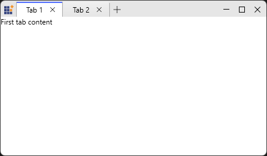
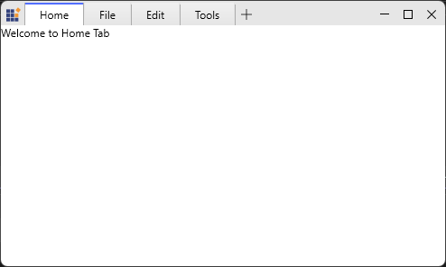

# Working With Tabs

This page explains common tab operations for `TabbedWindow`: adding, creating via the new‑tab flow, closing, selecting.

## Adding tab items using data binding

`SfTabControl` can be bound to an `ItemsSource` to auto‑create tabs from a collection of view models. When you auto‑generate tab items via `ItemsSource`, set `ItemTemplate` or `ItemContainerStyle.HeaderTemplate` to define headers and `ContentTemplate` to render tab content.

If the data source implements `INotifyCollectionChanged` (for example `ObservableCollection<T>`), the tab control will update when items are added or removed. If you bind to a plain `List<T>`, changes will not be reflected automatically.

Here we show a simple `TabModel` and `ViewModel` that expose header and content information.




// TabModel.cs
public class TabModel {
  public string Header { get; set; }
  public string Content { get; set; }
}

// MainViewModel.cs
public class MainViewModel : NotificationObject {
  public ObservableCollection<TabModel> TabItems { get; } = new ObservableCollection<TabModel>();

  public MainViewModel() {
    TabItems.Add(new TabModel { Header = "Tab 1", Content = "First tab content" });
    TabItems.Add(new TabModel { Header = "Tab 2", Content = "Second tab content" });
  }
}





<Window.DataContext>
  <local:MainViewModel />
</Window.DataContext>

<syncfusion:SfTabControl ItemsSource="{Binding TabItems}" x:Name="MainTabControl">
  <!-- Header template via ItemContainerStyle -->
  <syncfusion:SfTabControl.ItemContainerStyle>
    
  </syncfusion:SfTabControl.ItemContainerStyle>

  <!-- Content template -->
  <syncfusion:SfTabControl.ContentTemplate>
    <DataTemplate>
      <TextBlock Text="{Binding Content}" />
    </DataTemplate>
  </syncfusion:SfTabControl.ContentTemplate>
</syncfusion:SfTabControl>



N> To bind ItemsSource to TabbedWindow, you need to have collection with data object which holds header and content details.

## Closing tabs

Show or hide per‑item close affordance using `SfTabItem.CloseButtonVisibility`.




<syncfusion:SfTabControl>
    <syncfusion:SfTabControl.ItemContainerStyle>
        
    </syncfusion:SfTabControl.ItemContainerStyle>
    <syncfusion:SfTabItem Header="Home" Content="Welcome to Home Tab"/>
    <syncfusion:SfTabItem Header="File" Content="Welcome to File Tab"/>
    <syncfusion:SfTabItem Header="Edit" Content="Welcome to Edit Tab"/>
    <syncfusion:SfTabItem Header="Tools" Content="Welcome to Tools Tab"/>
</syncfusion:SfTabControl >




