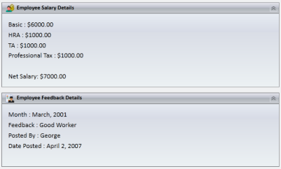
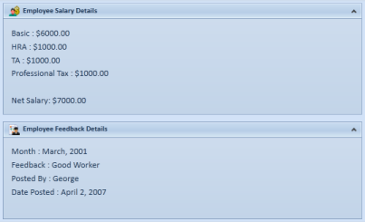
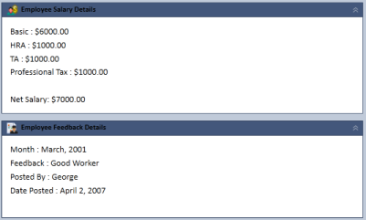
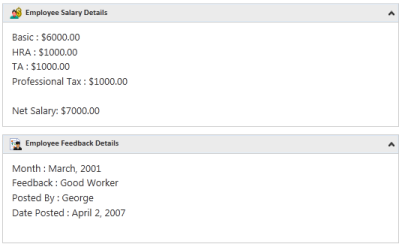
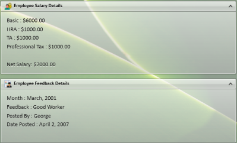

# Appearance

This section deals with the appearance of TaskBar control and contains the following topic:

## Setting Visual Styles

The appearance of the TaskBar control is customized by using the VisualStyle property. The various built-in visual styles are listed below.

_Property Table_

<table>
<tr>
<td>
Property</td><td>
Description</td></tr>
<tr>
<td>
VisualStyle</td><td>
Sets the visual style for the TaskBar control. The options provided are as follows.BlendOffice2003Office2007BlueOffice2007BlackOffice2007SilverShinyBlueShinyRedSyncOrangeVS2010MetroTransparent</td></tr>
</table>

To set the visual style for the TaskBar, use the below code.

[XAML]

&lt;!-- Adding TaskBar --&gt;

&lt;syncfusion:TaskBar Name="taskBar" &gt;

    &lt;!-- Adding TaskBarItem --&gt;

    &lt;syncfusion:TaskBarItem Name="taskBarItem1" Header="TaskBarItem1"&gt;

        &lt;!-- Adding content to TaskBarItem --&gt;

        &lt;StackPanel Margin="10" HorizontalAlignment="Center" 										VerticalAlignment="Stretch"&gt;

            &lt;TextBlock TextWrapping="Wrap"&gt;

This TaskBar that have a TaskBarItem.

            &lt;/TextBlock&gt;

        &lt;/StackPanel&gt;

    &lt;/syncfusion:TaskBarItem&gt;

&lt;/syncfusion:TaskBar&gt;

[C#]

// Setting the visual style as Office2007Blue

SkinStorage.SetVisualStyle(taskBar, "Office2007Blue");

{  | markdownify }
{:.image }

_TaskBar with "Office2007Blue" Visual Style_

{  | markdownify }
{:.image }

_TaskBar with "Office2007Black" Visual Style_

{  | markdownify }
{:.image }

_TaskBar with "Office2007Silver" Visual Style_

{  | markdownify }
{:.image }

_TaskBar with "Office2010Blue" Visual Style_

{  | markdownify }
{:.image }

_TaskBar with "Office2010Black" Visual Style_

{  | markdownify }
{:.image }

_TaskBar with "Office2010Silver" Visual Style_

{  | markdownify }
{:.image }

_TaskBar with "Blend" Visual Style_

{  | markdownify }
{:.image }

_TaskBar with "VS2010" Visual Style_

{  | markdownify }
{:.image }

_TaskBar with "Metro" Visual Style_

{  | markdownify }
{:.image }

_TaskBar with "Transparent" Visual Style_

