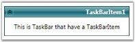

# Changing the flow directions in WPF TaskBar

The flow direction for the TaskBar is set through the [FlowDirection](https://docs.microsoft.com/en-us/dotnet/api/system.windows.frameworkelement.flowdirection?redirectedfrom=MSDN&view=netframework-4.7.2#System_Windows_FrameworkElement_FlowDirection) property.

Here is the code for setting this property.




<!-- Adding TaskBar  -->

<syncfusion:TaskBar Name="taskBar" FlowDirection="RightToLeft">

    <!-- Adding TaskBarItem -->

    <syncfusion:TaskBarItem Name="taskBarItem1" Header="TaskBarItem1">

        <!-- Adding content to TaskBarItem -->

        <StackPanel Margin="10" HorizontalAlignment="Center" 											VerticalAlignment="Stretch">

            <TextBlock TextWrapping="Wrap">

This is TaskBar that have a TaskBarItem</TextBlock>

        </StackPanel>

    </syncfusion:TaskBarItem>

</syncfusion:TaskBar>




// Setting flow direction as right to left

taskBar.FlowDirection = FlowDirection.RightToLeft;




FlowDirection = "RightToLeft"

