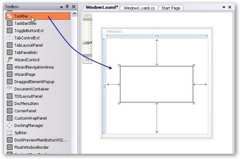

# Getting Started with WPF TaskBar

This section guides you on getting started with TaskBar control. It covers the following topics:

## Overview of Taskbar control

TaskBar control has the capability to provide a UI that is similar to the Windows Explorer TaskBar. It provides a consistent UI for placing commonly used functionalities as grouped items. You can place any Container Panel control inside the TaskBar. For example, when the customized Grid Panel with other controls are placed inside the TaskBar Item, it will be automatically arranged inside the TaskBar Items collection. TaskBar supports the Office2007Black, Office2007Blue, Office2007Silver, Office2003 and Blend themes.

## Why to use our TaskBar control

Here are some highlights of our TaskBar control.

* Windows Explorer TaskBar appearance can be achieved
* Horizontal/Vertical layouts for TaskBar Boxes
* Provides support to customize the background, header size, and collapse / expand the TaskBar Header
* Keyboard navigation support
* Ability to specify custom group margin and padding
* Supports built-in visual styles - Default, Win XP, Zune, Aero, Office2007Blue, Office2007Black, Office2007Silver, Office2003, Blend, LunaRoyale, LunaHomestead and LunaMetallic

## Creating the Taskbar and its children element using Docking Manager

There are two possible ways to create a simple TaskBar control.

### Through Designer

To create the TaskBar control through designer, do the following steps:

1. Drag the TaskBar control from the toolbox onto your WPF application.

     

2. Set the properties for the TaskBar in design mode by using the Smart Tag feature.

### Programmatically

TaskBar control is created by using either XAML or C# code. The following lines of code can be used to create a TaskBar control.




<!-- Adding TaskBar -->

<syncfusion:TaskBar Name="taskBar" >

</syncfusion:TaskBar>




//Creating an instance for TaskBar

TaskBar taskBar = new TaskBar();

//Adding TaskBar as content of window

this.Content = taskBar; 




N> To display the TaskBar by using C# code, you must already have a panel in which you are going to add the control. Otherwise, the control cannot be displayed.

The following screen shot shows the TaskBar control.

## Theme

TaskBar supports various built-in themes. Refer to the below links to apply themes for the TaskBar,

  * [Apply theme using SfSkinManager](https://help.syncfusion.com/wpf/themes/skin-manager)
	
  * [Create a custom theme using ThemeStudio](https://help.syncfusion.com/wpf/themes/theme-studio#creating-custom-theme)