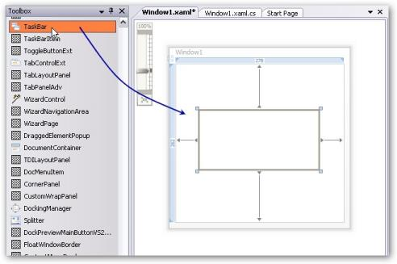
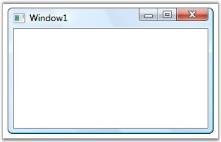

# Getting Started with WPF TaskBar

This section explains how to get started with the TaskBar control. It covers the following topics:

## Creating the TaskBar

You can create a TaskBar control in the following ways:

### Through the designer

To create the TaskBar control using the designer, follow these steps:

1. Drag the TaskBar control from the Toolbox and drop it onto your WPF application.
   

2. Use the Smart Tag feature to configure TaskBar properties such as Name, Orientation, and TaskBarItem children.

### Programmatically

You can create the TaskBar control using either XAML or C# code. Before using the TaskBar control, install the required NuGet package and add the necessary assembly references and namespaces.

#### Required NuGet Package

Install the package using the NuGet Package Manager Console:

```powershell
Install-Package Syncfusion.Tools.WPF
```
#### Required Assemblies

Add the following assemblies to your project:
  * `Syncfusion.Tools.WPF`
  * `Syncfusion.Shared.WPF`

#### Required Namespaces
  * XAML: `xmlns:syncfusion="http://schemas.syncfusion.com/wpf"`
  * C#: `Syncfusion.Windows.Tools.Controls`



<!-- Adding TaskBar -->
<Window x:Class="TaskBarSample.MainWindow"
        xmlns="http://schemas.microsoft.com/winfx/2006/xaml/presentation"
        xmlns:x="http://schemas.microsoft.com/winfx/2006/xaml"
        xmlns:d="http://schemas.microsoft.com/expression/blend/2008"
        xmlns:mc="http://schemas.openxmlformats.org/markup-compatibility/2006"
        xmlns:local="clr-namespace:TaskBarSample"
        xmlns:syncfusion="http://schemas.syncfusion.com/wpf"
        mc:Ignorable="d"
        Title="MainWindow" Height="450" Width="800">
    <Grid x:Name="grid">
        <syncfusion:TaskBar Name="taskBar" />
    </Grid>
</Window>



using System.Windows;
using Syncfusion.Windows.Tools.Controls;

public partial class MainWindow : Window
{
    public MainWindow()
    {
        InitializeComponent();

        // Creating an instance of TaskBar
        TaskBar taskBar = new TaskBar();

        // Adding the TaskBar as a child of the grid in the window
        grid.Children.Add(taskBar);
    }
}



Build and run the application. The TaskBar control is displayed in the main window, as shown below.



## Theme

The TaskBar control supports a variety of built-in themes. Refer to the following pages to learn how to apply themes to the TaskBar control:

  * [Apply theme using SfSkinManager](https://help.syncfusion.com/wpf/themes/skin-manager)
  * [Create a custom theme using ThemeStudio](https://help.syncfusion.com/wpf/themes/theme-studio#creating-custom-theme)


