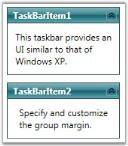

# Setting Group Width in WPF TaskBar

The width of the TaskBar is customized by using the [GroupWidth](https://help.syncfusion.com/cr/wpf/Syncfusion.Windows.Tools.Controls.TaskBar.html#Syncfusion_Windows_Tools_Controls_TaskBar_GroupWidth) property. This is a dependency property, which sets the group width of the TaskBar. It displays all the TaskBar Items in the TaskBar control with the same width. 

The following code snippet illustrates how to set the group width.




<!-- Adding TaskBar that have group width as 150 -->

<syncfusion:TaskBar Name="taskBar" GroupMargin="5" GroupWidth="150">

    <!-- Adding TaskBarItem -->

    <syncfusion:TaskBarItem Name="taskBarItem1" Header="TaskBarItem1">

        <!-- Adding content to TaskBarItem-->

        <StackPanel Margin="10" HorizontalAlignment="Center" 											VerticalAlignment="Stretch">

            <TextBlock TextWrapping="Wrap">This taskbar provides an UI similar to that of Windows XP.</TextBlock>

        </StackPanel>

    </syncfusion:TaskBarItem>

    <!-- Adding TaskBarItem -->

    <syncfusion:TaskBarItem Name="taskBarItem2" Header="TaskBarItem2">

        <!-- Adding content to TaskBarItem-->

        <StackPanel Margin="10" HorizontalAlignment="Center" 											VerticalAlignment="Stretch">

            <TextBlock TextWrapping="Wrap">Specify and customize the group margin.</TextBlock>

        </StackPanel>

    </syncfusion:TaskBarItem>

</syncfusion:TaskBar>




//Creating an instance for TaskBar

TaskBar taskBar = new TaskBar();

//Creating an instance for TaskBarItem

TaskBarItem taskBarItem1 = new TaskBarItem();

//Setting the header of TaskBarItem1

taskBarItem1.Header = "TaskBarItem1";

// Creating instance for TextBlock

TextBlock textBlock1 = new TextBlock();

// Adding text to textblock

textBlock1.Text = "This taskbar provides an UI similar to that of Windows XP.";

// Adding textblock to TaskBarItem

taskBarItem1.Items.Add(textBlock1);

//Creating an instance for TaskBarItem

TaskBarItem taskBarItem2 = new TaskBarItem();

//Setting the header of TaskBarItem1

taskBarItem2.Header = "TaskBarItem2";

// Creating instance for TextBlock

TextBlock textBlock2 = new TextBlock();

// Adding text to textblock

textBlock2.Text = "Specify and customize the group margin.";

// Adding textblock to TaskBarItem

taskBarItem2.Items.Add(textBlock2);

//Adding the TaskBarItem to TaskBar

taskBar.Items.Add(taskBarItem1);

taskBar.Items.Add(taskBarItem2);

//Setting group orientation to TaskBar

taskBar.GroupWidth = 150;       

//Adding TaskBar as content of window

this.Content = taskBar; 





Group Margin for the TaskBar



