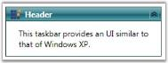

# Setting Header Image

You can set a custom header image for the TaskBarItem. Use the following code snippet to set an image for the header.

[XAML]

&lt;!-- Adding TaskBar that have group orientation as horizontal --&gt;

&lt;syncfusion:TaskBar Name="taskBar" GroupMargin="5"&gt;

    &lt;!-- Adding TaskBarItem --&gt;

    &lt;syncfusion:TaskBarItem Name="taskBarItem1"&gt;

        &lt;!-- Adding header with image --&gt;

        &lt;syncfusion:TaskBarItem.Header&gt;

            &lt;DockPanel Margin="0"&gt;

                &lt;Image Height="16" Width="16" Source="App.ico"/&gt;

                &lt;TextBlock Foreground="White" Margin="5,0,0,0" 												Text="Header"/&gt;				

&lt;/DockPanel&gt;

        &lt;/syncfusion:TaskBarItem.Header&gt;

        &lt;!-- Adding content to taskbaritem --&gt;

        &lt;StackPanel Margin="10" HorizontalAlignment="Center" 											VerticalAlignment="Stretch"&gt;

            <TextBlock TextWrapping="Wrap">This taskbar provides an UI similar to that of Windows XP.&lt;/TextBlock&gt;

        &lt;/StackPanel&gt;

    &lt;/syncfusion:TaskBarItem&gt;

&lt;/syncfusion:TaskBar&gt;

{  | markdownify }
{:.image }

See Also

Group Padding for the TaskBar Item

