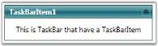

# Adding a TaskBar Item to the TaskBar Control

The Task Bar Item is added to the Task Bar by using either XAML or C# coding. Use the following code to add a Task Bar Item to the Task Bar control.




<!-- Adding TaskBar -->

<syncfusion:TaskBar Name="taskBar" >

<!-- Adding TaskBarItem -->

<syncfusion:TaskBarItem Name="taskBarItem1" Header="TaskBarItem1">

</syncfusion:TaskBarItem>

</syncfusion:TaskBar>





//Creating an instance for TaskBar

TaskBar taskBar = new TaskBar();

//Creating an instance for TaskBarItem

TaskBarItem taskBarItem1 = new TaskBarItem();

//Setting the header of TaskBarItem1

taskBarItem1.Header = "TaskBarItem1";

//Adding the TaskBarItem to TaskBar

taskBar.Items.Add(taskBarItem1);

//Adding TaskBar as content of window

this.Content = taskBar; 




The following screen shot shows the TaskBar control with TaskBar Item.

## Adding Content to TaskBar Item

To add text to the TaskBar Item, use the below code




<!-- Adding TaskBar  -->

<syncfusion:TaskBar Name="taskBar" >

<!-- Adding TaskBarItem -->

<syncfusion:TaskBarItem Name="taskBarItem1" Header="TaskBarItem1">

<!-- Adding content to TaskBarItem -->

<StackPanel Margin="10" HorizontalAlignment="Center" VerticalAlignment="Stretch">

<TextBlock TextWrapping="Wrap"> This TaskBar that have a TaskBarItem.</TextBlock>

</StackPanel>

</syncfusion:TaskBarItem>

</syncfusion:TaskBar>





//Creating an instance for TaskBar

TaskBar taskBar = new TaskBar();

//Creating an instance for TaskBarItem

TaskBarItem taskBarItem1 = new TaskBarItem();

//Setting the header of TaskBarItem1

taskBarItem1.Header = "TaskBarItem1";

// Creating instance for TextBlock

TextBlock textBlock1 = new TextBlock();

// Adding text to textblock

textBlock1.Text = "This TaskBar that have a TaskBarItem.";

// Adding textblock to taskbaritem

taskBarItem1.Items.Add(textBlock1);          

//Adding the TaskBarItem to TaskBar

taskBar.Items.Add(taskBarItem1);             

//Adding TaskBar as content of window

this.Content = taskBar; 



N> To display the TaskBar Item, you must already have the TaskBar in which you are going to add the TaskBar Item.

The following screen shot illustrates how text has been added to the TaskBar Item.

