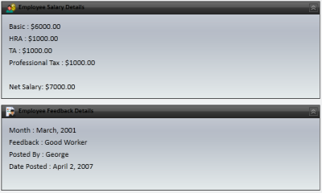
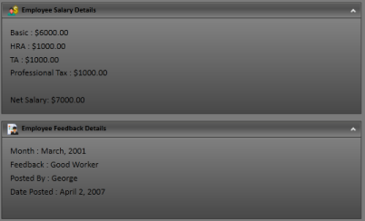
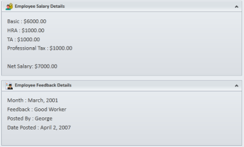
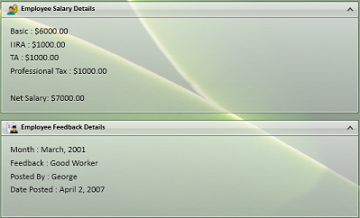

# Appearance in WPF TaskBar Control

This section deals with the appearance of TaskBar control and contains the following topic:

## Setting Visual Styles

The appearance of the TaskBar control is customized by using the VisualStyle property. The various built-in visual styles are listed below.

<table>
<tr>
<th>
Property</th><th>
Description</th></tr>
<tr>
<td>
VisualStyle</td><td>
Sets the visual style for the TaskBar control. The options provided are as follows. 
* Blend  
* Office2003  
* Office2007  
* BlueOffice2007  
* BlackOffice2007Silver  
* ShinyBlue  
* ShinyRed  
* SyncOrange  
* VS2010  
* Metro  
* Transparent</td></tr>
</table>

To set the visual style for the TaskBar, use the below code.





<!-- Adding TaskBar -->

<syncfusion:TaskBar Name="taskBar" >

    <!-- Adding TaskBarItem -->

    <syncfusion:TaskBarItem Name="taskBarItem1" Header="TaskBarItem1">

        <!-- Adding content to TaskBarItem -->

        <StackPanel Margin="10" HorizontalAlignment="Center" 										VerticalAlignment="Stretch">

            <TextBlock TextWrapping="Wrap">

This TaskBar that have a TaskBarItem.

            </TextBlock>

        </StackPanel>

    </syncfusion:TaskBarItem>

</syncfusion:TaskBar>





// Setting the visual style as Office2007Blue

SkinStorage.SetVisualStyle(taskBar, "Office2007Blue");





TaskBar with "Office2007Blue" Visual Style
{:.caption}

TaskBar with "Office2007Black" Visual Style
{:.caption}

TaskBar with "Office2007Silver" Visual Style
{:.caption}

TaskBar with "Office2010Blue" Visual Style
{:.caption}

TaskBar with "Office2010Black" Visual Style
{:.caption}

TaskBar with "Office2010Silver" Visual Style
{:.caption}

TaskBar with "Blend" Visual Style
{:.caption}

TaskBar with "VS2010" Visual Style
{:.caption}

TaskBar with "Metro" Visual Style
{:.caption}

TaskBar with "Transparent" Visual Style
{:.caption}

