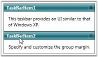

# Setting Group Margin

You can set the margin for the items in the TaskBar control by using the GroupMargin property. This is a dependency property, which sets the margin for all TaskBar Items in the TaskBar control. You can enhance the appearance of the TaskBar Items by using this property.

You can also set the value for Left, Right, Bottom and Top group margins.

Use the below code for setting the group margin.




<!-- Adding TaskBar that have group margin is 5 -->

<syncfusion:TaskBar Name="taskBar" GroupMargin="5">

    <!-- Adding TaskBarItem -->

    <syncfusion:TaskBarItem Name="taskBarItem1" Header="TaskBarItem1">

        <!-- Adding content to TaskBarItem -->

        <StackPanel Margin="10" HorizontalAlignment="Center" 										VerticalAlignment="Stretch">

            <TextBlock TextWrapping="Wrap">

This taskbar provides an UI similar to that of Windows XP.</TextBlock>

        </StackPanel>

    </syncfusion:TaskBarItem>

    <!-- Adding TaskBarItem -->

    <syncfusion:TaskBarItem Name="taskBarItem2" Header="TaskBarItem2">

        <!-- Adding content to TaskBarItem -->

        <StackPanel Margin="10" HorizontalAlignment="Center" 												VerticalAlignment="Stretch">

        <TextBlock TextWrapping="Wrap">

        Specify and customize the group margin.</TextBlock>

        </StackPanel>

    </syncfusion:TaskBarItem>

</syncfusion:TaskBar>




//Creating an instance for TaskBar

TaskBar taskBar = new TaskBar();

//Creating an instance for TaskBarItem

TaskBarItem taskBarItem1 = new TaskBarItem();

//Setting the header of TaskBarItem1

taskBarItem1.Header = "TaskBarItem1";

// Creating instance for TextBlock

TextBlock textBlock1 = new TextBlock();

// Adding text to textblock

textBlock1.Text = "This taskbar provides an UI similar to that of Windows XP.";

// Adding textblock to TaskBarItem

taskBarItem1.Items.Add(textBlock1);

//Creating an instance for TaskBarItem

TaskBarItem taskBarItem2 = new TaskBarItem();

//Setting the header of TaskBarItem1

taskBarItem2.Header = "TaskBarItem2";

// Creating instance for TextBlock

TextBlock textBlock2 = new TextBlock();

// Adding text to textblock

textBlock2.Text = "Specify and customize the group margin.";

// Adding textblock to TaskBarItem

taskBarItem2.Items.Add(textBlock2);

//Adding the TaskBarItem to TaskBar

taskBar.Items.Add(taskBarItem1);

taskBar.Items.Add(taskBarItem2);  

//Setting Group Margin

taskBar.GroupMargin = new Thickness(5);

//Adding TaskBar as content of window

this.Content = taskBar; 






Group Width for the TaskBar



