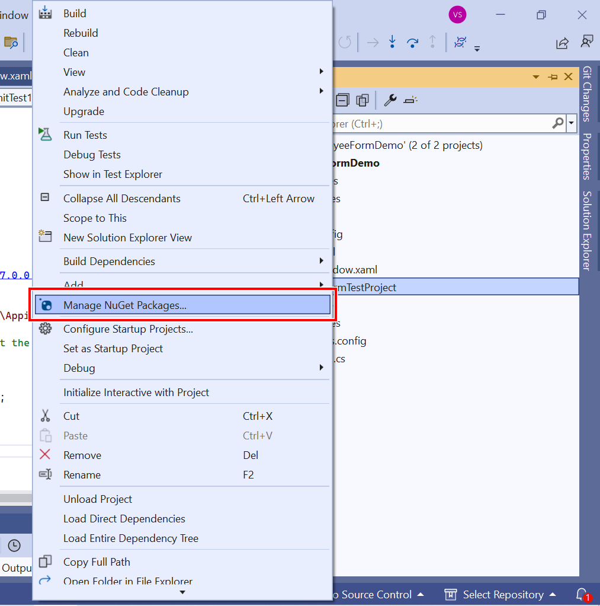

# Appium Testing in WPF

Appium is an open-source tool that allows you to create automated UI tests for applications. This section will guide you on how to automate your WPF application by utilizing Appium along with [Windows Application Driver](https://github.com/Microsoft/WinAppDriver) and the UI Recorder tool.

## Prerequisites

Enable [Developer Mode](https://learn.microsoft.com/en-us/windows/apps/get-started/enable-your-device-for-development) in Windows.
Download the [Windows Application Driver](https://github.com/Microsoft/WinAppDriver/releases) and install it. It is used to run tests.
Download the WinAppDriver UI Recorder, which is used to record tests at runtime. It does not require installation - simply unzip the downloaded archive to any folder.

N> To obtain the UI Recorder app, by visit the Windows Application Driver [releases](https://github.com/Microsoft/WinAppDriver/releases) page and scroll down.

### Remote Server

Run WinAppDriver.exe as an administrator and observe the command prompt displaying information about the URL and port that the service is listening on. The default URL is http://127.0.0.1:4723. The command prompt also functions as a logger, showing HTTP requests and JSON payloads whenever the Appium SDK performs an interaction.

N> This process should be run continuously until the test is complete. This serves as the listener server during testing on the machine.

**Location:** `C:\Program Files (x86)\Windows Application Driver`

The screenshot below shows the WinAppDriver listening address.

## Create Test Project

**Step 1:** Right-click on the solution in the application, select `Add`, and then click `New Project`.

**Step 2:** Search for the Unit Test Project in the search box. Then select the unit test project that meets your requirements and click the Next button.

**Step 3:** Click the `Create` button to create the TestProject.

**Step 4:** Right-click the Unit Test project in Solution Explorer and select `Manage NuGet Packages...`.

**Step 5:** Install the [Appium.WebDriver](https://www.nuget.org/packages/Microsoft.WinAppDriver.Appium.WebDriver/) NuGet package.

**Step 6:** Now, the basic unit test project has been created.

## Implement the test method

After creating the unit test project, there are two ways to create the test method in Unit Test Project, as detailed below:
                   1. Manually Write.
				   2. Use the UI Recorder Tool.

### Manually Write

**Step 1:** To use the Appium API, you need to create a WindowsDriver instance. The following code illustrates the creation of a WindowsDriver session.



public class UnitTest1
{
    // URL for the Windows Application Driver (WinAppDriver)
    private const string WindowsApplicationDriverUrl = "http://127.0.0.1:4723";

    // Path to your WPF application executable
    private const string employeeFormDemoPath = @"…\...\EmployeeFormDemo.exe";

    // Initialize the WindowsDriver session for Manually implement the test
    private static WindowsDriver<WindowsElement> driver;

    // Manually implement the test
    [TestMethod]
    public void TestMethod1()
    {
        if (driver == null)
        {
            // Create a new instance of AppiumOptions.
            var appiumOptions = new AppiumOptions();
            // Define the application that needs to be tested.
            appiumOptions.AddAdditionalCapability("app", employeeFormDemoPath);
            // Define the device that makes the test for applications.
            appiumOptions.AddAdditionalCapability("deviceName", "WindowsPC");

            // Create the WindowsDriver session
            driver = new WindowsDriver<WindowsElement>(new Uri(WindowsApplicationDriverUrl), appiumOptions);
         }
    }
}



**Step 2:** Use WinAppDriver's `FindElementByName`, `FindElementByClassName`, and `FindElementByAccessibilityId` methods to implement the test case manually.

N> To improve the clarity of tests, set the [AutomationProperties.AutomationId](https://learn.microsoft.com/en-us/dotnet/api/system.windows.automation.automationproperties.automationid?view=netframework-4.6.2) attached property for elements within the application. For additional details, consult the section titled [Use the AutomationID Property](https://learn.microsoft.com/en-us/dotnet/framework/ui-automation/use-the-automationid-property).

#### Example

The subsequent illustration demonstrates the automated process of filling out the Employee data form by utilizing Appium.



// Manually implement the test
[TestMethod]
public void TestMethod1()
{
    if (driver == null)
    {
        // Create a new instance of AppiumOptions.
        var appiumOptions = new AppiumOptions();
        // Define the application that needs to be tested.
        appiumOptions.AddAdditionalCapability("app", employeeFormDemoPath);
        // Define the device that makes the test for applications.
        appiumOptions.AddAdditionalCapability("deviceName", "WindowsPC");

        // Create the WindowsDriver session
        driver = new WindowsDriver<WindowsElement>(new Uri(WindowsApplicationDriverUrl), appiumOptions);

        //Find the element by using the FindElementByAccessibilityId method.
        var txtEmployeeIDElement = driver.FindElementByAccessibilityId("employeeIDTextBox");
        if (txtEmployeeIDElement != null)
        {
            // Perform the click operation to focus on the txtEmployeeIDElement.
            txtEmployeeIDElement.Click();
        }
        else
        {
            Console.WriteLine($"Failed to find element {txtEmployeeIDElement}");
            return;
        }
        //Set the value using the SendKeys method.
        txtEmployeeIDElement.SendKeys("1001");

        var txtEmployeeNameElement = driver.FindElementByAccessibilityId("employeeNameTextBox");
        if (txtEmployeeNameElement != null)
        {
            txtEmployeeNameElement.Click();
        }
        else
        {
            Console.WriteLine($"Failed to find element {txtEmployeeNameElement}");
            return;
        }
        txtEmployeeNameElement.SendKeys("Thomas");

        var txtEmployeeMailElement = driver.FindElementByAccessibilityId("employeeMailTextBox");
        if (txtEmployeeMailElement != null)
        {
            txtEmployeeMailElement.Click();
        }
        else
        {
            Console.WriteLine($"Failed to find element {txtEmployeeMailElement}");
            return;
        }
        txtEmployeeMailElement.SendKeys("thomas@gamil.com");

        var dpEmployeeBirthDateElement = driver.FindElementByAccessibilityId("employeeBirthDatePicker");
        if (dpEmployeeBirthDateElement != null)
        {
            dpEmployeeBirthDateElement.Click();
        }
        else
        {
            Console.WriteLine($"Failed to find element {dpEmployeeBirthDateElement}");
            return;
        }
        // Send the desired date in the format the DatePicker expects
        dpEmployeeBirthDateElement.SendKeys("03/12/2024");
        // Confirm the selection
        dpEmployeeBirthDateElement.SendKeys(Keys.Enter); 

        var cmbEmployeeGenderElement = driver.FindElementByAccessibilityId("genderComboBox");
        if (cmbEmployeeGenderElement != null)
        {
            cmbEmployeeGenderElement.Click();
        }
        else
        {
            Console.WriteLine($"Failed to find element {cmbEmployeeGenderElement}");
            return;
        }
        // Navigate down in the ComboBox
        cmbEmployeeGenderElement.SendKeys(Keys.Down);
        // Select the item
        cmbEmployeeGenderElement.SendKeys(Keys.Enter); 

        var btnSaveElement = driver.FindElementByAccessibilityId("btnSave");
        if (btnSaveElement != null)
        {
            btnSaveElement.Click();
        }
        else
        {
            Console.WriteLine($"Failed to find element {btnSaveElement}");
            return;
        }

        var messageBoxElement = driver.FindElementsByClassName("#32770");
        if (messageBoxElement != null)
        {

            var okElement = driver.FindElementByName("OK");
            if (okElement != null)
            {
                okElement.Click();
            }
        }
        else
        {
            Console.WriteLine($"Failed to find element {messageBoxElement}");
            return;
        }    
    }
}



### Use the UI Recorder Tool

**Step 1:** To use the Appium API, you need to create a WindowsDriver instance. The following code illustrates the creation of a WindowsDriver session.



public class UnitTest1
{
     // URL for the Windows Application Driver (WinAppDriver)
     private const string WindowsApplicationDriverUrl = "http://127.0.0.1:4723";

     // Path to your WPF application executable
     private const string employeeFormDemoPath = @"..\..\EmployeeFormDemo.exe";

     // Initialize the WindowsDriver session for UI Recorder Tool
     private static WindowsDriver<WindowsElement> MyDesktopSession;

     // Use the UI Recorder Tool
     [TestMethod]
     public void TestMethod2()
     {
         if (driver == null)
         {
             // Create a new instance of AppiumOptions.
             var appiumOptions = new AppiumOptions();
             // Define the application that needs to be tested.
             appiumOptions.AddAdditionalCapability("app", employeeFormDemoPath);
             // Define the device that makes the test for applications.
             appiumOptions.AddAdditionalCapability("deviceName", "WindowsPC");

             // Create the WindowsDriver session
             MyDesktopSession = new WindowsDriver<WindowsElement>(new Uri(WindowsApplicationDriverUrl), appiumOptions);
         }
     }
}



**Step 2:** Run the application (e.g. EmployeeFormDemo)

**Step 3:** Launch the WinAppDriver UI Recorder by double-clicking on the `WinAppDriverUiRecorder` application.

**Step 4:** Select the `Record` option. Position your cursor over the initial UI component (Application) you intend to engage with and wait until it begins to blink in a blue color.

**Step 5:** As soon as the element flashes, the recorder is ready for action, enabling you to perform various user interface operations such as clicking on the element, dragging it, entering new information, among others. After you finish interacting with the current element, shift your pointer to another UI element, again wait until it begins to blink in a blue color, and then proceed with the same procedures.

**Step 6:** After capturing the series of actions, click on `Stop Recording` within the recorder interface. Open the actions list (Click on the dropdown at the end of UI Recorder) to verify that all user interface actions have been successfully logged.

**Step 7:** Click the `Generate and copy C# code to Clipboard` button to copy the code generated from WinAppDriverUiRecorder. Paste this code into the test method.

#### Example

The subsequent illustration demonstrates the automated process of filling out the Employee data form by utilizing Appium.



// Use the UI Recorder Tool
[TestMethod]
public void TestMethod2()
{
    if (MyDesktopSession == null)
    {
        // Create a new instance of AppiumOptions.
        var appiumOptions = new AppiumOptions();
        // Define the application that needs to be tested.
        appiumOptions.AddAdditionalCapability("app", employeeFormDemoPath);
        // Define the device that makes the test for applications.
        appiumOptions.AddAdditionalCapability("deviceName", "WindowsPC");

        // Create the WindowsDriver session
        MyDesktopSession = new WindowsDriver<WindowsElement>(new Uri(WindowsApplicationDriverUrl), appiumOptions);

        // LeftClick on "employeeIDTextBox" at (26,12)
        Console.WriteLine("LeftClick on \"employeeIDTextBox\" at (26,12)");
        string xp1 = "/Window[@Name=\"Employee Form Demo\"][@ClassName=\"Window\"]/Edit[@AutomationId=\"employeeIDTextBox\"]";
        var winElem1 = MyDesktopSession.FindElementByXPath(xp1);
        if (winElem1 != null)
        {
            winElem1.Click();
        }
        else
        {
            Console.WriteLine($"Failed to find element {xp1}");
            return;
        }

        // KeyboardInput VirtualKeys=""1002"" CapsLock=False NumLock=False ScrollLock=False
        Console.WriteLine("KeyboardInput VirtualKeys=\"\"1002\"\" CapsLock=False NumLock=False ScrollLock=False");
        winElem1.SendKeys("1002");

        // LeftClick on "employeeNameTextBox" at (14,15)
        Console.WriteLine("LeftClick on \"employeeNameTextBox\" at (14,15)");
        string xp3 = "/Window[@Name=\"Employee Form Demo\"][@ClassName=\"Window\"]/Edit[@AutomationId=\"employeeNameTextBox\"]";
        var winElem3 = MyDesktopSession.FindElementByXPath(xp3);
        if (winElem3 != null)
        {
            winElem3.Click();
        }
        else
        {
            Console.WriteLine($"Failed to find element {xp3}");
            return;
        }

        // KeyboardInput VirtualKeys=""Hardy"" CapsLock=False NumLock=False ScrollLock=False
        Console.WriteLine("KeyboardInput VirtualKeys=\"\"Hardy\"\" CapsLock=False NumLock=False ScrollLock=False");
        winElem3.SendKeys("Hardy");

        // LeftClick on "employeeMailTextBox" at (8,14)
        Console.WriteLine("LeftClick on \"employeeMailTextBox\" at (8,14)");
        string xp5 = "/Window[@Name=\"Employee Form Demo\"][@ClassName=\"Window\"]/Edit[@AutomationId=\"employeeMailTextBox\"]";
        var winElem5 = MyDesktopSession.FindElementByXPath(xp5);
        if (winElem5 != null)
        {
            winElem5.Click();
        }
        else
        {
            Console.WriteLine($"Failed to find element {xp5}");
            return;
        }

        // KeyboardInput VirtualKeys=""hardy@gmail.com"" CapsLock=False NumLock=False ScrollLock=False
        Console.WriteLine("KeyboardInput VirtualKeys=\"\"hardy@gmail.com\"\" CapsLock=False NumLock=False ScrollLock=False");
        winElem5.SendKeys("hardy@gmail.com");

        // LeftClick on "Show Calendar" at (9,18)
        Console.WriteLine("LeftClick on \"Show Calendar\" at (9,18)");
        string xp7 = "/Window[@Name=\"Employee Form Demo\"][@ClassName=\"Window\"]/Custom[@AutomationId=\"employeeBirthDatePicker\"]/Button[@AutomationId=\"PART_Button\"][@Name=\"Show Calendar\"]";
        var winElem7 = MyDesktopSession.FindElementByXPath(xp7);
        if (winElem7 != null)
        {
            winElem7.Click();
        }
        else
        {
            Console.WriteLine($"Failed to find element {xp7}");
            return;
        }

        // MouseHover on "UiTask" at (187,49)
        Console.WriteLine("MouseHover on \"UiTask\" at (187,49)");
        string xp8 = "/Window[@Name=\"Employee Form Demo\"][@ClassName=\"Window\"]/Window[@ClassName=\"Popup\"]/Calendar[@ClassName=\"Calendar\"]";
        var winElem8 = MyDesktopSession.FindElementByXPath(xp8);
        if (winElem8 != null)
        {
            //TODO: Hover at (187,49) on winElem8
        }
        else
        {
            Console.WriteLine($"Failed to find element {xp8}");
            return;
        }

        // LeftClick on "Wednesday, March 13, 2024" at (0,10)
        Console.WriteLine("LeftClick on \"Wednesday, March 13, 2024\" at (0,10)");
        string xp9 = "/Window[@Name=\"Employee Form Demo\"][@ClassName=\"Window\"]/Window[@ClassName=\"Popup\"]/Calendar[@ClassName=\"Calendar\"]/Button[@Name=\"Wednesday, March 13, 2024\"][@ClassName=\"CalendarDayButton\"]";
        var winElem9 = MyDesktopSession.FindElementByXPath(xp9);
        if (winElem9 != null)
        {
            winElem9.Click();
        }
        else
        {
            Console.WriteLine($"Failed to find element {xp9}");
            return;
        }

        // LeftClick on "genderComboBox" at (59,27)
        Console.WriteLine("LeftClick on \"genderComboBox\" at (59,27)");
        string xp10 = "/Window[@Name=\"Employee Form Demo\"][@ClassName=\"Window\"]/ComboBox[@AutomationId=\"genderComboBox\"]";
        var winElem10 = MyDesktopSession.FindElementByXPath(xp10);
        if (winElem10 != null)
        {
            winElem10.Click();
        }
        else
        {
            Console.WriteLine($"Failed to find element {xp10}");
            return;
        }

        // LeftClick on "Male" at (56,14)
        Console.WriteLine("LeftClick on \"Male\" at (56,14)");
        string xp11 = "/Window[@Name=\"Employee Form Demo\"][@ClassName=\"Window\"]/Window[@ClassName=\"Popup\"]/ListItem[@Name=\"Male\"][@ClassName=\"ListBoxItem\"]";
        var winElem11 = MyDesktopSession.FindElementByXPath(xp11);
        if (winElem11 != null)
        {
            winElem11.Click();
        }
        else
        {
            Console.WriteLine($"Failed to find element {xp11}");
            return;
        }

        // LeftClick on "Save" at (77,31)
        Console.WriteLine("LeftClick on \"Save\" at (77,31)");
        string xp12 = "/Window[@Name=\"Employee Form Demo\"][@ClassName=\"Window\"]/Button[@AutomationId=\"btnSave\"][@Name=\"Save\"]";
        var winElem12 = MyDesktopSession.FindElementByXPath(xp12);
        if (winElem12 != null)
        {
            winElem12.Click();
        }
        else
        {
            Console.WriteLine($"Failed to find element {xp12}");
            return;
        }

        // LeftClick on "OK" at (91,15)
        Console.WriteLine("LeftClick on \"OK\" at (91,15)");
        string xp13 = "/Window[@Name=\"Employee Form Demo\"][@ClassName=\"Window\"]/Window[@ClassName=\"#32770\"]/Button[@Name=\"OK\"][@ClassName=\"Button\"]";
        var winElem13 = MyDesktopSession.FindElementByXPath(xp13);
        if (winElem13 != null)
        {
            winElem13.Click();
        }
        else
        {
            Console.WriteLine($"Failed to find element {xp13}");
            return;
        }
    }
}



N> During our internal testing, it was noted that the auto-generated code might not successfully identify the user interface element using its complete path.



string xp1 = "/Pane[@Name=\"Desktop 1\"][@ClassName=\"#32769\"]/Window[@Name=\"Employee Form Demo\"][@ClassName=\"Window\"]";



N> Ensure that all element paths are complete and begin with "/Window" to prevent this.



string xp1 = "/Window[@Name=\"Employee Form Demo\"][@ClassName=\"Window\"]";



## Automate Test Method

After completing the implementation of TestMethod, you can test the application by following these steps.

**Step 1:** Right-click on the TestProject and click on `Run Tests`.

**Step 2:** Now, the test will launch your application, repeat all recorded steps, and close the application afterwards. All test details can be found in the Test Explorer.

N> Every action taken during the test is recorded in the console of WinAppDriver that is initiated.

[View Sample in GitHub](https://github.com/SyncfusionExamples/Automate-WPF-application-by-utilizing-Appium-along-with-WinAppDriver).