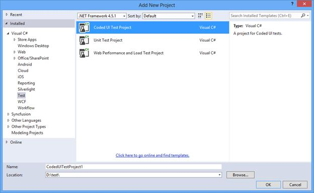
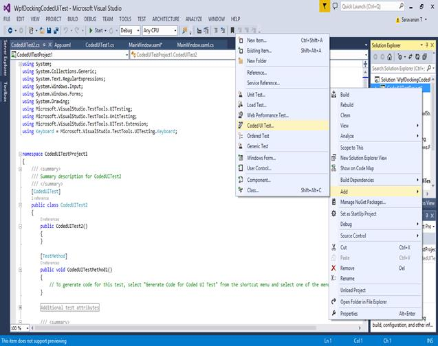
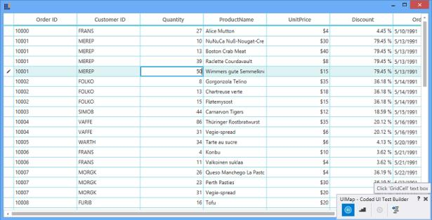
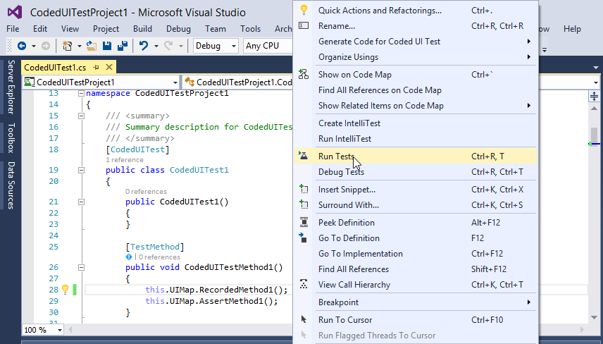

# Coded UI Testing in WPF

Automated tests that drive your application through its user interface (UI) are known as Coded UI Tests (CUITs). These tests include functional testing of the UI controls. Our controls support CUITs Coded UI automation that helps you to create automated tests for inner elements and records the sequence of actions. When dragging the crosshair shown in Coded UI Test Builder on UI elements, it shows the properties of the respective UI elements. You can also add assertion for each of the properties.

Provided here are the three levels of support in Coded UI Test automation.

<table>
<tr>
<td>
{{'**Levels**'| markdownify }}
</td>
<td>
{{'**Description**'| markdownify }}
</td>
</tr>
<tr>
<td>
Level 1
</td>
<td>
Record and detect the UI elements when performing actions in the control.
</td>
</tr>
<tr>
<td>
Level 2
</td>
<td>
Provide custom properties for UI elements when dragging the crosshair to any UI element.
</td>
</tr>
<tr>
<td>
Level 3
</td>
<td>
<b>Coded UI Test Builder</b> generates code from the recorded session and custom class is implemented to access custom properties, so the generated code is simplified.
</td>
</tr>
</table>

## Prerequisites and compatibility

### Prerequisites

The prerequisites are tabulated in the following table.

<table>
<tr>
<td>
.Net Framework
</td>
<td>
4.5,4.5.1,4.6
</td>
</tr>
<tr>
<td>
Other Requirement
</td>
<td>
Extension dll and Syncfusion build installed dll should be referred as same version.
</td>
</tr>
</table>

### Compatibility

<table>
<tr>
<td>
Visual Studio

</td>
<td>
Coded UI provides support only in Visual Studio – 2010, 2012 and 2013 Ultimate and Premium platforms for Visual Studio 2015 and 2017 supported only in Enterprise platform. For more information about the platforms and configurations supported by Coded UI tests, refer to this {{'[link](https://docs.microsoft.com/en-us/previous-versions/visualstudio/visual-studio-2015/test/supported-configurations-and-platforms-for-coded-ui-tests-and-action-recordings?view=vs-2015&redirectedfrom=MSDN#"")'| markdownify }}.
</td>
</tr>
</table>

## Create, record, and run the tests

### Creating Coded UI Project

CUIT contains the Coded UI test project. When application does not contain the CUIT project, create a new project. In the Solutions Explorer, on the shortcut menu of the solution is as follows:

  * Choose Add New Project. 
  * Select either Visual Basic or Visual C#.
  * Right-click the test project, choose Add, and select Coded UI Test.

Coded UI test project does not appear on Visual Studio, if Visual Studio Enterprise edition does not installed in the system. To create CUIT, install Visual Studio Enterprise edition in system.

### Adding Coded UI Test file

To add the CUIT file, follow the steps:

1.Create the CUIT project, the CUIT file will be automatically generated. To add another test file, right-click the test project, choose Add, and select Coded UI Test.

2.`Generate Code for Coded UI Test` dialog box will be shown after selecting the Coded UI test file. Choose `Record` to record the test actions.

3.Then, right-click the body of the Coded UI Test file. 

4.Choose `Coded UI Test Builder` (UI Map) at the bottom right side of the window.

5.Start the recording option from UI Map to record the test actions and recording option can be paused when testing the project.

6.Run the application, on which you will be performing UI testing.

7.Drag the crosshairs on to the UI elements of your WPF grid control application. It shows the available properties of the inner UI elements in the grid controls.

8.The actions made on UI elements can be recorded by clicking `Record` on the `Coded UI Test builder`. For example, you can record the action of changing the cell value in SfDataGrid. Click `Pause` to finish the record.

9.Then, click the `Generate Code` icon in `Coded UI Test Builder` to generate a test method. Close the `Coded UI Test Builder`. You can see the generated code for the cell value changed action.



public void RecordedMethod1()
{
   #region Variable Declarations
   WpfText uIMEREPText = this.UIWpfWindow.UISfDataGridCustom.UIGridCellCustom4.UIMEREPText;
   WpfEdit uIGridCellEdit = this.UIWpfWindow.UISfDataGridCustom.UIGridCellEdit;
   WpfSfGridCell uIGridCellCustom11 = this.UIWpfWindow.UISfDataGridCustom.UIGridCellCustom11;
   WpfSfGridCell uIGridCellCustom12 = this.UIWpfWindow.UISfDataGridCustom.UIGridCellCustom12;
   #endregion
}



10.An assertion can also be created to check the modified cell value. Drag the crosshair to the modified cell, the Assertion window appears. The properties for the control (Cell) will be listed in the Assertion dialog box. You can add assertion by clicking `Generate Code` in `Coded UI Test Builder`.

### Testing recorded steps

Application can be tested with the generated CUIT method. Follow the procedure to test the recorded steps:

1.Add a test method called CodedUITestProject1.





public void CodedUITestMethod1()

{
// Generates code for this test. Select "Generate Code for Coded UI Test" from the shortcut menu and select one of the menu items.
    this.UIMap.RecordedMethod1();
}





Public Sub CodedUITestMethod1()

' Generates code for this test. Select "Generate Code for Coded UI Test" from the shortcut menu and select one of the menu items.
	Me.UIMap.RecordedMethod2()
End Sub 





2.Build and run the application that has already been configured. CUIT builder can be opened with the following steps.

3.Right-click the body of the `CodedUITestMethod` and select `Run Tests`.

4.Before running tests, ensure that the test application is launched and the initial states of controls are same as at the beginning of the test recording.

## Supported controls

The following controls are featured in Coded UI testing support.

<table>
<tr>
<th>
Supported Controls  </th>
<th>
Levels  </th></tr>
<tr>
<td>
DataGrid  </td><td>
3 Levels  </td></tr>
<tr>
<td>
GridControl  </td><td>
3 Levels  </td></tr>
<tr>
<td>
SfDataPager  </td><td>
3 Levels  </td></tr>
<tr>
<td>
TreeGrid  </td><td>
3 Levels  </td></tr>
<tr>
<td>
ComboBoxAdv  </td><td>
2 Levels  </td></tr>
<tr>
<td>
DockingManager  </td><td>
2 Levels  </td></tr>
<tr>
<td>
DocumentContainer  </td><td>
2 Levels  </td></tr>
<tr>
<td>
DateTimeEdit  </td><td>
2 Levels  </td></tr>
<tr>
<td>
GridData  </td><td>
2 Levels  </td></tr>
<tr>
<td>
GridTree  </td><td>
2 Levels  </td></tr>
<tr>
<td>
PivotGrid  </td><td>
2 Levels  </td></tr>
<tr>
<td>
PropertyGrid  </td><td>
2 Levels  </td></tr>
<tr>
<td>
Ribbon  </td><td>
2 Levels  </td></tr>
<tr>
<td>
SfChart  </td><td>
2 Levels  </td></tr>
<tr>
<td>
SfMultiColumnDropDown  </td><td>
2 Levels  </td></tr>
<tr>
<td>
TabControlExt  </td><td>
2 Levels  </td></tr>
<tr>
<td>
TileView  </td><td>
2 Levels  </td></tr>
<tr>
<td>
TreeView  </td><td>
2 Levels  </td></tr>
</table>

N> The three level supported control can only have Coded UI Test extension project.

## Coded UI Test extension support

The Coded UI Test(CUIT) extension is a technology manager that tells Coded UI Test to use UI automation for Syncfusion WPF controls.

The following controls have extension project.

* SfDataGrid
* SfTreeGrid
* GridControl

To test the Coded UI supported controls with CUITs, build the Extension project and place in the following mentioned location.

<table>
<tr>
<th>Controls</th>
<th>Compile assemblies</th>
<th>Adding Extension assembly</th>
<th>Extension Project</th>
</tr>
<tr>
<td>
SfDataGrid
</td>
<td>
SfGrid.WPF 
</td>
<td>
Syncfusion.VisualStudio.TestTools.UITest.SfGridExtension.dll
</td>
<td>
Get the Extension project from {{'[this](https://github.com/SyncfusionExamples/coded-ui-test-external-plugin-source-project-for-wpf-datagrid-and-treegrid)'| markdownify }} location.
</td>
</tr>
<tr>
<td>
SfTreeGrid
</td>
<td>
SfGrid.WPF 
</td>
<td>
Syncfusion.VisualStudio.TestTools.UITest.SfGridExtension.dll
</td>
<td>
Get the Extension project from {{'[this](https://github.com/SyncfusionExamples/coded-ui-test-external-plugin-source-project-for-wpf-datagrid-and-treegrid)'| markdownify }} location.
</td>
</tr>
<tr>
<td>
GridControl
</td>
<td>
Grid.WPF
</td>
<td>
Syncfusion.VisualStudio.TestTools.UITest.GridExtension.dll
</td>
<td>
Get the Extension project from {{'[this](https://github.com/SyncfusionExamples/coded-ui-test-external-plugin-source-project-for-wpf-gridcontrol-and-griddatacontrol)'| markdownify }} location.
</td>
</tr>
</table>

To run the CUITs, follow the steps:

1. Run the Extension project and build it.
2. You can get the following tabulated assembly from the bin folder.

The above assembly must be placed in the following directory based on your Visual Studio version.

<table>
<tr>
<th>Visual Studio Version</th>
<th>Relative Path</th>
</tr>
<tr>
<td>
2010
</td>
<td>
C:\Program Files (x86)\Common Files\Microsoft Shared\VSTT\10.0\UITestExtensionPackages
</td>
</tr>
<tr>
<td>
2012
</td>
<td>
C:\Program Files (x86)\Common Files\Microsoft Shared\VSTT\11.0\UITestExtensionPackages
</td>
</tr>
<tr>
<td>
2013
</td>
<td>
C:\Program Files (x86)\Common Files\Microsoft Shared\VSTT\13.0\UITestExtensionPackages
</td>
</tr>
<tr>
<td>
2015
</td>
<td>
C:\Program Files (x86)\Common Files\Microsoft Shared\VSTT\14.0\UITestExtensionPackages
</td>
</tr>
<tr>
<td>
2017
</td>
<td>
C:\Program Files (x86)\Common Files\Microsoft Shared\VSTT\15.0\UITestExtensionPackages
</td>
</tr>
</table>

N> The Extension package should be installed(For example, **Syncfusion.VisualStudio.TestTools.UITest.SfGridExtension.dll**) in GAC location. Refer to the MSDN link for [GAC](https://docs.microsoft.com/en-us/previous-versions/dotnet/netframework-2.0/ex0ss12c(v=vs.80)) installation.

### UI Elements for supported controls

The following UI Elements for Coded UI supported controls,

<table>
<tr>
<th>Controls Name</th>
<th>UI Elements</th>
</tr>
<tr>
<td>
ComboBoxAdv
</td>
<td>
ComboBoxAdv and
ComboBoxItemAdv
</td>
</tr>
<tr>
<td>
TreeViewAdv
</td>
<td>
TreeViewAdv and
TreeViewItemAdv
</td>
</tr>
<tr>
<td>
PropertyGrid
</td>
<td>
PropertyGrid,
ClearButton,
DescriptionBorder,
DescriptionDetailsTextBlock,
DescriptionNameTextBlock,
PropertyCategoryViewItem,
PropertyGridScrollViewer,
PropertyGridSplitter,
PropertyItemTextBlock,
PropertyView,
PropertyViewItem,
SearchTextBox,
ToggleSortButton, and
ToggleGroupButton
</td>
</tr>
<tr>
<td>
Ribbon
</td>
<td>
Ribbon,
RibbonTab,
RibbonBar,
RibbonButton,
RibbonCheckBox,
RibbonComboBox,
RibbonComboBoxItem,
RibbonGallery,
RibbonGalleryPopup,
RibbonGalleryItem,
RibbonMenuGroup,
RibbonMenuGroupItem,
RibbonMenuItem,
DropDownButton,
SplitButton,
ApplicationMenu,
MenuButton,
SimpleMenuButton,
SplitMenuButton,
BackStage,
BackStageCommandButton,
BackStageTabItem,
RibbonToggleButton,
QATListBox,
QuickAccessToolBar, and
QuickAccessToolBarDropDown
</td>
</tr>
<tr>
<td>
SfMultiColumnDropDown
</td>
<td>
SfMultiColumnDropDownControl
</td>
</tr>
<tr>
<td>
SfDataPager
</td>
<td>
SfDataPager
</td>
</tr>
<tr>
<td>
SfDataGrid
</td>
<td>
GridStackedHeaderCellControl,
GridTableSummaryCell,
GridGroupSummaryCell,
GridCaptionSummaryCell,
GridDetailsViewExpanderCellControl, and
GridIndentCell
</td>
</tr>
<tr>
<td>
SfTreeGrid
</td>
<td>
TreeGridStackedHeaderCell and
TreeGridExpanderCell
</td>
</tr>
<tr>
<td>
PivotGrid
</td>
<td>
PivotGrid
</td>
</tr>
</table>

### UI Elements and Properties

The following Coded UI supported controls have UI Elements and other supported properties apart from default properties are listed below.

<table>
<tr>
<th> Control Name </th>
<th> UI Elements </th>
<th> Properties </th>
</tr>
<tr><td colspan="1" rowspan="8">SfDataGrid</td></tr>
<tr>
<td>
DataGrid
</td>
<td>
RowCount,
ColumnCount,
SelectionMode,
SelectionUnit,
SelectedIndex, and
SelectedItemCount.
</td>
</tr>
<tr>
<td>
GridCell
</td>
<td>
CellValue,
FormattedValue,
RowIndex,
ColumnIndex, and
ColumnName.
</td>
</tr>
<tr>
<td>
GridHeaderCellControl
</td>
<td>
MappingName,
IsFilterApplied,
FilterIconVisibility,
SortDirection, and
SortNumberVisibility.
</td>
</tr>
<tr>
<td>
GridRowHeaderCell
</td>
<td>
RowErrorMessage and
RowIndexState
</td>
</tr>
<tr>
<td>
GroupDropArea
</td>
<td>
IsExpanded and
GroupDropAreaText
</td>
</tr>
<tr>
<td>
DetailsViewDataGrid
</td>
<td>
RowCount,
ColumnCount,
SelectionMode,
SelectionUnit,
SelectedIndex, and
SelectedItemCount.
</td>
</tr>
<tr>
<td>
GroupDropAreaItem
</td>
<td>
GroupNameSortDirection
</td>
</tr>
<tr><td colspan="1" rowspan="5">TreeGrid</td></tr>
<tr>
<td>TreeGrid</td>
<td>RowCount, ColumnCount, SelectionMode, SelectionUnit, SelectionIndex, and SelectedItemCount.</td></tr>
<tr>
<td>TreeGridCell</td>
<td>CellValue, FormattedValue, RowIndex, ColumnIndex, and ColumnName.</td></tr>
<tr>
<td>TreeGridHeaderCell</td>
<td>MappingName, SortDirection, and SortNumberVisibility.</td></tr>
<tr>
<td>TreeGridRowHeaderCell</td>
<td>RowErrorMessage, RowIndex, and State.</td>
</tr>
<tr>
<td colspan="1" rowspan="5">GridControl</td></tr>
<tr>
<td>GridCell</td>
<td>Text, CellValue, ColumnHeader, Format, Description, FormulaTag, CellWidth, CellHeight, FormattedText.</td></tr>
<tr>
<td>Grid</td>
<td>SelectedRanges, GridName, RowCount, ColumnCount.</td></tr>
<tr>
<tr>
<td colspan="1" rowspan="2">SfMultiColumnDropDownControl</td></tr>
<tr><td>SfMultiColumnDropDown</td>
<td>AllowAutoComplete, AllowNullInput, AllowImmediatePopup, AllowIncrementalFiltering, AllowCaseSensitiveFiltering, AllowSpinOnMouseWheel, DisplayMember, IsDropDownOpenSelectedIndex, ValueMember.</td></tr>
</tr>

<tr>
<td colspan="1" rowspan="2">SfDataPager</td></tr>
<tr><td>SfDataPager</td>
<td>AccentBackground, AccentForeground, AutoEllipsisMode, AutoEllipsisText, DisplayMode, EnableGridPaging, NumericButtonCount, Orientation, PageCount, PageSize, UseOnDemandPaging.</td></tr>

</table>

## Steps to work with Coded UI

### SfDataGrid

Follow the steps to create a `Coded UI Test` project and test the SfDataGrid application.

1.Create a new WPF application or open an existing WPF application with SfDataGrid. Enable the `Coded UI Test` by setting AutomationPeerHelper.EnableCodedUI to true and access the AutomationPeerHelper class from Syncfusion.UI.Xaml.Grid namespace.



using Syncfusion.UI.Xaml.Grid;
public MainWindow()
{
 InitializeComponent();
 AutomationPeerHelper.EnableCodedUI = true;
}



2.Build the application and launch the .exe file from bin folder.

3.Create, record, and run the tests for Coded UI Test project by referring [Create, Record, and Run the tests](https://help.syncfusion.com/wpf/testing/coded-ui#create-record-and-run-the-tests) section.

### Hand code for CUIT operation

This session demonstrates the example codes to perform the operation with hand code.

#### Hand code for changing the cell value 



//Change Cell Value
[TestMethod]
public void CodedUITestMethod1()
{
    //this.UIMap.AssertMethod1();
    var cell = this.UIMap.UIMainWindowWindow.UISfDataGridCustom.UIVirtualizingCellsConCustom.UIGridCellCustom;
    cell.DrawHighlight();
    Mouse.DoubleClick(cell);
    Keyboard.SendKeys("Raj");
    Keyboard.SendKeys("{Enter}");
    Task.Delay(10);
    cell.DrawHighlight();
}



#### Hand code for find GridCell 



[TestMethod]
public void FindGridCell()
{
    WpfSfDataGrid dataGrid = this.UIMap.UIMainWindowWindow.UISfDataGridCustom;
    WpfSfGridCell cell = new WpfSfGridCell(dataGrid);
    cell.SearchProperties[WpfSfGridCell.PropertyNames.RowIndex] = "1";
    cell.SearchProperties[WpfSfGridCell.PropertyNames.ColumnIndex] = "1";
    Assert.IsTrue(cell.TryFind());
} 



N> In the previous code snippet, at least two unique properties of GridCell (row index and column index / row index and cell value / column index and cell value) should be provided to search in SfDataGrid.

#### Hand code for sort click operation



[TestMethod]
public void Mouse_Click_on_GridHeaderCell()
{
    WpfSfDataGrid dataGrid = this.UIMap.UIMainWindowWindow.UISfDataGridCustom;
    WpfSfHeaderCellControl cell = new WpfSfHeaderCellControl(dataGrid);
    cell.SearchProperties[WpfSfHeaderCellControl.PropertyNames.ColumnName] = "OrderID";
    if (cell.TryFind())
    {
        cell.DrawHighlight();
        Mouse.DoubleClick(cell);
    }
}




### SfTreeGrid

Follow the steps to create a **Coded UI Test** project and test the tree grid application.

1.Create a new WPF application or open an existing WPF application with tree grid. Enable Coded UI Test in tree grid by setting **AutomationPeerHelper.EnableCodedUI** to true and access the AutomationPeerHelper class from Syncfusion.UI.Xaml.Grid namespace.



using Syncfusion.UI.Xaml.Grid;
public MainWindow()
{
 InitializeComponent();
 AutomationPeerHelper.EnableCodedUI = true;
}



2.Build the application and launch the .exe file from the bin folder.

3.Create, record and run the tests for Coded UI Test project by referring [Create, Record, and Run the tests](https://help.syncfusion.com/wpf/testing/coded-ui#create-record-and-run-the-tests) section.

<table>
<tr>
<th>Automation peer class name</th>
<th>Control name in code generation</th>
<th>Property provider class name</th>
</tr>
<tr>
<td>
SfTreeGridAutomationPeer
</td>
<td>
WpfSfTreeGrid
</td>
<td>
SfTreeGridPropertyProvider
</td>
</tr>
<tr>
<td>
TreeGridCellAutomationPeer
</td>
<td>
WpfSfTreeGridCell
</td>
<td>
SfTreeGridCellPropertyProvider
</td>
</tr>
<tr>
<td>
TreeGridHeaderCellAutomationPeer
</td>
<td>
WpfSfTreeGridHeaderCell
</td>
<td>
SfTreeGridHeaderCellPropertyProvider
</td>
</tr>
<tr>
<td>
TreeGridRowHeaderCellAutomationPeer
</td>
<td>
WpfSfTreeGridRowHeaderCell
</td>
<td>
SfTreeGridRowHeaderCellPropertyProvider
</td>
</tr>
<tr>
<td>
TreeGridStackedHeaderCellAutomationPeer
</td>
<td>
WpfSfTreeGridStackedHeaderCell
</td>
<td>
SfTreeGridStackedHeaderCellPropertyProvider
</td>
</tr>
<tr>
<td>
TreeGridExpanderCellAutomationPeer
</td>
<td>
WpfTreeGridExpanderCell
</td>
<td>
SfTreeGridExpanderCellPropertyProvider
</td>
</tr>
</table>

### GridControl

Follow the steps to prepare the grid application.

1.Syncfusion.VisualStudio.TestTools.UITest.GridExtensions.dll contains implementation to easily change an existing application to the test application, plugin is required. Add a reference to this assembly. 

2.Open App.xaml file. 



<Application x:Class="WpfApplication3.App"
              xmlns="http://schemas.microsoft.com/winfx/2006/xaml/presentation"
              xmlns:x="http://schemas.microsoft.com/winfx/2006/xaml"
              StartupUri="Window1.xaml">
     <Application.Resources>
	 
     </Application.Resources>
</Application>



3.Change the application to Syncfusion:GridControlTestApplication.



<syncfusion:GridControlTestApplication x:Class="WpfApplication3.App"
	xmlns="http://schemas.microsoft.com/winfx/2006/xaml/presentation" 
	xmlns:syncfusion="http://schemas.syncfusion.com/wpf" 
	xmlns:x="http://schemas.microsoft.com/winfx/2006/xaml" 
	StartupUri="Window1.xaml"> 
	<syncfusion:GridControlTestApplication.Resources> 
	
	</syncfusion:GridControlTestApplication.Resources> 
</syncfusion:GridControlTestApplication>



4.For the code behind file (App.xaml.cs), make sure to inherit from **GridControlTestApplication**.



namespace WpfApplication3 
{ 
	/// 

	/// Interaction logic for App.xaml 
	/// 

	public partial class App : GridControlTestApplication 
	{
	 
	} 
} 



5.Build the application for testing.

6.Add the following reference in your sample.

* Syncfusion.VisualStudio.TestTools.UITest.GridCommunication.dll

* Syncfusion.VisualStudio.TestTools.UITest.GridExtension.dll

7.To create, record and run the tests for Coded UI Test project, you can refer this section [Create, Record, and Run the tests](https://help.syncfusion.com/wpf/testing/coded-ui#create-record-and-run-the-tests).

### Hand code for CUIT operation

This session demonstrates the example codes to perform the operation with hand code.

#### Hand code to find GridCell



[TestMethod]
public void FindGridCell()
{
    var datagrid = this.UIMap.UISyncfusionGridDataCoWindow.UISyncfusionGridDataCoWindow1;
    UITestControl cell = new UITestControl(datagrid);
    cell.SearchProperties["ControlType"] = "Cell";
    cell.SearchProperties["RowIndex"] = "16";
    cell.SearchProperties["ColumnIndex"] = "3";
    Assert.IsTrue(cell.TryFind());
}




#### Hand code for changing the cell value



[TestMethod]
public void CodedUITestMethod1()
{
    var datagrid = this.UIMap.UISyncfusionGridDataCoWindow.UISyncfusionGridDataCoWindow1;
    var cell = this.UIMap.UISyncfusionGridDataCoWindow.UISyncfusionGridDataCoWindow1.UIItem24Grid1Cell;
    cell.DrawHighlight();
    var rowindex = Convert.ToInt16(cell.GetProperty("RowIndex").ToString());
    var columnIndex = Convert.ToInt32(cell.GetProperty("ColumnIndex").ToString());
    Playback.Wait(100);
    GridCellInfo info = new GridCellInfo(rowindex, columnIndex, "Grid1");  
    Playback.Wait(50);
    //click the cell for enter into edit mode.
    Playback.Wait(50);
    Keyboard.SendKeys("^(A)"); //select all the text
    Playback.Wait(150);
    Keyboard.SendKeys("{DELETE}"); //Delete the previous value
    Playback.Wait(150);
    Keyboard.SendKeys("23"); //insert new value
    Playback.Wait(50);
    Keyboard.SendKeys("{TAB}"); //Commit value using tab key navigation
    Playback.Wait(50);
    var value = cell.GetProperty("CellValue");
    Playback.Wait(200);
    if (value.ToString() == "23")
    {
        Assert.IsTrue(true);
    }
    else
        Assert.IsFalse(true);
 
}
 


