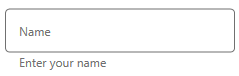
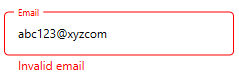
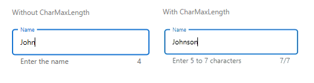

# Assistive Labels in WPF TextInputLayout (SfTextInputLayout)

Assistive labels provide additional information about the text entered in the control of the input view.

## Helper text

Helper text provides additional guidance on the `Input` field, such as `How to use it?` and can be set using the `HelperText` property.

 

 

<inputLayout:SfTextInputLayout
  Hint="Name"
  HelperText="Enter your name">
  <TextBox />
</inputLayout:SfTextInputLayout>   



 

var inputLayout = new SfTextInputLayout();
inputLayout.Hint = "Name";
inputLayout.HelperText = "Enter your name";
inputLayout.InputView = new TextBox(); 





### Helper text visibility

We can specify the display state of the helper text using the `HelperTextVisibility` property, the type of which is [`Visibility`](https://docs.microsoft.com/en-us/dotnet/api/system.windows.visibility?view=netframework-4.8).

## Error message

If the text `Input` is not acknowledged, the troubleshooting instructions will be shown in the error message. Error messages are shown below the input line until the correct text has been entered. It can be set using the `ErrorText` property, but it will only be shown when the `HasError` property is set to `true`.

 

 

<inputLayout:SfTextInputLayout
    Hint="Email" 
    HelperText="Enter your email address"
    ErrorText="Invalid email"
    HasError="true">
    <TextBox />
</inputLayout:SfTextInputLayout>  
 



 

var inputLayout = new SfTextInputLayout();
inputLayout.Hint = "Email";
inputLayout.HelperText = "Enter your email address";
inputLayout.ErrorText = "Invalid email";
inputLayout.HasError = true; 
inputLayout.InputView = new TextBox(); 





N> Error validations should be done in the application level.

## Character counter
Character counter is used when characters need to be limited. Use the `CharMaxLength` property to set the limit for characters. We can specify the display state of the character count using the `CharCountVisibility` property, the type of which is [`Visibility`](https://docs.microsoft.com/en-us/dotnet/api/system.windows.visibility?view=netframework-4.8).

 

 

<inputLayout:SfTextInputLayout
    Hint="Name" 
    CharCountVisibility="Visible"
    CharMaxLength="7"
    HelperText="Enter 5 to 7 characters">
    <TextBox />
</inputLayout:SfTextInputLayout> 
  



 

var inputLayout = new SfTextInputLayout();
inputLayout.Hint = "Name";
inputLayout.CharMaxLength = 7;
inputLayout.CharCountVisibility = Visiblity.Visible;
inputLayout.HelperText = "Enter 5 to 7 characters";
inputLayout.InputView = new TextBox(); 





N> When the number of characters to be entered in the input view exceeds the `CharMaxLength`, the `ErrorForeground` value will be applied to the hint label, base line, border and counter label.

