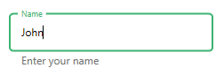
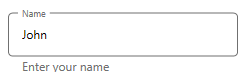
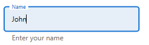
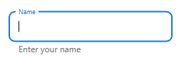

# Customization in WPF TextInputLayout (SfTextInputLayout)

Based on the text input layout state, the colors will be applied to the hint label, base line, border and assistive labels.

## Focused color

When the input view is focused, the value of the `FocusedForeground` property will be added to the hint label, base line and border.

I> The cursor color of the input view is the same as the `Accent` color of the  application.

 

 

<inputLayout:SfTextInputLayout
    Hint="User name" 
    FocusedForeground="Green"
    HelperText="Enter your name"
 <TextBox Text="John" />
</inputLayout:SfTextInputLayout>  
 


 

var inputLayout = new SfTextInputLayout();
inputLayout.Hint = "User name";
inputLayout.FocusedForeground = Brushes.Green;
inputLayout.InputView = new TextBox() { Text = "John" }; 





N> The current active color of the text input layout can be obtained from the `ActiveForeground` property.

Since error is not a state, the error color will not be set to `ActiveForeground` when `HasError` property is set to `true`.

## Unfocused color

When the input view is unfocused, the `Foreground` property value will be applied to the hint label, base line and border.

 

 

<inputLayout:SfTextInputLayout
    Hint="User name" 
    Foreground="Gray"
    HelperText="Enter your name"
 <TextBox Text="John" />
</inputLayout:SfTextInputLayout>  
 


 

var inputLayout = new SfTextInputLayout();
inputLayout.Hint = "User name";
inputLayout.Foreground = Brushes.Gray;
inputLayout.InputView = new TextBox() { Text = "John" }; 





## Error color

When the input layout is set to error state, the `ErrorForeground` property value will be added to the hint label, base line, border and error text.

 

 

<inputLayout:SfTextInputLayout
    Hint="Name" 
    ErrorForeground="Red"
    ErrorText="Should not contain special characters"
    HasError="True">
    <TextBox Text="John/" />
</inputLayout:SfTextInputLayout>  
 


 

var inputLayout = new SfTextInputLayout();
inputLayout.Hint = "Name";
inputLayout.ErrorForeground = Brushes.Red;
inputLayout.ErrorText = "Should not contain special characters";
inputLayout.HasError = true;
inputLayout.InputView = new TextBox() { Text = "John/" }; 





## Container color
The color of the container can be customized by setting the `ContainerBackground` property. It is applicable when the `ContainerType` property is set to `Filled` and `Outlined`.

 

 

<inputLayout:SfTextInputLayout
    Hint="Name" 
    FocusedForeground="Blue"
    ContainerType="Outlined"
    ContainerBackground="LightBlue">
    <TextBox Text="John" />
</inputLayout:SfTextInputLayout>  
 


 

var inputLayout = new SfTextInputLayout();
inputLayout.Hint = "Name";
inputLayout.FocusedColor = Brushes.Blue;
inputLayout.ContainerBackground = Brushes.LightBlue;
inputLayout.ContainerType = ContainerType.Outlined;
inputLayout.InputView = new Entry() { TextBox = "John" }; 





N> Container color is not applicable for `None' type.

## Outline corner radius

The corner radius of the outlined border can be customized by setting `OutlineCornerRadius` property.





<inputLayout:SfTextInputLayout
    Hint="Name" 
    ContainerType="Outlined"
    OutlineCornerRadius="8">
    <TextBox />
</inputLayout:SfTextInputLayout>  
			




var inputLayout = new SfTextInputLayout();
inputLayout.Hint = "Name";
inputLayout.ContainerType = ContainerType.Outlined;
inputLayout.OutlineCornerRadius = 8;
inputLayout.InputView = new TextBox(); 





>**NOTE**
It is only applicable to the `Outlined` type of container.
