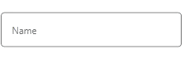

# Getting Started with WPF TextInputLayout (SfTextInputLayout)

This section explains the steps needed to configure the control of the text input layout.

## Adding TextInputLayout reference

Refer to this [document](https://help.syncfusion.com/wpf/add-syncfusion-controls) to learn how to add Syncfusion controls in Visual Studio projects through various ways. Refer to this [document](https://help.syncfusion.com/wpf/control-dependencies) to learn about the assemblies required for adding TextInputLayout to your project.

## Initialize TextInputLayout

Import the namespace of the text input layout as shown in the following code snippet.

 

 

xmlns:inputLayout="clr-namespace:Syncfusion.UI.Xaml.TextInputLayout;assembly=Syncfusion.SfTextInputLayout.WPF"



 

using Syncfusion.UI.Xaml.TextInputLayout;



 

You can either use the below schemas or the above mentioned namespace to refer the TextInputLayout control in xaml.

 

 

xmlns:inputLayout="http://schemas.syncfusion.com/wpf"



 

Then, initialize the text input layout as demonstrated in the following code snippet.

 

 

 <inputLayout:SfTextInputLayout>
 <TextBox/>
 </inputLayout:SfTextInputLayout>



 

 SfTextInputLayout inputLayout = new SfTextInputLayout();
 inputLayout.InputView = new TextBox();



 

## Adding hint

Floating label for the text input layout can be added by setting the `Hint` property. We can specify the display state of the hint label using the `HintVisibility` property, the type of which is [`Visibility`](https://docs.microsoft.com/en-us/dotnet/api/system.windows.visibility?view=netframework-4.8).
 

 

<inputLayout:SfTextInputLayout
   Hint="Name">
   <TextBox />
</inputLayout:SfTextInputLayout>  



 

var inputLayout = new SfTextInputLayout();
inputLayout.Hint = "Name"; 
inputLayout.InputView = new TextBox(); 





When focusing the input view, the hint label will be moved to the top position; it will be returned to the original position when proceeding further (on unfocused) without entering any value.

Run the project, and check if you get following output to make sure that the project has been configured properly to add the text input layout control.

## Theme

SfTextInputLayout supports various built-in themes. Refer to the below links to apply themes for the SfTextInputLayout,

  * [Apply theme using SfSkinManager](https://help.syncfusion.com/wpf/themes/skin-manager)
	
  * [Create a custom theme using ThemeStudio](https://help.syncfusion.com/wpf/themes/theme-studio#creating-custom-theme)

  
