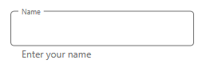

# Hint Position in WPF TextInputLayout (SfTextInputLayout)

We can decide how the floating label will display by setting the `HintFloatMode` property.

>**NOTE**
The default value of the `HintFloatMode` is `Float`.

## Float

The hint label will be float to the top of input view get focused.

 

 

<inputLayout:SfTextInputLayout 
    Hint="Name"
    HintFloatMode="Float" 
    HelperText="Enter your name">
    <TextBox />
</inputLayout:SfTextInputLayout>
 


 

var inputLayout = new SfTextInputLayout();
inputLayout.Hint = "Name";
inputLayout.HintFloatMode = HintFloatMode.Float;
inputLayout.HelperText= "Enter your name";
inputLayout.InputView = new TextBox(); 





## AlwaysFloat

The hint label will be positioned always at the top of input view.

 

 

 <inputLayout:SfTextInputLayout 
    Hint="Name"
    HintFloatMode="AlwaysFloat" 
    HelperText="Enter your name">
    <TextBox />
</inputLayout:SfTextInputLayout>



 

var inputLayout = new SfTextInputLayout();
inputLayout.Hint = "Name";
inputLayout.HintFloatMode = HintFloatMode.AlwaysFloat;
inputLayout.HelperText= "Enter your name";
inputLayout.InputView = new TextBox(); 





## None

The hint label will be hidden when the input view is focused.

 

 

<inputLayout:SfTextInputLayout 
    Hint="Name"
    HintFloatMode= "None"
    HelperText="Enter your name">
    <TextBox />
</inputLayout:SfTextInputLayout> 
 



 

var inputLayout = new SfTextInputLayout();
inputLayout.Hint = "Name";
inputLayout.HintFloatMode = HintFloatMode.None;
inputLayout.HelperText= "Enter your name";
inputLayout.InputView = new TextBox(); 





