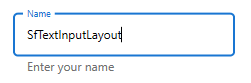
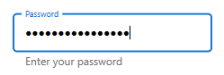

# Supported input views

Input views can be added to the text input layout control by setting the [InputView](https://help.syncfusion.com/cr/wpf/Syncfusion.UI.Xaml.TextInputLayout.SfTextInputLayout.html#Syncfusion_UI_Xaml_TextInputLayout_SfTextInputLayout_InputView) property. To reduce the XAML syntax, the [InputView](https://help.syncfusion.com/cr/wpf/Syncfusion.UI.Xaml.TextInputLayout.SfTextInputLayout.html#Syncfusion_UI_Xaml_TextInputLayout_SfTextInputLayout_InputView) property is applied with the ContentPropertyAttribute. The [SfTextInputLayout](https://help.syncfusion.com/cr/wpf/Syncfusion.UI.Xaml.TextInputLayout.html) has the following controls as the supported input views.

* TextBox 

* PasswordBox

* ComboBox

* [`ComboBoxAdv`](https://help.syncfusion.com/wpf/combobox/overview)

* [`SfTextBoxExt`](https://help.syncfusion.com/wpf/autocomplete/overview)

## TextBox

You can enter the text as an input by adding the [TextBox](https://docs.microsoft.com/en-us/dotnet/desktop/wpf/controls/textbox-overview?view=netframeworkdesktop-4.8) in the [SfTextInputLayout](https://help.syncfusion.com/cr/wpf/Syncfusion.UI.Xaml.TextInputLayout.html).

 

 

         <inputLayout:SfTextInputLayout Hint="Name" HelperText="Enter your name">
            <TextBox/>
        </inputLayout:SfTextInputLayout>



 

         SfTextInputLayout inputLayout = new SfTextInputLayout();
         inputLayout.Hint = "Name";
         inputLayout.HelperText = "Enter your name";
         inputLayout.InputView = new TextBox();
         this.Content = inputLayout;
			




## PasswordBox

You can enter the password characters as an input by adding the [PasswordBox](https://docs.microsoft.com/en-us/dotnet/api/system.windows.controls.passwordbox?view=netcore-3.1) in the [SfTextInputLayout](https://help.syncfusion.com/cr/wpf/Syncfusion.UI.Xaml.TextInputLayout.html).

 

 

        <inputLayout:SfTextInputLayout Hint="Password" HelperText="Enter your password">
            <PasswordBox/>
        </inputLayout:SfTextInputLayout>



 

         SfTextInputLayout inputLayout = new SfTextInputLayout();
         inputLayout.Hint = "Password";
         inputLayout.HelperText = "Enter your password";
         inputLayout.InputView = new PasswordBox();
         this.Content = inputLayout;





## ComboBox

You can use the [`ComboBox`](https://docs.microsoft.com/en-us/dotnet/desktop/wpf/controls/combobox?view=netframeworkdesktop-4.8) control as an input in the [`SfTextInputLayout`](https://help.syncfusion.com/cr/wpf/Syncfusion.UI.Xaml.TextInputLayout.html).

 

 

        <inputLayout:SfTextInputLayout Hint="Name" VerticalAlignment="Center" HorizontalAlignment="Center">
            <ComboBox x:Name="comboBox" Width="150" Height="10"  ItemsSource="{Binding Countries}"/>
        </inputLayout:SfTextInputLayout>



 

            SfTextInputLayout sfTextInputLayout = new SfTextInputLayout() { Hint = "Name" };
            sfTextInputLayout.HorizontalAlignment = HorizontalAlignment.Center;
            sfTextInputLayout.VerticalAlignment = VerticalAlignment.Center;
            ComboBox comboBox = new ComboBox();
            comboBox.Width = 150;
            comboBox.Height = 10;
            comboBox.ItemsSource = viewModel.Countries;
            sfTextInputLayout.InputView = comboBox;
            this.Content = sfTextInputLayout;





## ComboBoxAdv

You can use the [`ComboBoxAdv`](https://help.syncfusion.com/wpf/combobox/overview) control as an input in the [`SfTextInputLayout`](https://help.syncfusion.com/cr/wpf/Syncfusion.UI.Xaml.TextInputLayout.html).

 

 

        <inputLayout:SfTextInputLayout Hint="Name" VerticalAlignment="Center" HorizontalAlignment="Center">
            <inputLayout:ComboBoxAdv x:Name="comboBox" ItemsSource="{Binding Countries}" Width="150" Height="10"/>
        </inputLayout:SfTextInputLayout>



 

            SfTextInputLayout sfTextInputLayout = new SfTextInputLayout() { Hint = "Name" };
            sfTextInputLayout.HorizontalAlignment = HorizontalAlignment.Center;
            sfTextInputLayout.VerticalAlignment = VerticalAlignment.Center;
            ComboBoxAdv comboBox = new ComboBoxAdv();
            comboBox.Width = 150;
            comboBox.Height = 10;
            comboBox.ItemsSource = viewModel.Countries;
            sfTextInputLayout.InputView = comboBox;
            this.Content = sfTextInputLayout;





## Autocomplete (SfTextBoxExt)

You can use the [`SfTextBoxExt`](https://help.syncfusion.com/wpf/autocomplete/overview) control to enter the text as an input in the [`SfTextInputLayout`](https://help.syncfusion.com/cr/wpf/Syncfusion.UI.Xaml.TextInputLayout.html).

 

 

       <inputLayout:SfTextInputLayout Hint="Name" VerticalAlignment="Center" HorizontalAlignment="Center">
            <inputLayout:SfTextBoxExt AutoCompleteMode="Suggest" Width="250" 
                                      AutoCompleteSource="{Binding Countries}">

            </inputLayout:SfTextBoxExt>
        </inputLayout:SfTextInputLayout>



 

       SfTextInputLayout sfTextInputLayout = new SfTextInputLayout() { Hint = "Name" };
            sfTextInputLayout.HorizontalAlignment = HorizontalAlignment.Center;
            sfTextInputLayout.VerticalAlignment = VerticalAlignment.Center;

            SfTextBoxExt sfTextBoxExt = new SfTextBoxExt();
            sfTextBoxExt.AutoCompleteMode = AutoCompleteMode.Suggest;
            sfTextBoxExt.Width = 250;
            sfTextBoxExt.AutoCompleteSource = viewModel.Countries;
            sfTextInputLayout.InputView = sfTextBoxExt;
            this.Content = sfTextInputLayout;





