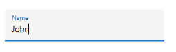

# Container Type in WPF TextInputLayout (SfTextInputLayout)

Containers enhance the discoverability of the input view by creating a contrast between the input view and the assistive elements.

N> The default value of the `ContainerType` is `Outlined`.

## Outlined

The container will be covered with a rounded border.

 

 

<inputLayout:SfTextInputLayout
    Hint="Name" 
    ContainerType="Outlined">
    <TextBox Text="John" />
</inputLayout:SfTextInputLayout>  
 



 

var inputLayout = new SfTextInputLayout();
inputLayout.Hint = "Name";
inputLayout.ContainerType = ContainerType.Outlined;
inputLayout.InputView = new TextBox() { Text = "John" }; 





## Filled

The background of the input view will be filled with container color, and the base line stroke and thickness will be changed based on the state of the input view.

 

 

<inputLayout:SfTextInputLayout
    Hint="Name" 
    ContainerType="Filled">
    <TextBox Text="John" />
</inputLayout:SfTextInputLayout>  



 

var inputLayout = new SfTextInputLayout();
inputLayout.Hint = "Name";
inputLayout.ContainerType = ContainerType.Filled;
inputLayout.InputView = new TextBox() { Text = "John" }; 





## None

The container will have an empty background and enough space.

 

 

<inputLayout:SfTextInputLayout
    Hint="Name" 
    ContainerType="None">
    <TextBox Text="John" />
</inputLayout:SfTextInputLayout>  
 



 

var inputLayout = new SfTextInputLayout();
inputLayout.Hint = "Name";
inputLayout.ContainerType = ContainerType.None;
inputLayout.InputView = new TextBox() { Text = "John" }; 





