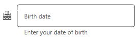
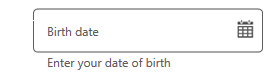

# Custom Icons in WPF TextInputLayout (SfTextInputLayout)

Any custom icons can be added to the leading edge or the trailing edge of the input view in the text input layout control. Events and commands linked to custom icons should be handled at the application level.

Unicode or font icons for labels can be shown as icons.

## Leading view

A label can be added as a leading icon to the input view by setting the `LeadingView` property. It can be placed inside or outside the container by setting the `LeadingViewPosition` property. By default, it is placed `Outside`.

 

 

<inputLayout:SfTextInputLayout
    Hint="Birth date"
    LeadingViewPosition="Inside" >
    <TextBox />
    <inputLayout:SfTextInputLayout.LeadingView>
       <Label
           FontFamily="/Assets/Sync FontIcons.ttf#Sync FontIcons"
           Text="&#x1F5D3;">     
       </Label>
    </inputLayout:SfTextInputLayout.LeadingView>
 </inputLayout:SfTextInputLayout> 



 

var inputLayout = new SfTextInputLayout();
inputLayout.Hint = "Birth date";
inputLayout.LeadingViewPosition = ViewPosition.Inside;
inputLayout.LeadingView = new Label() { Text = "\U0001F5D3" };
inputLayout.InputView = new TextBox(); 





## Trailing  view

A label can be added as a trailing icon to the input view by setting the `TrailingView` property. It can be placed either inside or outside the input view container by setting the `TrailingViewPosition` property. By default, it is placed `Inside`.



 

<inputLayout:SfTextInputLayout
    Hint="Birth date"
    TrailingViewPosition="Outside">
    <TextBox  />
    <inputLayout:SfTextInputLayout.TrailingView>
      <Label
         FontFamily="/Assets/Sync FontIcons.ttf#Sync FontIcons"
         Text="&#x1F5D3;">     
      </Label>
    </inputLayout:SfTextInputLayout.TrailingView>
 </inputLayout:SfTextInputLayout> 



 

var inputLayout = new SfTextInputLayout();
inputLayout.Hint = "Birth date";
inputLayout.TrailingViewPosition = ViewPosition.Outside; 
inputLayout. TrailingView = new Label() { Text = "\U0001F5D3" };
inputLayout.InputView = new TextBox(); 





