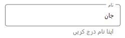

# Right-to-Left

The TextInputLayout supports to change the flow of text to the right-to-left direction by setting the `FlowDirection` to `RightToLeft`.




    <inputLayout:SfTextInputLayout
            x:Name="textinputlayout" 
            FlowDirection="RightToLeft"
            ContainerType="Outlined"
            Hint="نام"  
            HelperText="اپنا نام درج کریں" >
            <TextBox Text="جانسن" />
    </inputLayout:SfTextInputLayout>




textinputlayout.FlowDirection = FlowDirection.RightToLeft;
textinputlayout.ContainerType = ContainerType.Outlined;
textinputlayout.Hint = "نام";
textinputlayout.HelperText = "اپنا نام درج کریں";
textinputlayout.InputView = new TextBox() { Text = "جانسن"}; 




