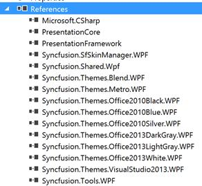

# Apply themes at run time

The built-in themes can be changed at runtime using the `VisualStyle` property. The controls can be used to switch various built-in themes at run time. For example, a `ComboBox` control is used to switch various built-in themes added as reference to the project.





<Grid>
    <Grid.RowDefinitions>
        <RowDefinition Height="20"></RowDefinition>
        <RowDefinition Height="*"></RowDefinition>
    </Grid.RowDefinitions>
    <ComboBox SelectionChanged="ComboBox_SelectionChanged">
        <ComboBoxItem>MaterialLight</ComboBoxItem>
        <ComboBoxItem>MaterialDark</ComboBoxItem>
        <ComboBoxItem>MaterialLightBlue</ComboBoxItem>
        <ComboBoxItem>MaterialDarkBlue</ComboBoxItem>
        <ComboBoxItem>Office2019Colorful</ComboBoxItem>
        <ComboBoxItem>Office2019Black</ComboBoxItem>
        <ComboBoxItem>Metro</ComboBoxItem>
        <ComboBoxItem>Blend</ComboBoxItem>
        <ComboBoxItem>Lime</ComboBoxItem>
        <ComboBoxItem>Saffron</ComboBoxItem>
        <ComboBoxItem>Office2016Colorful</ComboBoxItem>
        <ComboBoxItem>Office2016White</ComboBoxItem>
        <ComboBoxItem>Office2016DarkGray</ComboBoxItem>
        <ComboBoxItem>Office365</ComboBoxItem>
        <ComboBoxItem>VisualStudio2015</ComboBoxItem>
        <ComboBoxItem>VisualStudio2013</ComboBoxItem>
        <ComboBoxItem>Office2013White</ComboBoxItem>
        <ComboBoxItem>Office2013DarkGray</ComboBoxItem>
        <ComboBoxItem>Office2013LightGray</ComboBoxItem>
        <ComboBoxItem>Office2010Black</ComboBoxItem>
        <ComboBoxItem>Office2010Blue</ComboBoxItem>
        <ComboBoxItem>Office2010Silver</ComboBoxItem>
    </ComboBox>
    <syncfusion:DockingManager Grid.Row="1" x:Name="SyncDockingManager" UseDocumentContainer="True" PersistState="True" >
        <ContentControl x:Name="SolutionExplorer" syncfusion:DockingManager.Header="Solution Explorer"
                                          syncfusion:DockingManager.SideInDockedMode="Right"/>
        <ContentControl x:Name="ToolBox" syncfusion:DockingManager.Header="Toolbox"
                                 syncfusion:DockingManager.State="AutoHidden" />
        <ContentControl x:Name="Properties" syncfusion:DockingManager.Header="Properties"
                                    syncfusion:DockingManager.State="Float" />
        <ContentControl x:Name="Output" syncfusion:DockingManager.Header="Output"
                syncfusion:DockingManager.SideInDockedMode="Tabbed"
				syncfusion:DockingManager.TargetNameInDockedMode="SolutionExplorer"/>
        <ContentControl x:Name="StartPage" syncfusion:DockingManager.Header="Start Page" syncfusion:DockingManager.State="Document"/>
    </syncfusion:DockingManager>
</Grid>









private void ComboBox_SelectionChanged(object sender, SelectionChangedEventArgs e)
{
	SfSkinManager.SetVisualStyle(this,(VisualStyles)Enum.Parse(typeof(VisualStyles),((sender as ComboBox).SelectedItem as ComboBoxItem).Content.ToString()));
}





Private Sub ComboBox_SelectionChanged(ByVal sender As Object, ByVal e As SelectionChangedEventArgs)
	SfSkinManager.SetVisualStyle(Me,CType(System.Enum.Parse(GetType(VisualStyles),(TryCast((TryCast(sender, ComboBox)).SelectedItem, ComboBoxItem)).Content.ToString()), VisualStyles))
End Sub




