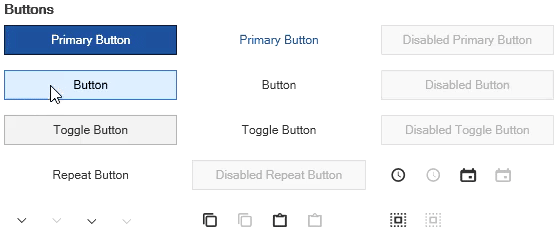

# Keyboard Focus Visual in WPF Skin Manager

The [WPF Skin Manager](https://help.syncfusion.com/cr/wpf/Syncfusion.SfSkinManager.SfSkinManager.html) allows you to apply various keyboard focus visual styles for both Syncfusion&reg; and Framework controls using the [FocusVisualKind](https://help.syncfusion.com/cr/wpf/Syncfusion.SfSkinManager.Theme.html#Syncfusion_SfSkinManager_Theme_FocusVisualKind) property. 

The [FocusVisualKind](https://help.syncfusion.com/cr/wpf/Syncfusion.SfSkinManager.FocusVisualKind.html) enum contains the following values:

* `Default` - The default keyboard focus visual style will be applied.
* `HighVisibility` - High visibility keyboard visual feedback is an effect that shows a border for focusable elements when the user moves the keyboard focus to that element. 

N> The `HighVisibility` keyboard focus visual is enabled by default in the Fluent theme.





public partial class MainWindow : ChromelessWindow
{
    public MainWindow()
    {
        SfSkinManager.SetTheme(this, new Theme() { ThemeName = "MaterialDark", FocusVisualKind = FocusVisualKind.HighVisibility });
        InitializeComponent();            
    }        
}





N> [View sample in GitHub](https://github.com/SyncfusionExamples/change-focusvisualkind-using-skinmanager).

