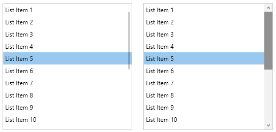

# Windows 10 Compact ScrollBar - Touch ScrollBars

The [SfSkinManager](https://help.syncfusion.com/cr/wpf/Syncfusion.SfSkinManager.SfSkinManager.html) helps to apply various scrollbar styles like windows 10 compact scrollbar for both syncfusion and framework controls using [ScrollBarMode](https://help.syncfusion.com/cr/wpf/Syncfusion.SfSkinManager.Theme.html#Syncfusion_SfSkinManager_Theme_ScrollBarMode) property which will be available only in [themes supported from theme studio](https://help.syncfusion.com/wpf/themes/skin-manager#themes-list).

The [ScrollBarMode](https://help.syncfusion.com/cr/wpf/Syncfusion.SfSkinManager.ScrollBarMode.html) enum has below values,

* `Default` - The ScrollBar will be displayed with default look of thumb along with up/down arrow to scroll.
* `Compact` - The window 10 like compact scrollbar will have look of thin layer of thumb until user hover the scrollbar area. 

N> The `Compact` scrollbar mode is enabled by default in [WPF Fluent Theme](https://help.syncfusion.com/wpf/themes/fluent-theme). 





public partial class MainWindow : ChromelessWindow
{
    public MainWindow()
    {
        SfSkinManager.SetTheme(this, new Theme() { ThemeName = "MaterialDark", ScrollBarMode = ScrollBarMode.Compact });
        InitializeComponent();            
    }        
}





N> [View sample in GitHub](https://github.com/SyncfusionExamples/change-scrollbar-mode-using-skinmanager).

