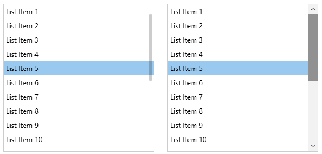

# ScrollBar Mode in WPF Skin Manager

The [SfSkinManager](https://help.syncfusion.com/cr/wpf/Syncfusion.SfSkinManager.SfSkinManager.html) allows you to apply various scrollbar styles like Windows 10 compact scrollbar, for both Syncfusion&reg; and Framework controls using the [ScrollBarMode](https://help.syncfusion.com/cr/wpf/Syncfusion.SfSkinManager.Theme.html#Syncfusion_SfSkinManager_Theme_ScrollBarMode) property, which will be available only in [themes supported by theme studio](https://help.syncfusion.com/wpf/themes/skin-manager#themes-list).

The [ScrollBarMode](https://help.syncfusion.com/cr/wpf/Syncfusion.SfSkinManager.ScrollBarMode.html) enum contains the following values:

* `Default` - The ScrollBar will be displayed with the default look of a thumb along with up and down arrow to scroll.
* `Compact` - The Windows 10 like compact scrollbar will have the look of a thin layer of thumb until the user hovers over the scrollbar area. 

N> The `Compact` scrollbar mode is enabled by default in the [WPF Fluent Theme](https://help.syncfusion.com/wpf/themes/fluent-theme) and WPF Windows11 Theme. 





public partial class MainWindow : ChromelessWindow
{
    public MainWindow()
    {
        SfSkinManager.SetTheme(this, new Theme() { ThemeName = "MaterialDark" });
        SkinManagerHelper.SetScrollBarMode(this, ScrollBarMode.Compact);
        InitializeComponent();            
    }        
}





N> [View sample in GitHub](https://github.com/SyncfusionExamples/change-scrollbar-mode-using-skinmanager).

