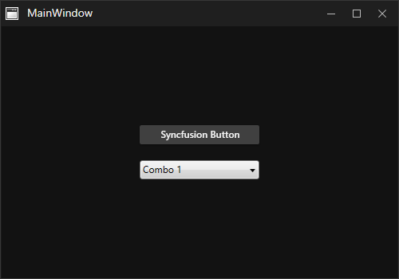
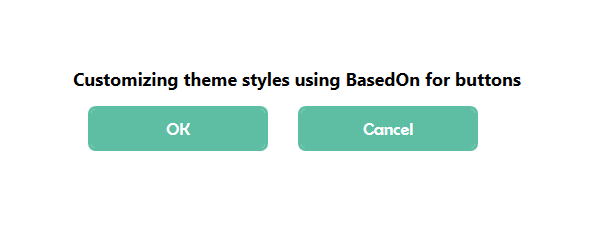
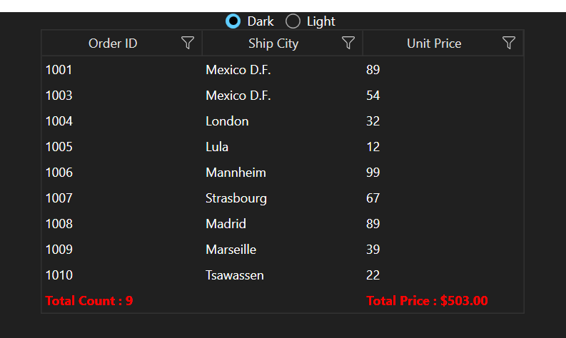

# Getting Started with WPF Skin Manager

The [SfSkinManager](https://help.syncfusion.com/cr/wpf/Syncfusion.SfSkinManager.SfSkinManager.html) helps you to apply the themes for both Syncfusion and Framework controls. There are 27 built-in themes that can be applied using the `SfSkinManager` for a rich user interface experience. Some of the built-in themes color derivations can be customized using [WPF Theme Studio](https://help.syncfusion.com/wpf/themes/theme-studio).

N> Theme Studio-based themes provide improved consistency and uniqueness among various controls when compared to other themes. It is preferable to use Theme Studio-based themes in the application over other themes. 

## Themes list

The following table lists the available themes as well as the assembly or NuGet reference to be used in the application. 

<table>
<tr>
<th>
Styles</th><th>
Assembly</th><th>
NuGet package</th></tr>
<tr>
<td>
Windows11Light</td><td>
Syncfusion.Themes.Windows11Light.Wpf.dll</td><td>
{{'[Syncfusion.Themes.Windows11Light.WPF](https://www.nuget.org/packages/Syncfusion.Themes.Windows11Light.WPF/)'| markdownify }}
</td></tr>
<tr>
<td>
Windows11Dark</td><td>
Syncfusion.Themes.Windows11Dark.Wpf.dll</td><td>
{{'[Syncfusion.Themes.Windows11Dark.WPF](https://www.nuget.org/packages/Syncfusion.Themes.Windows11Dark.WPF/)'| markdownify }}
</td></tr>
<tr>
<td>
FluentLight</td><td>
Syncfusion.Themes.FluentLight.Wpf.dll</td><td>
{{'[Syncfusion.Themes.FluentLight.WPF](https://www.nuget.org/packages/Syncfusion.Themes.FluentLight.WPF/)'| markdownify }}
</td></tr>
<tr>
<td>
FluentDark</td><td>
Syncfusion.Themes.FluentDark.Wpf.dll</td><td>
{{'[Syncfusion.Themes.FluentDark.WPF](https://www.nuget.org/packages/Syncfusion.Themes.FluentDark.WPF/)'| markdownify }}
</td></tr>
<tr>
<td>
MaterialLight</td><td>
Syncfusion.Themes.MaterialLight.Wpf.dll</td><td>
{{'[Syncfusion.Themes.MaterialLight.WPF](https://www.nuget.org/packages/Syncfusion.Themes.MaterialLight.WPF/)'| markdownify }}
</td></tr>
<tr>
<td>
MaterialDark</td><td>
Syncfusion.Themes.MaterialDark.Wpf.dll</td><td>
{{'[Syncfusion.Themes.MaterialDark.WPF](https://www.nuget.org/packages/Syncfusion.Themes.MaterialDark.WPF/)'| markdownify }}
</td></tr>
<tr>
<td>
MaterialLightBlue</td><td>
Syncfusion.Themes.MaterialLightBlue.Wpf.dll</td><td>
{{'[Syncfusion.Themes.MaterialLightBlue.WPF](https://www.nuget.org/packages/Syncfusion.Themes.MaterialLightBlue.WPF/)'| markdownify }}
</td></tr>
<tr>
<td>
MaterialDarkBlue</td><td>
Syncfusion.Themes.MaterialDarkBlue.Wpf.dll</td><td>
{{'[Syncfusion.Themes.MaterialDarkBlue.WPF](https://www.nuget.org/packages/Syncfusion.Themes.MaterialDarkBlue.WPF/)'| markdownify }}
</td></tr>
<tr>
<td>
Office2019Colorful</td><td>
Syncfusion.Themes.Office2019Colorful.Wpf.dll</td><td>
{{'[Syncfusion.Themes.Office2019Colorful.WPF](https://www.nuget.org/packages/Syncfusion.Themes.Office2019Colorful.WPF/)'| markdownify }}
</td></tr>
<tr>
<td>
Office2019Black</td><td>
Syncfusion.Themes.Office2019Black.Wpf.dll</td><td>
{{'[Syncfusion.Themes.Office2019Black.WPF](https://www.nuget.org/packages/Syncfusion.Themes.Office2019Black.WPF/)'| markdownify }}
</td></tr>
<tr>
<td>
Office2019White</td><td>
Syncfusion.Themes.Office2019White.Wpf.dll</td><td>
{{'[Syncfusion.Themes.Office2019White.WPF](https://www.nuget.org/packages/Syncfusion.Themes.Office2019White.WPF/)'| markdownify }}
</td></tr>
<tr>
<td>
Office2019DarkGray</td><td>
Syncfusion.Themes.Office2019DarkGray.Wpf.dll</td><td>
{{'[Syncfusion.Themes.Office2019DarkGray.WPF](https://www.nuget.org/packages/Syncfusion.Themes.Office2019DarkGray.WPF/)'| markdownify }}
</td></tr>
<tr>
<td>
Office2019HighContrast</td><td>
Syncfusion.Themes.Office2019HighContrast.Wpf.dll</td><td>
{{'[Syncfusion.Themes.Office2019HighContrast.WPF](https://www.nuget.org/packages/Syncfusion.Themes.Office2019HighContrast.WPF/)'| markdownify }}
</td></tr>
<tr>
<td>
Office2019HighContrastWhite</td><td>
Syncfusion.Themes.Office2019HighContrastWhite.Wpf.dll</td><td>
{{'[Syncfusion.Themes.Office2019HighContrastWhite.WPF](https://www.nuget.org/packages/Syncfusion.Themes.Office2019HighContrastWhite.WPF/)'| markdownify }}
</td></tr>
<tr>
<td>
SystemTheme</td><td>
Syncfusion.Themes.SystemTheme.Wpf.dll</td><td>
{{'[Syncfusion.Themes.SystemTheme.WPF](https://www.nuget.org/packages/Syncfusion.Themes.SystemTheme.WPF/)'| markdownify }}
</td></tr>
<tr>
<td>
Metro</td><td>
Syncfusion.Themes.Metro.Wpf.dll</td><td>
{{'[Syncfusion.Themes.Metro.WPF](https://www.nuget.org/packages/Syncfusion.Themes.Metro.WPF/)'| markdownify }}
</td></tr>
<tr>
<td>
Lime</td><td>
Syncfusion.Themes.Lime.Wpf.dll</td><td>
{{'[Syncfusion.Themes.Lime.WPF](https://www.nuget.org/packages/Syncfusion.Themes.Lime.WPF/)'| markdownify }}
</td></tr>
<tr>
<td>
Saffron</td><td>
Syncfusion.Themes.Saffron.Wpf.dll</td><td>
{{'[Syncfusion.Themes.Saffron.WPF](https://www.nuget.org/packages/Syncfusion.Themes.Saffron.WPF/)'| markdownify }}
</td></tr>
<tr>
<td>
Blend</td><td>
Syncfusion.Themes.Blend.Wpf.dll</td><td>
{{'[Syncfusion.Themes.Blend.WPF](https://www.nuget.org/packages/Syncfusion.Themes.Blend.WPF/)'| markdownify }}
</td></tr>
<tr>
<td>
Office2013White</td><td>
Syncfusion.Themes.Office2013White.Wpf.dll</td><td>
{{'[Syncfusion.Themes.Office2013White.WPF](https://www.nuget.org/packages/Syncfusion.Themes.Office2013White.WPF/)'| markdownify }}
</td></tr>
<tr>
<td>
Office2013LightGray</td><td>
Syncfusion.Themes.Office2013LightGray.Wpf.dll</td><td>
{{'[Syncfusion.Themes.Office2013LightGray.WPF](https://www.nuget.org/packages/Syncfusion.Themes.Office2013LightGray.WPF/)'| markdownify }}
</td></tr>
<tr>
<td>
Office2013DarkGray</td><td>
Syncfusion.Themes.Office2013DarkGray.Wpf.dll</td><td>
{{'[Syncfusion.Themes.Office2013DarkGray.WPF](https://www.nuget.org/packages/Syncfusion.Themes.Office2013DarkGray.WPF/)'| markdownify }}
</td></tr>
<tr>
<td>
VisualStudio2013</td><td>
Syncfusion.Themes.VisualStudio2013.Wpf.dll</td><td>
{{'[Syncfusion.Themes.VisualStudio2013.WPF](https://www.nuget.org/packages/Syncfusion.Themes.VisualStudio2013.WPF/)'| markdownify }}
</td></tr>
<tr>
<td>
Office2010Black</td><td>
Syncfusion.Themes.Office2010Black.Wpf.dll</td><td>
{{'[Syncfusion.Themes.Office2010Black.WPF](https://www.nuget.org/packages/Syncfusion.Themes.Office2010Black.WPF/)'| markdownify }}
</td></tr>
<tr>
<td>
Office2010Blue</td><td>
Syncfusion.Themes.Office2010Blue.Wpf.dll</td><td>
{{'[Syncfusion.Themes.Office2010Blue.WPF](https://www.nuget.org/packages/Syncfusion.Themes.Office2010Blue.WPF/)'| markdownify }}
</td></tr>
<tr>
<td>
Office2010Silver</td><td>
Syncfusion.Themes.Office2010Silver.Wpf.dll</td><td>
{{'[Syncfusion.Themes.Office2010Silver.WPF](https://www.nuget.org/packages/Syncfusion.Themes.Office2010Silver.WPF/)'| markdownify }}
</td></tr>
<tr>
<td>
Office365</td><td>
Syncfusion.Themes.Office365.Wpf.dll</td><td>
{{'[Syncfusion.Themes.Office365.WPF](https://www.nuget.org/packages/Syncfusion.Themes.Office365.WPF/)'| markdownify }}
</td></tr>
<tr>
<td>
Office2016Colorful</td><td>
Syncfusion.Themes.Office2016Colorful.Wpf.dll</td><td>
{{'[Syncfusion.Themes.Office2016Colorful.WPF](https://www.nuget.org/packages/Syncfusion.Themes.Office2016Colorful.WPF/)'| markdownify }}
</td></tr>
<tr>
<td>
Office2016White</td><td>
Syncfusion.Themes.Office2016White.Wpf.dll</td><td>
{{'[Syncfusion.Themes.Office2016White.WPF](https://www.nuget.org/packages/Syncfusion.Themes.Office2016White.WPF/)'| markdownify }}
</td></tr>
<tr>
<td>
Office2016DarkGray</td><td>
Syncfusion.Themes.Office2016DarkGray.Wpf.dll</td><td>
{{'[Syncfusion.Themes.Office2016DarkGray.WPF](https://www.nuget.org/packages/Syncfusion.Themes.Office2016DarkGray.WPF/)'| markdownify }}
</td></tr>
<tr>
<td>
VisualStudio2015</td><td>
Syncfusion.Themes.VisualStudio2015.Wpf.dll</td><td>
{{'[Syncfusion.Themes.VisualStudio2015.WPF](https://www.nuget.org/packages/Syncfusion.Themes.VisualStudio2015.WPF/)'| markdownify }}
</td></tr>
</table>

The following table lists the available themes supported in theme studio and alternative themes suggestions to be used in the application. 

<table>
<tr>
<th>
Styles</th><th>
Supported in ThemeStudio</th><th>
Alternative theme suggestion to use</th></tr>
<tr>
<td>
Windows11Light</td><td>
Yes</td><td>
-</td></tr>
<tr>
<td>
Windows11Dark</td><td>
Yes</td><td>
-</td></tr>
<tr>
<td>
FluentLight</td><td>
Yes</td><td>
-</td></tr>
<tr>
<td>
FluentDark</td><td>
Yes</td><td>
-</td></tr>
<tr>
<td>
MaterialLight</td><td>
Yes</td><td>
-</td></tr>
<tr>
<td>
MaterialDark</td><td>
Yes</td><td>
-</td></tr>
<tr>
<td>
MaterialLightBlue</td><td>
Yes</td><td>
-</td></tr>
<tr>
<td>
MaterialDarkBlue</td><td>
Yes</td><td>
-</td></tr>
<tr>
<td>
Office2019Colorful</td><td>
Yes</td><td>
-</td></tr>
<tr>
<td>
Office2019Black</td><td>
Yes</td><td>
-</td></tr>
<tr>
<td>
Office2019White</td><td>
Yes</td><td>
-</td></tr>
<tr>
<td>
Office2019DarkGray</td><td>
Yes</td><td>
-</td></tr>
<tr>
<td>
Office2019HighContrast</td><td>
Yes</td><td>
-</td></tr>
<tr>
<td>
Office2019HighContrastWhite</td><td>
Yes</td><td>
-</td></tr>
<tr>
<td>
SystemTheme</td><td>
Yes</td><td>
-</td></tr>
<tr>
<td>
Metro</td><td>
-</td><td>
FluentLight, Office2019Colorful</td></tr>
<tr>
<td>
Lime</td><td>
-</td><td>
FluentLight, Office2019Colorful</td></tr>
<tr>
<td>
Saffron</td><td>
-</td><td>
FluentLight, Office2019Colorful</td></tr>
<tr>
<td>
Blend</td><td>
-</td><td>
FluentDark, MaterialDark, Office2019Black</td></tr>
<tr>
<td>
Office2013White</td><td>
-</td><td>
Office2019White</td></tr>
<tr>
<td>
Office2013LightGray</td><td>
-</td><td>
Office2019Colorful</td></tr>
<tr>
<td>
Office2013DarkGray</td><td>
-</td><td>
Office2019DarkGray</td></tr>
<tr>
<td>
VisualStudio2013</td><td>
-</td><td>
-</td></tr>
<tr>
<td>
Office2010Black</td><td>
-</td><td>
-</td></tr>
<tr>
<td>
Office2010Blue</td><td>
-</td><td>
-</td></tr>
<tr>
<td>
Office2010Silver</td><td>
-</td><td>
-</td></tr>
<tr>
<td>
Office365</td><td>
-</td><td>
Office2019Colorful</td></tr>
<tr>
<td>
Office2016Colorful</td><td>
-</td><td>
Office2019Colorful</td></tr>
<tr>
<td>
Office2016White</td><td>
-</td><td>
Office2019White</td></tr>
<tr>
<td>
Office2016DarkGray</td><td>
-</td><td>
Office2019DarkGray</td></tr>
<tr>
<td>
VisualStudio2015</td><td>
-</td><td>
-</td></tr>
</table>

## Apply a theme to a control

### Add SkinManager reference

There are several ways for including the Syncfusion [SfSkinManager](https://help.syncfusion.com/cr/wpf/Syncfusion.SfSkinManager.SfSkinManager.html) reference in the Visual Studio WPF project. The following steps will help you to add by `XAML` Code:

1) Add a reference to the `Syncfusion.SfSkinManager.WPF` assembly or [Syncfusion.SfSkinManager.WPF nuget package](https://www.nuget.org/packages/Syncfusion.SfSkinManager.WPF/) to the project.
2) Import Syncfusion WPF schema `http://schemas.syncfusion.com/wpf` or the assembly namespace `Syncfusion.SfSkinManager` into a XAML page.





<Window
    xmlns="http://schemas.microsoft.com/winfx/2006/xaml/presentation"
    xmlns:x="http://schemas.microsoft.com/winfx/2006/xaml"
    xmlns:syncfusionskin ="clr-namespace:Syncfusion.SfSkinManager;assembly=Syncfusion.SfSkinManager.WPF"
    xmlns:syncfusion="http://schemas.syncfusion.com/wpf" />





### Add a theme assembly reference

The [SfSkinManager](https://help.syncfusion.com/cr/wpf/Syncfusion.SfSkinManager.SfSkinManager.html) supports to apply themes listed in [themes list](https://help.syncfusion.com/wpf/themes/skin-manager#themes-list). To use a theme in the application, add Reference to the corresponding theme assembly. For example, to apply `MaterialDark` theme, attach `Syncfusion.Themes.MaterialDark.Wpf` assembly or [NuGet](https://www.nuget.org/packages/Syncfusion.Themes.MaterialDark.WPF/) reference to the project. While applying a theme to a Window, SkinManager inherits the same theme to all the elements inside the Window.

### Set theme

Themes will be applied to both Syncfusion and Framework controls by using [Theme](https://help.syncfusion.com/cr/wpf/Syncfusion.SfSkinManager.SfSkinManager.html#Syncfusion_SfSkinManager_SfSkinManager_ThemeProperty) attached property of the [SfSkinManager](https://help.syncfusion.com/cr/wpf/Syncfusion.SfSkinManager.SfSkinManager.html). The theme assemblies have resource dictionaries with styles of controls. Thus, when the `Theme` property is set, the skin manager merges the theme resource dictionaries of an element to which the theme is applied and its descendants into the resource dictionary of the element to which the theme is applied or `Application.Current.Resource`.

N> While applying the theme to a Window or any element, `SkinManager` inherits the same theme to all its descendants.





<syncfusion:ChromelessWindow x:Class="DataGrid_Themes.MainWindow"
                             xmlns="http://schemas.microsoft.com/winfx/2006/xaml/presentation"
                             xmlns:x="http://schemas.microsoft.com/winfx/2006/xaml"
                             xmlns:local="clr-namespace:DataGrid_Themes"
                             xmlns:syncfusion="http://schemas.syncfusion.com/wpf"
							 xmlns:syncfusionskin ="clr-namespace:Syncfusion.SfSkinManager;assembly=Syncfusion.SfSkinManager.WPF"
                             Icon="App.ico"
                             Title="Getting Started"
                             WindowStartupLocation="CenterScreen"
                             syncfusionskin:SfSkinManager.Theme="{syncfusionskin:SkinManagerExtension ThemeName=MaterialDark}">

    <Grid DataContext="{StaticResource viewmodel}">
        <syncfusion:SfDataGrid Name="sfgrid" Margin="5"
                                       AutoGenerateColumns="False"
                                       AllowDraggingColumns="True"
                                       AllowEditing="True"
                                       LiveDataUpdateMode="AllowDataShaping"
                                       AllowFiltering="True"
                                       HeaderRowHeight="26"
                                       SelectionMode="Extended"
                                       ColumnSizer="Auto"
                                       ItemsSource="{Binding EmployeeDetails}">
        </syncfusion:SfDataGrid>
    </Grid>
</syncfusion:ChromelessWindow>





SfSkinManager.SetTheme(this, new Theme("MaterialDark"));





N> [View sample in GitHub](https://github.com/SyncfusionExamples/wpf-themes-demo-using-skinmanager).

## Apply a theme globally in the application

By default, [SfSkinManager](https://help.syncfusion.com/cr/wpf/Syncfusion.SfSkinManager.SfSkinManager.html) merges the required resource files from the theme assembly to the element to which the theme is applied. To apply a theme globally in an application, set the `ApplyStylesOnApplication` property to `True`. It merges all the theme resource files to `Application.Current.Resources`.

N> The `SfSkinManager.ApplyStylesOnApplication` static property should be set before `InitializeComponent` of the window or during application start up, when applying for multiple windows. 





SfSkinManager.ApplyStylesOnApplication = true;





## Customize theme colors and fonts in the application

To customize the theme colors and fonts in the application, call [RegisterThemeSettings](https://help.syncfusion.com/cr/wpf/Syncfusion.SfSkinManager.SfSkinManager.html#Syncfusion_SfSkinManager_SfSkinManager_RegisterThemeSettings_System_String_Syncfusion_SfSkinManager_IThemeSetting_) method and pass the theme name and respective theme setting instance as parameters.

Each theme supported by the theme studio has its own theme settings class, which begins with the prefix of the themes' name. For example, if the theme name is `MaterialDark`, then there will be theme settings class called `MaterialDarkThemeSettings`. 

N> Need to register theme settings before setting respective theme for window or control.

Please find the complete list of theme names, respective theme settings class, and supported palette.

<table>
<tr>
<th>
Styles/Theme name</th><th>
Respective theme settings class to customize</th>
<th>Supported palette</th>
</tr>
<tr>
<td>
Windows11Light</td><td>
{{'[Windows11LightThemeSettings](https://help.syncfusion.com/cr/wpf/Syncfusion.Themes.Windows11Light.WPF.Windows11LightThemeSettings.html)'| markdownify }}
</td>
<td>
{{'[Windows11Palette](https://help.syncfusion.com/cr/wpf/Syncfusion.Themes.Windows11Light.WPF.Windows11Palette.html)'| markdownify }}
</td>
</tr>
<tr>
<td>
Windows11Dark</td><td>
{{'[Windows11DarkThemeSettings](https://help.syncfusion.com/cr/wpf/Syncfusion.Themes.Windows11Dark.WPF.Windows11DarkThemeSettings.html)'| markdownify }}
</td>
<td>
{{'[Windows11Palette](https://help.syncfusion.com/cr/wpf/Syncfusion.Themes.Windows11Dark.WPF.Windows11Palette.html)'| markdownify }}
</td>
</tr>
<tr>
<td>
FluentLight</td><td>
{{'[FluentLightThemeSettings](https://help.syncfusion.com/cr/wpf/Syncfusion.Themes.FluentLight.WPF.FluentLightThemeSettings.html)'| markdownify }}
</td>
<td>
{{'[FluentPalette](https://help.syncfusion.com/cr/wpf/Syncfusion.Themes.FluentLight.WPF.FluentPalette.html)'| markdownify }}
</td>
</tr>
<tr>
<td>
FluentDark</td><td>
{{'[FluentDarkThemeSettings](https://help.syncfusion.com/cr/wpf/Syncfusion.Themes.FluentDark.WPF.FluentDarkThemeSettings.html)'| markdownify }}
</td>
<td>
{{'[FluentPalette](https://help.syncfusion.com/cr/wpf/Syncfusion.Themes.FluentDark.WPF.FluentPalette.html)'| markdownify }}
</td>
</tr>
<tr>
<td>
MaterialLight</td><td>
{{'[MaterialLightThemeSettings](https://help.syncfusion.com/cr/wpf/Syncfusion.Themes.MaterialLight.WPF.MaterialLightThemeSettings.html)'| markdownify }}
</td>
<td>
{{'[MaterialPalette](https://help.syncfusion.com/cr/wpf/Syncfusion.Themes.MaterialLight.WPF.MaterialPalette.html)'| markdownify }}
</td></tr>
<tr>
<td>
MaterialDark</td><td>
{{'[MaterialDarkThemeSettings](https://help.syncfusion.com/cr/wpf/Syncfusion.Themes.MaterialDark.WPF.MaterialDarkThemeSettings.html)'| markdownify }}
</td>
<td>
{{'[MaterialPalette](https://help.syncfusion.com/cr/wpf/Syncfusion.Themes.MaterialDark.WPF.MaterialPalette.html)'| markdownify }}
</td></tr>
<tr>
<td>
MaterialLightBlue</td><td>
{{'[MaterialLightBlueThemeSettings](https://help.syncfusion.com/cr/wpf/Syncfusion.Themes.MaterialLightBlue.WPF.MaterialLightBlueThemeSettings.html)'| markdownify }}
</td>
<td>
{{'[MaterialPalette](https://help.syncfusion.com/cr/wpf/Syncfusion.Themes.MaterialLightBlue.WPF.MaterialPalette.html)'| markdownify }}
</td></tr>
<tr>
<td>
MaterialDarkBlue</td><td>
{{'[MaterialDarkBlueThemeSettings](https://help.syncfusion.com/cr/wpf/Syncfusion.Themes.MaterialDarkBlue.WPF.MaterialDarkBlueThemeSettings.html)'| markdownify }}
</td>
<td>
{{'[MaterialPalette](https://help.syncfusion.com/cr/wpf/Syncfusion.Themes.MaterialDarkBlue.WPF.MaterialPalette.html)'| markdownify }}
</td></tr>
<tr>
<td>
Office2019Colorful</td><td>
{{'[Office2019ColorfulThemeSettings](https://help.syncfusion.com/cr/wpf/Syncfusion.Themes.Office2019Colorful.WPF.Office2019ColorfulThemeSettings.html)'| markdownify }}
</td>
<td>
{{'[Office2019Palette](https://help.syncfusion.com/cr/wpf/Syncfusion.Themes.Office2019Colorful.WPF.Office2019Palette.html)'| markdownify }}
</td></tr>
<tr>
<td>
Office2019Black</td><td>
{{'[Office2019BlackThemeSettings](https://help.syncfusion.com/cr/wpf/Syncfusion.Themes.Office2019Black.WPF.Office2019BlackThemeSettings.html)'| markdownify }}
</td>
<td>
{{'[Office2019Palette](https://help.syncfusion.com/cr/wpf/Syncfusion.Themes.Office2019Black.WPF.Office2019Palette.html)'| markdownify }}
</td></tr>
<tr>
<td>
Office2019White</td><td>
{{'[Office2019WhiteThemeSettings](https://help.syncfusion.com/cr/wpf/Syncfusion.Themes.Office2019White.WPF.Office2019WhiteThemeSettings.html)'| markdownify }}
</td>
<td>
{{'[Office2019Palette](https://help.syncfusion.com/cr/wpf/Syncfusion.Themes.Office2019White.WPF.Office2019Palette.html)'| markdownify }}
</td></tr>
<tr>
<td>
Office2019DarkGray</td><td>
{{'[Office2019DarkGrayThemeSettings](https://help.syncfusion.com/cr/wpf/Syncfusion.Themes.Office2019DarkGray.WPF.Office2019DarkGrayThemeSettings.html)'| markdownify }}
</td>
<td>
{{'[Office2019Palette](https://help.syncfusion.com/cr/wpf/Syncfusion.Themes.Office2019DarkGray.WPF.Office2019Palette.html)'| markdownify }}
</td></tr>
<tr>
<td>
Office2019HighContrast</td><td>
{{'[Office2019HighContrastThemeSettings](https://help.syncfusion.com/cr/wpf/Syncfusion.Themes.Office2019HighContrast.WPF.Office2019HighContrastThemeSettings.html)'| markdownify }}
</td>
<td>
{{'[HighContrastPalette](https://help.syncfusion.com/cr/wpf/Syncfusion.Themes.Office2019HighContrast.WPF.HighContrastPalette.html)'| markdownify }}
</td></tr>
<tr>
<td>
Office2019HighContrastWhite</td><td>
{{'[Office2019HighContrastWhiteThemeSettings](https://help.syncfusion.com/cr/wpf/Syncfusion.Themes.Office2019HighContrastWhite.WPF.Office2019HighContrastWhiteThemeSettings.html)'| markdownify }}
</td>
<td>
{{'[HighContrastPalette](https://help.syncfusion.com/cr/wpf/Syncfusion.Themes.Office2019HighContrastWhite.WPF.HighContrastPalette.html)'| markdownify }}
</td></tr>
<tr>
<td>
SystemTheme</td><td>
{{'[SystemThemeThemeSettings](https://help.syncfusion.com/cr/wpf/Syncfusion.Themes.SystemTheme.WPF.SystemThemeThemeSettings.html)'| markdownify }}
</td>
<td>-</td>
</tr>
</table>

Customize theme colors and fonts in the application





FluentDarkThemeSettings themeSettings = new FluentDarkThemeSettings();
themeSettings.PrimaryBackground = new SolidColorBrush(Colors.Red);
themeSettings.PrimaryForeground = new SolidColorBrush(Colors.AntiqueWhite); 
themeSettings.BodyFontSize = 15;
themeSettings.HeaderFontSize = 18;
themeSettings.SubHeaderFontSize = 17;
themeSettings.TitleFontSize = 17;
themeSettings.SubTitleFontSize = 16;
themeSettings.BodyAltFontSize = 15;
themeSettings.FontFamily = new FontFamily("Callibri");
SfSkinManager.RegisterThemeSettings("FluentDark", themeSettings);





Customize theme colors using the predefined palette





FluentDarkThemeSettings themeSettings = new FluentDarkThemeSettings();
themeSettings.Palette = FluentPalette.PinkRed;
SfSkinManager.RegisterThemeSettings("FluentDark", themeSettings);





N> [View sample in GitHub](https://github.com/SyncfusionExamples/customize-themes-using-theme-settings).

## Apply themes to the specific controls 

To apply themes for specific controls in application and exclude some of the controls in window visual tree, provide control names list parameter in constructor of [Theme](https://help.syncfusion.com/cr/wpf/Syncfusion.SfSkinManager.Theme.html) class.

This controls list option enables to merge the specific controls theme resource dictionary xaml files to window resources or application resources immediately instead of traversing the window visual tree and applying the theme for those controls in visual tree only.

N> For framework controls, theme will be applied by default on setting the  `Theme` property and cannot be skipped by using above option.

For example, we have skipped applying style for `ComboBoxAdv` in below snippet by providing control names `ButtonAdv` and `ChromelessWindow` only in control names list parameter of `Theme` class.





<syncfusion:ChromelessWindow x:Class="SkinManagerApplication.MainWindow"
        xmlns="http://schemas.microsoft.com/winfx/2006/xaml/presentation"
        xmlns:x="http://schemas.microsoft.com/winfx/2006/xaml"
        xmlns:d="http://schemas.microsoft.com/expression/blend/2008"
        xmlns:mc="http://schemas.openxmlformats.org/markup-compatibility/2006"
        xmlns:local="clr-namespace:SkinManagerApplication"
        xmlns:syncfusion="http://schemas.syncfusion.com/wpf"
        mc:Ignorable="d"
        Title="MainWindow" Height="350" Width="500">
    <StackPanel HorizontalAlignment="Center" VerticalAlignment="Center">
        <syncfusion:ButtonAdv Label="Syncfusion Button" SmallIcon="{x:Null}"  Margin="0,0,0,0" Width="150" Height="24"/>
        <syncfusion:ComboBoxAdv Width="150" Height="24" Margin="0,20,0,0" SelectedIndex="0">
            <syncfusion:ComboBoxItemAdv Content="Combo 1"/>
            <syncfusion:ComboBoxItemAdv Content="Combo 2"/>
        </syncfusion:ComboBoxAdv>
    </StackPanel>
</syncfusion:ChromelessWindow>









public partial class MainWindow : ChromelessWindow
{
    public MainWindow()
    {
        SfSkinManager.SetTheme(this, new Theme("MaterialDark", new string[] { "ButtonAdv", "ChromelessWindow" }));
        InitializeComponent();
    }
}





## Apply themes to the controls derived from Syncfusion controls

To apply themes to the derived control using `SfSkinManager`, call [SetResourceReference](https://docs.microsoft.com/en-us/dotnet/api/system.windows.frameworkelement.setresourcereference) method and, pass the `StyleProperty` and derived control type as parameters. 





 <local:SfDataGridExt x:Name="grid"
                             AllowGrouping="True"
                             AutoGenerateColumns="False"
                             ItemsSource="{Binding EmployeeDetails}"
                             ShowGroupDropArea="True">
            <local:SfDataGridExt.Resources>
                <ResourceDictionary>
                    <ResourceDictionary.MergedDictionaries>
                        <ResourceDictionary Source="/Syncfusion.SfGrid.WPF;component/Styles/Styles.xaml" />
                    </ResourceDictionary.MergedDictionaries>
                </ResourceDictionary>
            </local:SfDataGridExt.Resources>
            <local:SfDataGridExt.Columns>
                <syncfusion:GridNumericColumn MappingName="EmployeeAge" />
                <syncfusion:GridTextColumn MappingName="EmployeeName" />
                <syncfusion:GridTextColumn MappingName="EmployeeGender" />
                <syncfusion:GridTextColumn AllowEditing="True" MappingName="Country" />
                <syncfusion:GridNumericColumn MappingName="EmployeeSalary" />
            </local:SfDataGridExt.Columns>
</local:SfDataGridExt>









 public class SfDataGridExt : SfDataGrid
    {
        public SfDataGridExt()
        {
            SetResourceReference(StyleProperty, typeof(SfDataGrid));
        }
    }





## Clearing SkinManager instance in an application

The `SfSkinManager` will hold some instances to use it further when applying the theme. However, this can be cleared using the function named `Dispose(object)`, which must be called when the theme applied by `SfSkinManager` is to be cleared, as shown in the following code. **Object** refers to the element whose instance needs to be cleared.





private void Window_Closed(object sender, EventArgs e) 
{ 
   SfSkinManager.Dispose(this); 
} 





## Resource Key List

### Framework Controls

<table>
<tr><th>Control Name</th><th>Key Name</th></tr>
<tr><td>Button</td><td>WPFButtonStyle</td></tr>
<tr><td>Calendar</td><td>WPFCalendarStyle</td></tr>
<tr><td>CheckBox</td><td>WPFCheckBoxStyle</td></tr>
<tr><td>ComboBox</td><td>WPFComboBoxStyle</td></tr>
<tr><td>DataGrid</td><td>WPFDataGridStyle</td></tr>
<tr><td>DatePicker</td><td>WPFDatePickerStyle</td></tr>
<tr><td>Expander</td><td>WPFExpanderStyle</td></tr>
<tr><td>FlatButton</td><td>WPFFlatButtonStyle</td></tr>
<tr><td>FlatPrimaryButton</td><td>WPFFlatPrimaryButtonStyle</td></tr>
<tr><td>FlatToggleButton</td><td>WPFFlatToggleButtonStyle</td></tr>
<tr><td>GlyphButton</td><td>WPFGlyphButtonStyle</td></tr>
<tr><td>GlyphDropdownExpander</td><td>WPFGlyphDropdownExpanderStyle</td></tr>
<tr><td>GlyphEditableDropdownExpander</td><td>WPFGlyphEditableDropdownExpanderStyle</td></tr>
<tr><td>GlyphPrimaryToggleButton</td><td>WPFGlyphPrimaryToggleButtonStyle</td></tr>
<tr><td>GlyphRepeatButton</td><td>WPFGlyphRepeatButtonStyle</td></tr>
<tr><td>GlyphToggleButton</td><td>WPFGlyphToggleButtonStyle</td></tr>
<tr><td>GlyphTreeExpander</td><td>WPFGlyphTreeExpanderStyle</td></tr>
<tr><td>GridSplitter</td><td>WPFGridSplitterStyle</td></tr>
<tr><td>GroupBox</td><td>WPFGroupBoxStyle</td></tr>
<tr><td>Hyperlink</td><td>WPFHyperlinkStyle</td></tr>
<tr><td>Label</td><td>WPFLabelStyle</td></tr>
<tr><td>ListBox</td><td>WPFListBoxStyle</td></tr>
<tr><td>ListView</td><td>WPFListViewStyle</td></tr>
<tr><td>Menu</td><td>WPFMenuStyle</td></tr>
<tr><td>PasswordBox</td><td>WPFPasswordBoxStyle</td></tr>
<tr><td>PrimaryButton</td><td>WPFPrimaryButtonStyle</td></tr>
<tr><td>ProgressBar</td><td>WPFProgressBarStyle</td></tr>
<tr><td>RadioButton</td><td>WPFRadioButtonStyle</td></tr>
<tr><td>RepeatButton</td><td>WPFRepeatButtonStyle</td></tr>
<tr><td>ResizeGrip</td><td>WPFResizeGripStyle</td></tr>
<tr><td>RichTextBox</td><td>WPFRichTextBoxStyle</td></tr>
<tr><td>ScrollViewer</td><td>WPFScrollViewerStyle</td></tr>
<tr><td>Separator</td><td>WPFSeparatorStyle</td></tr>
<tr><td>Slider</td><td>WPFSliderStyle</td></tr>
<tr><td>StatusBar</td><td>WPFStatusBarStyle</td></tr>
<tr><td>TabControl</td><td>WPFTabControlStyle</td></tr>
<tr><td>TextBlock</td><td>WPFTextBlockStyle</td></tr>
<tr><td>TextBox</td><td>WPFTextBoxStyle</td></tr>
<tr><td>ToggleButton</td><td>WPFToggleButtonStyle</td></tr>
<tr><td>ToolBar</td><td>WPFToolBarStyle</td></tr>
<tr><td>ToolTip</td><td>WPFToolTipStyle</td></tr>
<tr><td>TreeView</td><td>WPFTreeViewStyle</td></tr>
<tr><td>Window</td><td>WPFWindowStyle</td></tr>
</table>

### Syncfusion Controls

<table>
<tr><th>Control Name</th><th>Key Name</th></tr>
<tr><td>AutoComplete</td><td>SyncfusionAutoCompleteStyle</td></tr>
<tr><td>BusyIndicator</td><td>SyncfusionBusyIndicatorStyle</td></tr>
<tr><td>ButtonAdv</td><td>SyncfusionButtonAdvStyle</td></tr>
<tr><td>CalendarEdit</td><td>SyncfusionCalendarEditStyle</td></tr>
<tr><td>CardView</td><td>SyncfusionCardViewStyle</td></tr>
<tr><td>CheckListBox</td><td>SyncfusionCheckListBoxStyle</td></tr>
<tr><td>ChromelessWindow</td><td>SyncfusionChromelessWindowStyle</td></tr>
<tr><td>Clock</td><td>SyncfusionClockStyle</td></tr>
<tr><td>ColorEdit</td><td>SyncfusionColorEditStyle</td></tr>
<tr><td>ColorPicker</td><td>SyncfusionColorPickerStyle</td></tr>
<tr><td>ColorPickerPalette</td><td>SyncfusionColorPickerPaletteStyle</td></tr>
<tr><td>ComboBoxAdv</td><td>SyncfusionComboBoxAdvStyle</td></tr>
<tr><td>CurrencyTextBox</td><td>SyncfusionCurrencyTextBoxStyle</td></tr>
<tr><td>DateTimeEdit</td><td>SyncfusionDateTimeEditStyle</td></tr>
<tr><td>DockingManager</td><td>SyncfusionDockingManagerStyle</td></tr>
<tr><td>DocumentContainer</td><td>SyncfusionDocumentContainerStyle</td></tr>
<tr><td>DoubleTextBox</td><td>SyncfusionDoubleTextBoxStyle</td></tr>
<tr><td>DropDownButtonAdv</td><td>SyncfusionDropDownButtonAdvStyle</td></tr>
<tr><td>EditControl</td><td>SyncfusionEditControlStyle</td></tr>
<tr><td>FontListBox</td><td>SyncfusionFontListBoxStyle</td></tr>
<tr><td>FontListComboBox</td><td>SyncfusionFontListComboBoxStyle</td></tr>
<tr><td>Gallery</td><td>SyncfusionGalleryStyle</td></tr>
<tr><td>GridPrintPreviewControl</td><td>SyncfusionGridPrintPreviewControlStyle</td></tr>
<tr><td>GroupBar</td><td>SyncfusionGroupBarStyle</td></tr>
<tr><td>HierarchyNavigator</td><td>SyncfusionHierarchyNavigatorStyle</td></tr>
<tr><td>IntegerTextBox</td><td>SyncfusionIntegerTextBoxStyle</td></tr>
<tr><td>MaskedTextBox</td><td>SyncfusionMaskedTextBoxStyle</td></tr>
<tr><td>MenuAdv</td><td>SyncfusionMenuAdvStyle</td></tr>
<tr><td>NotifyIcon</td><td>SyncfusionNotifyIconStyle</td></tr>
<tr><td>PdfViewerControl</td><td>SyncfusionPdfViewerControlStyle</td></tr>
<tr><td>PercentTextBox</td><td>SyncfusionPercentTextBoxStyle</td></tr>
<tr><td>PinnableListBox</td><td>SyncfusionPinnableListBoxStyle</td></tr>
<tr><td>PivotGridControl</td><td>SyncfusionPivotGridControlStyle</td></tr>
<tr><td>PrintPreview</td><td>SyncfusionPrintPreviewStyle</td></tr>
<tr><td>PrintPreviewControl</td><td>SyncfusionPrintPreviewControlStyle</td></tr>
<tr><td>PropertyGrid</td><td>SyncfusionPropertyGridStyle</td></tr>
<tr><td>Ribbon</td><td>SyncfusionRibbonStyle</td></tr>
<tr><td>SfAccordion</td><td>SyncfusionSfAccordionStyle</td></tr>
<tr><td>SfAreaSparkline</td><td>SyncfusionSfAreaSparklineStyle</td></tr>
<tr><td>SfBadge</td><td>SyncfusionSfBadgeStyle</td></tr>
<tr><td>SfBulletGraph</td><td>SyncfusionSfBulletGraphStyle</td></tr>
<tr><td>SfBusyIndicator</td><td>SyncfusionSfBusyIndicatorStyle</td></tr>
<tr><td>SfCalculator</td><td>SyncfusionSfCalculatorStyle</td></tr>
<tr><td>SfChart</td><td>SyncfusionSfChartStyle</td></tr>
<tr><td>SfChart3D</td><td>SyncfusionSfChart3DStyle</td></tr>
<tr><td>SfCircularGauge</td><td>SyncfusionSfCircularGaugeStyle</td></tr>
<tr><td>SfCircularProgressBar</td><td>SyncfusionSfCircularProgressBarStyle</td></tr>
<tr><td>SfColorPalette</td><td>SyncfusionSfColorPaletteStyle</td></tr>
<tr><td>SfColumnSparkline</td><td>SyncfusionSfColumnSparklineStyle</td></tr>
<tr><td>SfDataGrid</td><td>SyncfusionSfDataGridStyle</td></tr>
<tr><td>SfDataPager</td><td>SyncfusionSfDataPagerStyle</td></tr>
<tr><td>SfDatePicker</td><td>SyncfusionSfDatePickerStyle</td></tr>
<tr><td>SfDateSelector</td><td>SyncfusionSfDateSelectorStyle</td></tr>
<tr><td>SfDateTimeRangeNavigator</td><td>SyncfusionSfDateTimeRangeNavigatorStyle</td></tr>
<tr><td>SfDiagram</td><td>SyncfusionSfDiagramStyle</td></tr>
<tr><td>SfDiagramRibbon</td><td>SyncfusionSfDiagramRibbonStyle</td></tr>
<tr><td>SfDigitalGauge</td><td>SyncfusionSfDigitalGaugeStyle</td></tr>
<tr><td>SfDomainUpDown</td><td>SyncfusionSfDomainUpDownStyle</td></tr>
<tr><td>SfGridSplitter</td><td>SyncfusionSfGridSplitterStyle</td></tr>
<tr><td>SfHeatMap</td><td>SyncfusionSfHeatMapStyle</td></tr>
<tr><td>SfHubTile</td><td>SyncfusionSfHubTileStyle</td></tr>
<tr><td>SfImageEditor</td><td>SyncfusionSfImageEditorStyle</td></tr>
<tr><td>SfKanban</td><td>SyncfusionSfKanbanStyle</td></tr>
<tr><td>SfLineSparkline</td><td>SyncfusionSfLineSparklineStyle</td></tr>
<tr><td>SfLinearGauge</td><td>SyncfusionSfLinearGaugeStyle</td></tr>
<tr><td>SfLinearProgressBar</td><td>SyncfusionSfLinearProgressBarStyle</td></tr>
<tr><td>SfMap</td><td>SyncfusionSfMapStyle</td></tr>
<tr><td>SfMaskedEdit</td><td>SyncfusionSfMaskedEditStyle</td></tr>
<tr><td>SfMultiColumnDropDownControl</td><td>SyncfusionSfMultiColumnDropDownControlStyle</td></tr>
<tr><td>SfNavigationDrawer</td><td>SyncfusionSfNavigationDrawerStyle</td></tr>
<tr><td>SfPulsingTile</td><td>SyncfusionSfPulsingTileStyle</td></tr>
<tr><td>SfRadialMenu</td><td>SyncfusionSfRadialMenuStyle</td></tr>
<tr><td>SfRadialSlider</td><td>SyncfusionSfRadialSliderStyle</td></tr>
<tr><td>SfRangeSlider</td><td>SyncfusionSfRangeSliderStyle</td></tr>
<tr><td>SfRating</td><td>SyncfusionSfRatingStyle</td></tr>
<tr><td>SfRichTextBoxAdv</td><td>SyncfusionSfRichTextBoxAdvStyle</td></tr>
<tr><td>SfScheduler</td><td>SyncfusionSfSchedulerStyle</td></tr>
<tr><td>SfSmithChart</td><td>SyncfusionSfSmithChartStyle</td></tr>
<tr><td>SfSpreadsheet</td><td>SyncfusionSfSpreadsheetStyle</td></tr>
<tr><td>SfStepProgressBar</td><td>SyncfusionSfStepProgressBarStyle</td></tr>
<tr><td>SfSunburstChart</td><td>SyncfusionSfSunburstChartStyle</td></tr>
<tr><td>SfTextBoxExt</td><td>SyncfusionSfTextBoxExtStyle</td></tr>
<tr><td>SfTextInputLayout</td><td>SyncfusionSfTextInputLayoutStyle</td></tr>
<tr><td>SfTimePicker</td><td>SyncfusionSfTimePickerStyle</td></tr>
<tr><td>SfTimeSelector</td><td>SyncfusionSfTimeSelectorStyle</td></tr>
<tr><td>SfTreeGrid</td><td>SyncfusionSfTreeGridStyle</td></tr>
<tr><td>SfTreeMap</td><td>SyncfusionSfTreeMapStyle</td></tr>
<tr><td>SfTreeNavigator</td><td>SyncfusionSfTreeNavigatorStyle</td></tr>
<tr><td>SfTreeView</td><td>SyncfusionSfTreeViewStyle</td></tr>
<tr><td>SfWinLossSparkline</td><td>SyncfusionSfWinLossSparklineStyle</td></tr>
<tr><td>SplitButtonAdv</td><td>SyncfusionSplitButtonAdvStyle</td></tr>
<tr><td>Stencil</td><td>SyncfusionStencilStyle</td></tr>
<tr><td>TabControlExt</td><td>SyncfusionTabControlExtStyle</td></tr>
<tr><td>TabNavigationControl</td><td>SyncfusionTabNavigationControlStyle</td></tr>
<tr><td>TabSplitter</td><td>SyncfusionTabSplitterStyle</td></tr>
<tr><td>TaskBar</td><td>SyncfusionTaskBarStyle</td></tr>
<tr><td>TileViewControl</td><td>SyncfusionTileViewControlStyle</td></tr>
<tr><td>TimeSpanEdit</td><td>SyncfusionTimeSpanEditStyle</td></tr>
<tr><td>ToolBarAdv</td><td>SyncfusionToolBarAdvStyle</td></tr>
<tr><td>TreeViewAdv</td><td>SyncfusionTreeViewAdvStyle</td></tr>
<tr><td>UpDown</td><td>SyncfusionUpDownStyle</td></tr>
<tr><td>WizardControl</td><td>SyncfusionWizardControlStyle</td></tr>
</table>	

## How to

### Apply customized theme from Theme Studio

Create custom themes by modifying the existing themes from Theme studio. To apply a custom theme in the application by using the following reference.





xmlns:syncfusion="http://schemas.syncfusion.com/wpf"
xmlns:syncfusionskin="clr-namespace:Syncfusion.SfSkinManager;assembly=Syncfusion.SfSkinManager.WPF"
syncfusionskin:SfSkinManager.Theme="{syncfusionskin:SkinManagerExtension ThemeName=FluentLightGreen}"





SfSkinManager.SetTheme(this, new Theme("FluentLightGreen"));





### Customize theme in application level

To customize the Syncfusion theme in application level, merge the theme in ResourceDictionary and override the style using 'BasedOn' property. 

In 'ResourceDictionary', mention the style path which need to be override, in 'BasedOn', mention the key stated in the table.

We can customize or override the theme styles by following the steps outlined below.

**Step 1**: Merge the resource dictionaries of the controls which need to customize. In this example, we have merged the Framework Button‘s resource dictionary.




<ResourceDictionary.MergedDictionaries> 
     <ResourceDictionary Source="/Syncfusion.Themes.Windows11Light.WPF;component/MSControl/Button.xaml" /> 
</ResourceDictionary.MergedDictionaries>





**Step 2**: Declare style for the control with 'BasedOn' key. Here style of the button has been declared and its key is used in 'BasedOn'. Button's Background, Foreground, FontFamily, BorderBrush has been overridden.





   





**Step 3**: Now, utilize the customized styles in our application using the 'Style' property. This step adds custom styles of Buttons in WPF application. 





<StackPanel Orientation="Horizontal" >
    <Button Content="OK" Height="30" Width="120" Margin="10" Style="{StaticResource customizeButtonStyle}"></Button>
    <Button Content="Cancel" Height="30" Width="120" Margin="10" Style="{StaticResource customizeButtonStyle}"></Button>          
</StackPanel>





### Change visual style at runtime

Themes for application can be changed at runtime by changing `VisualStyle` property. Make sure that the new theme assembly is attached as reference in the application when applying theme.





<syncfusion:ChromelessWindow x:Class="DataGrid_Themes.MainWindow"
                             xmlns="http://schemas.microsoft.com/winfx/2006/xaml/presentation"
                             xmlns:x="http://schemas.microsoft.com/winfx/2006/xaml"
                             xmlns:local="clr-namespace:DataGrid_Themes"
                             xmlns:system="clr-namespace:System;assembly=mscorlib"
                             xmlns:syncfusion="http://schemas.syncfusion.com/wpf"
							 xmlns:syncfusionskin ="clr-namespace:Syncfusion.SfSkinManager;assembly=Syncfusion.SfSkinManager.WPF"
							 syncfusionskin:SfSkinManager.VisualStyle="{Binding ElementName=comboVisualStyle, Path=SelectedValue, Mode=OneWay, UpdateSourceTrigger=PropertyChanged}">

    <syncfusion:ChromelessWindow.Resources>
        <ObjectDataProvider
            x:Key="Themes"
            MethodName="GetValues"
            ObjectType="{x:Type system:Enum}">
            <ObjectDataProvider.MethodParameters>
                <x:Type TypeName="syncfusionskin:VisualStyles" />
            </ObjectDataProvider.MethodParameters>
        </ObjectDataProvider>
    </syncfusion:ChromelessWindow.Resources>

    <Grid>
        <Grid.RowDefinitions>
            <RowDefinition Height="40"/>
            <RowDefinition Height="*"/>
        </Grid.RowDefinitions>
        <ComboBox
                x:Name="comboVisualStyle"
                Grid.Row="0"
                Width="250"
                Margin="5"
                ItemsSource="{Binding Source={StaticResource Themes}}"
                SelectedIndex="18" />
                
        <Grid Grid.Row="1" DataContext="{StaticResource viewmodel}">
            <syncfusion:SfDataGrid Name="sfgrid" Margin="5"
                                       AutoGenerateColumns="False"
                                       AllowDraggingColumns="True"
                                       AllowEditing="True"
                                       LiveDataUpdateMode="AllowDataShaping"
                                       AllowFiltering="True"
                                       HeaderRowHeight="26"
                                       SelectionMode="Extended"
                                       ColumnSizer="Auto"
                                       ItemsSource="{Binding EmployeeDetails}">
             
            </syncfusion:SfDataGrid>
        </Grid>
    </Grid>
</syncfusion:ChromelessWindow>





SfSkinManager.SetVisualStyle(this, (VisualStyles)Enum.Parse(typeof(VisualStyles), comboVisualStyle.SelectedItem.ToString()));





N> [View sample in GitHub](https://github.com/SyncfusionExamples/change-themes-at-runtime-using-skinmanager).

### Switch theme with custom styles

To change a theme dynamically with custom styles, utilize the resource dictionary and override the style using the 'BasedOn' property.

We have provided an example that demonstrates switching between the Window11Light and Windows11Dark themes using the SfGrid control. In this example, we customize the foreground color of the GridTableSummaryCell to green in **Window 11 Light** and red in **Windows 11 Dark**.
 
*  **Step 1**: In this example, we have an SfDataGrid and a RadioButton which is used to switching theme and we need to add resource dictionaries with paths in merged dictionaries in view model or code behind. The following code can be used to effortlessly switch themes.
 


      

        private void RadioButton_Click(object sender, RoutedEventArgs e)
        {
            var themeName = (sender as RadioButton).Content.ToString();
            string syncfusionTheme = string.Empty;
            if (themeName == "Dark")
            {
                syncfusionTheme = "Windows11Dark";
                SfSkinManager.SetTheme(Application.Current.MainWindow, new Theme("Windows11Dark"));
            }
            else if (themeName == "Light")
            {
                syncfusionTheme = "Windows11Light";
                SfSkinManager.SetTheme(Application.Current.MainWindow, new Theme("Windows11Light"));
            }
            
            MergeResourceDictionary(syncfusionTheme);
            MergeCustomResourceDictionary(themeName);
        }

        private void MergeResourceDictionary(string syncfusionTheme)
        {
            Application.Current.Resources.MergedDictionaries.Add(new ResourceDictionary()
            {
                Source = new Uri($"/Syncfusion.Themes.{syncfusionTheme}.WPF;component/MSControl/Window.xaml", UriKind.RelativeOrAbsolute)
            });
            Application.Current.Resources.MergedDictionaries.Add(new ResourceDictionary()
            {
                Source = new Uri($"/Syncfusion.Themes.{syncfusionTheme}.WPF;component/MSControl/ComboBox.xaml", UriKind.RelativeOrAbsolute)
            });       
            Application.Current.Resources.MergedDictionaries.Add(new ResourceDictionary()
            {
                Source = new Uri($"/Syncfusion.Themes.{syncfusionTheme}.WPF;component/SfDataGrid/SfDataGrid.xaml", UriKind.RelativeOrAbsolute)
            });
        }

        private void MergeCustomResourceDictionary(object selectedTheme)
        {
            Application.Current.Resources.MergedDictionaries.Add(new ResourceDictionary()
            {
                Source = new Uri($"/WpfApp1;component/Themes/{selectedTheme}.xaml", UriKind.RelativeOrAbsolute)
            });
        }





*  **Step 2**: Customize the foreground color and font weight of the table summary row in both light and dark themes.

**Light Theme**





<!--Light.xaml-->
<ResourceDictionary>
           
</ResourceDictionary>





**Dark Theme**





<!--Dark.xaml-->

<ResourceDictionary>
                
</ResourceDictionary>





**Output Screenshots**

Light Theme:

Dark Theme:

