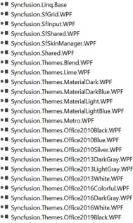

# Getting started with SkinManager for WPF

The [SfSkinManager](https://help.syncfusion.com/cr/wpf/Syncfusion.SfSkinManager.SfSkinManager.html) helps to apply the themes for both syncfusion and framework controls. There are 27 built-in themes that can be applied using `SfSkinManager` for rich user interface experience. Some of the built-in themes color derivations can be customized using [ThemeStudio](https://help.syncfusion.com/wpf/themes/theme-studio).

N> Theme studio based themes provides improved consistency and uniqueness among various controls compared to other themes. Its recommended to use theme studio based themes in application over other themes. 

## Themes List

Below table lists available themes and assembly or nuget reference to use the same in application. 

<table>
<tr>
<th>
Styles</th><th>
Assembly</th><th>
NuGet package</th><th>
Supported in ThemeStudio</th><th>
Alternative theme suggestion to use</th></tr>
<tr>
<td>
FluentLight</td><td>
Syncfusion.Themes.FluentLight.Wpf.dll</td><td>
{{'[Syncfusion.Themes.FluentLight.WPF](https://www.nuget.org/packages/Syncfusion.Themes.FluentLight.WPF/)'| markdownify }}
</td><td>
Yes</td><td>
-</td></tr>
<tr>
<td>
FluentDark</td><td>
Syncfusion.Themes.FluentDark.Wpf.dll</td><td>
{{'[Syncfusion.Themes.FluentDark.WPF](https://www.nuget.org/packages/Syncfusion.Themes.FluentDark.WPF/)'| markdownify }}
</td><td>
Yes</td><td>
-</td></tr>
<tr>
<td>
MaterialLight</td><td>
Syncfusion.Themes.MaterialLight.Wpf.dll</td><td>
{{'[Syncfusion.Themes.MaterialLight.WPF](https://www.nuget.org/packages/Syncfusion.Themes.MaterialLight.WPF/)'| markdownify }}
</td><td>
Yes</td><td>
-</td></tr>
<tr>
<td>
MaterialDark</td><td>
Syncfusion.Themes.MaterialDark.Wpf.dll</td><td>
{{'[Syncfusion.Themes.MaterialDark.WPF](https://www.nuget.org/packages/Syncfusion.Themes.MaterialDark.WPF/)'| markdownify }}
</td><td>
Yes</td><td>
-</td></tr>
<tr>
<td>
MaterialLightBlue</td><td>
Syncfusion.Themes.MaterialLightBlue.Wpf.dll</td><td>
{{'[Syncfusion.Themes.MaterialLightBlue.WPF](https://www.nuget.org/packages/Syncfusion.Themes.MaterialLightBlue.WPF/)'| markdownify }}
</td><td>
Yes</td><td>
-</td></tr>
<tr>
<td>
MaterialDarkBlue</td><td>
Syncfusion.Themes.MaterialDarkBlue.Wpf.dll</td><td>
{{'[Syncfusion.Themes.MaterialDarkBlue.WPF](https://www.nuget.org/packages/Syncfusion.Themes.MaterialDarkBlue.WPF/)'| markdownify }}
</td><td>
Yes</td><td>
-</td></tr>
<tr>
<td>
Office2019Colorful</td><td>
Syncfusion.Themes.Office2019Colorful.Wpf.dll</td><td>
{{'[Syncfusion.Themes.Office2019Colorful.WPF](https://www.nuget.org/packages/Syncfusion.Themes.Office2019Colorful.WPF/)'| markdownify }}
</td><td>
Yes</td><td>
-</td></tr>
<tr>
<td>
Office2019Black</td><td>
Syncfusion.Themes.Office2019Black.Wpf.dll</td><td>
{{'[Syncfusion.Themes.Office2019Black.WPF](https://www.nuget.org/packages/Syncfusion.Themes.Office2019Black.WPF/)'| markdownify }}
</td><td>
Yes</td><td>
-</td></tr>
<tr>
<td>
Office2019White</td><td>
Syncfusion.Themes.Office2019White.Wpf.dll</td><td>
{{'[Syncfusion.Themes.Office2019White.WPF](https://www.nuget.org/packages/Syncfusion.Themes.Office2019White.WPF/)'| markdownify }}
</td><td>
Yes</td><td>
-</td></tr>
<tr>
<td>
Office2019DarkGray</td><td>
Syncfusion.Themes.Office2019DarkGray.Wpf.dll</td><td>
{{'[Syncfusion.Themes.Office2019DarkGray.WPF](https://www.nuget.org/packages/Syncfusion.Themes.Office2019DarkGray.WPF/)'| markdownify }}
</td><td>
Yes</td><td>
-</td></tr>
<tr>
<td>
Office2019HighContrast</td><td>
Syncfusion.Themes.Office2019HighContrast.Wpf.dll</td><td>
{{'[Syncfusion.Themes.Office2019HighContrast.WPF](https://www.nuget.org/packages/Syncfusion.Themes.Office2019HighContrast.WPF/)'| markdownify }}
</td><td>
Yes</td><td>
-</td></tr>
<tr>
<td>
Office2019HighContrastWhite</td><td>
Syncfusion.Themes.Office2019HighContrastWhite.Wpf.dll</td><td>
{{'[Syncfusion.Themes.Office2019HighContrastWhite.WPF](https://www.nuget.org/packages/Syncfusion.Themes.Office2019HighContrastWhite.WPF/)'| markdownify }}
</td><td>
Yes</td><td>
-</td></tr>
<tr>
<td>
SystemTheme</td><td>
Syncfusion.Themes.SystemTheme.Wpf.dll</td><td>
{{'[Syncfusion.Themes.SystemTheme.WPF](https://www.nuget.org/packages/Syncfusion.Themes.SystemTheme.WPF/)'| markdownify }}
</td><td>
Yes</td><td>
-</td></tr>
<tr>
<td>
Metro</td><td>
Syncfusion.Themes.Metro.Wpf.dll</td><td>
{{'[Syncfusion.Themes.Metro.WPF](https://www.nuget.org/packages/Syncfusion.Themes.Metro.WPF/)'| markdownify }}
</td><td>
-</td><td>
FluentLight, Office2019Colorful</td></tr>
<tr>
<td>
Lime</td><td>
Syncfusion.Themes.Lime.Wpf.dll</td><td>
{{'[Syncfusion.Themes.Lime.WPF](https://www.nuget.org/packages/Syncfusion.Themes.Lime.WPF/)'| markdownify }}
</td><td>
-</td><td>
FluentLight, Office2019Colorful</td></tr>
<tr>
<td>
Saffron</td><td>
Syncfusion.Themes.Saffron.Wpf.dll</td><td>
{{'[Syncfusion.Themes.Saffron.WPF](https://www.nuget.org/packages/Syncfusion.Themes.Saffron.WPF/)'| markdownify }}
</td><td>
-</td><td>
FluentLight, Office2019Colorful</td></tr>
<tr>
<td>
Blend</td><td>
Syncfusion.Themes.Blend.Wpf.dll</td><td>
{{'[Syncfusion.Themes.Blend.WPF](https://www.nuget.org/packages/Syncfusion.Themes.Blend.WPF/)'| markdownify }}
</td><td>
-</td><td>
FluentDark, MaterialDark, Office2019Black</td></tr>
<tr>
<td>
Office2013White</td><td>
Syncfusion.Themes.Office2013White.Wpf.dll</td><td>
{{'[Syncfusion.Themes.Office2013White.WPF](https://www.nuget.org/packages/Syncfusion.Themes.Office2013White.WPF/)'| markdownify }}
</td><td>
-</td><td>
Office2019White</td></tr>
<tr>
<td>
Office2013LightGray</td><td>
Syncfusion.Themes.Office2013LightGray.Wpf.dll</td><td>
{{'[Syncfusion.Themes.Office2013LightGray.WPF](https://www.nuget.org/packages/Syncfusion.Themes.Office2013LightGray.WPF/)'| markdownify }}
</td><td>
-</td><td>
Office2019Colorful</td></tr>
<tr>
<td>
Office2013DarkGray</td><td>
Syncfusion.Themes.Office2013DarkGray.Wpf.dll</td><td>
{{'[Syncfusion.Themes.Office2013DarkGray.WPF](https://www.nuget.org/packages/Syncfusion.Themes.Office2013DarkGray.WPF/)'| markdownify }}
</td><td>
-</td><td>
Office2019DarkGray</td></tr>
<tr>
<td>
VisualStudio2013</td><td>
Syncfusion.Themes.VisualStudio2013.Wpf.dll</td><td>
{{'[Syncfusion.Themes.VisualStudio2013.WPF](https://www.nuget.org/packages/Syncfusion.Themes.VisualStudio2013.WPF/)'| markdownify }}
</td><td>
-</td><td>
-</td></tr>
<tr>
<td>
Office2010Black</td><td>
Syncfusion.Themes.Office2010Black.Wpf.dll</td><td>
{{'[Syncfusion.Themes.Office2010Black.WPF](https://www.nuget.org/packages/Syncfusion.Themes.Office2010Black.WPF/)'| markdownify }}
</td><td>
-</td><td>
-</td></tr>
<tr>
<td>
Office2010Blue</td><td>
Syncfusion.Themes.Office2010Blue.Wpf.dll</td><td>
{{'[Syncfusion.Themes.Office2010Blue.WPF](https://www.nuget.org/packages/Syncfusion.Themes.Office2010Blue.WPF/)'| markdownify }}
</td><td>
-</td><td>
-</td></tr>
<tr>
<td>
Office2010Silver</td><td>
Syncfusion.Themes.Office2010Silver.Wpf.dll</td><td>
{{'[Syncfusion.Themes.Office2010Silver.WPF](https://www.nuget.org/packages/Syncfusion.Themes.Office2010Silver.WPF/)'| markdownify }}
</td><td>
-</td><td>
-</td></tr>
<tr>
<td>
Office365</td><td>
Syncfusion.Themes.Office365.Wpf.dll</td><td>
{{'[Syncfusion.Themes.Office365.WPF](https://www.nuget.org/packages/Syncfusion.Themes.Office365.WPF/)'| markdownify }}
</td><td>
-</td><td>
Office2019Colorful</td></tr>
<tr>
<td>
Office2016Colorful</td><td>
Syncfusion.Themes.Office2016Colorful.Wpf.dll</td><td>
{{'[Syncfusion.Themes.Office2016Colorful.WPF](https://www.nuget.org/packages/Syncfusion.Themes.Office2016Colorful.WPF/)'| markdownify }}
</td><td>
-</td><td>
Office2019Colorful</td></tr>
<tr>
<td>
Office2016White</td><td>
Syncfusion.Themes.Office2016White.Wpf.dll</td><td>
{{'[Syncfusion.Themes.Office2016White.WPF](https://www.nuget.org/packages/Syncfusion.Themes.Office2016White.WPF/)'| markdownify }}
</td><td>
-</td><td>
Office2019White</td></tr>
<tr>
<td>
Office2016DarkGray</td><td>
Syncfusion.Themes.Office2016DarkGray.Wpf.dll</td><td>
{{'[Syncfusion.Themes.Office2016DarkGray.WPF](https://www.nuget.org/packages/Syncfusion.Themes.Office2016DarkGray.WPF/)'| markdownify }}
</td><td>
-</td><td>
Office2019DarkGray</td></tr>
<tr>
<td>
VisualStudio2015</td><td>
Syncfusion.Themes.VisualStudio2015.Wpf.dll</td><td>
{{'[Syncfusion.Themes.VisualStudio2015.WPF](https://www.nuget.org/packages/Syncfusion.Themes.VisualStudio2015.WPF/)'| markdownify }}
</td><td>
-</td><td>
-</td></tr>
</table>

## Apply a theme to a control

### Add SkinManager reference

There are several ways to add the Syncfusion [SfSkinManager](https://help.syncfusion.com/cr/wpf/Syncfusion.SfSkinManager.SfSkinManager.html) reference in Visual Studio WPF project. The following steps will help to add through `XAML` Code,

1) Add reference to `Syncfusion.SfSkinManager.WPF` assembly or [Syncfusion.SfSkinManager.WPF nuget package](https://www.nuget.org/packages/Syncfusion.SfSkinManager.WPF/) to the project.
2) Import Syncfusion WPF schema `http://schemas.syncfusion.com/wpf` or the assembly namespace `Syncfusion.SfSkinManager` in XAML page.





<Window
    xmlns="http://schemas.microsoft.com/winfx/2006/xaml/presentation"
    xmlns:x="http://schemas.microsoft.com/winfx/2006/xaml"
    xmlns:syncfusionskin ="clr-namespace:Syncfusion.SfSkinManager;assembly=Syncfusion.SfSkinManager.WPF"
    xmlns:syncfusion="http://schemas.syncfusion.com/wpf" />





### Add theme assembly reference

The [SfSkinManager](https://help.syncfusion.com/cr/wpf/Syncfusion.SfSkinManager.SfSkinManager.html) supports to apply themes listed in [themes list](https://help.syncfusion.com/wpf/themes/skin-manager#themes-list). To use a theme in application, you need to add reference to corresponding theme assembly. For example, to apply `MaterialDark` theme, attach `Syncfusion.Themes.MaterialDark.Wpf` assembly or [NuGet](https://www.nuget.org/packages/Syncfusion.Themes.MaterialDark.WPF/) reference to the project. When you are applying theme to a Window, SkinManager inherits the same theme to all the elements inside window.

### Set theme

Themes will be applied to both syncfusion and framework controls by using [Theme](https://help.syncfusion.com/cr/wpf/Syncfusion.SfSkinManager.SfSkinManager.html#Syncfusion_SfSkinManager_SfSkinManager_ThemeProperty) attached property of the [SfSkinManager](https://help.syncfusion.com/cr/wpf/Syncfusion.SfSkinManager.SfSkinManager.html). The theme assemblies have resource dictionaries with styles of controls. So, when you set `Theme` property, the skin manager merges the theme resource dictionaries of an element to which theme applied and its descendants into the resource dictionary of the element to which theme is applied or `Application.Current.Resource`.

N> When you are applying theme to a Window or any element, `SkinManager` inherits the same theme to all its descendants.





<syncfusion:ChromelessWindow x:Class="DataGrid_Themes.MainWindow"
                             xmlns="http://schemas.microsoft.com/winfx/2006/xaml/presentation"
                             xmlns:x="http://schemas.microsoft.com/winfx/2006/xaml"
                             xmlns:local="clr-namespace:DataGrid_Themes"
                             xmlns:syncfusion="http://schemas.syncfusion.com/wpf"
							 xmlns:syncfusionskin ="clr-namespace:Syncfusion.SfSkinManager;assembly=Syncfusion.SfSkinManager.WPF"
                             Icon="App.ico"
                             Title="Getting Started"
                             WindowStartupLocation="CenterScreen"
                             syncfusionskin:SfSkinManager.Theme="{syncfusionskin:SkinManagerExtension ThemeName=MaterialDark}">

    <Grid DataContext="{StaticResource viewmodel}">
        <syncfusion:SfDataGrid Name="sfgrid" Margin="5"
                                       AutoGenerateColumns="False"
                                       AllowDraggingColumns="True"
                                       AllowEditing="True"
                                       LiveDataUpdateMode="AllowDataShaping"
                                       AllowFiltering="True"
                                       HeaderRowHeight="26"
                                       SelectionMode="Extended"
                                       ColumnSizer="Auto"
                                       ItemsSource="{Binding EmployeeDetails}">
        </syncfusion:SfDataGrid>
    </Grid>
</syncfusion:ChromelessWindow>





SfSkinManager.SetTheme(this, new Theme("MaterialDark"));





N> [View sample in GitHub](https://github.com/SyncfusionExamples/wpf-themes-demo-using-skinmanager).

## Apply a theme globally in the application

By default, [SfSkinManager](https://help.syncfusion.com/cr/wpf/Syncfusion.SfSkinManager.SfSkinManager.html) merges the required resource files from the theme assembly to the element to which theme is applied. To apply a theme globally in an application, set the `ApplyStylesOnApplication` property to `True`. It merges all the theme resource files to `Application.Current.Resources`.

N> The `SfSkinManager.ApplyStylesOnApplication` static property should be set before `InitializeComponent` of window or in application start up, if you are applying for multiple windows. 





SfSkinManager.ApplyStylesOnApplication = true;





## Customize theme colors and fonts in the application

To customize the theme colors and fonts in the application, call [RegisterThemeSettings](https://help.syncfusion.com/cr/wpf/Syncfusion.SfSkinManager.SfSkinManager.html#Syncfusion_SfSkinManager_SfSkinManager_RegisterThemeSettings_System_String_Syncfusion_SfSkinManager_IThemeSetting_) method and pass the theme name and respective theme setting instance as parameters.

Each theme supported in theme studio has respective theme settings class with prefix of theme name. For example, if `MaterialDark` is theme name, then there will be theme settings class with name `MaterialDarkThemeSettings`. 

N> Need to register theme settings before setting respective theme for window/control.

Please find the complete list of theme name and respective theme settings class.

<table>
<tr>
<th>
Styles/Theme name</th><th>
Respective theme settings class to customize</th></tr>
<tr>
<td>
FluentLight</td><td>
{{'[FluentLightThemeSettings](https://help.syncfusion.com/cr/wpf/Syncfusion.Themes.FluentLight.WPF.FluentLightThemeSettings.html)'| markdownify }}
</td></tr>
<tr>
<td>
FluentDark</td><td>
{{'[FluentDarkThemeSettings](https://help.syncfusion.com/cr/wpf/Syncfusion.Themes.FluentDark.WPF.FluentDarkThemeSettings.html)'| markdownify }}
</td></tr>
<tr>
<td>
MaterialLight</td><td>
{{'[MaterialLightThemeSettings](https://help.syncfusion.com/cr/wpf/Syncfusion.Themes.MaterialLight.WPF.MaterialLightThemeSettings.html)'| markdownify }}
</td></tr>
<tr>
<td>
MaterialDark</td><td>
{{'[MaterialDarkThemeSettings](https://help.syncfusion.com/cr/wpf/Syncfusion.Themes.MaterialDark.WPF.MaterialDarkThemeSettings.html)'| markdownify }}
</td></tr>
<tr>
<td>
MaterialLightBlue</td><td>
{{'[MaterialLightBlueThemeSettings](https://help.syncfusion.com/cr/wpf/Syncfusion.Themes.MaterialLightBlue.WPF.MaterialLightBlueThemeSettings.html)'| markdownify }}
</td></tr>
<tr>
<td>
MaterialDarkBlue</td><td>
{{'[MaterialDarkBlueThemeSettings](https://help.syncfusion.com/cr/wpf/Syncfusion.Themes.MaterialDarkBlue.WPF.MaterialDarkBlueThemeSettings.html)'| markdownify }}
</td></tr>
<tr>
<td>
Office2019Colorful</td><td>
{{'[Office2019ColorfulThemeSettings](https://help.syncfusion.com/cr/wpf/Syncfusion.Themes.Office2019Colorful.WPF.Office2019ColorfulThemeSettings.html)'| markdownify }}
</td></tr>
<tr>
<td>
Office2019Black</td><td>
{{'[Office2019BlackThemeSettings](https://help.syncfusion.com/cr/wpf/Syncfusion.Themes.Office2019Black.WPF.Office2019BlackThemeSettings.html)'| markdownify }}
</td></tr>
<tr>
<td>
Office2019White</td><td>
{{'[Office2019WhiteThemeSettings](https://help.syncfusion.com/cr/wpf/Syncfusion.Themes.Office2019White.WPF.Office2019WhiteThemeSettings.html)'| markdownify }}
</td></tr>
<tr>
<td>
Office2019DarkGray</td><td>
{{'[Office2019DarkGrayThemeSettings](https://help.syncfusion.com/cr/wpf/Syncfusion.Themes.Office2019DarkGray.WPF.Office2019DarkGrayThemeSettings.html)'| markdownify }}
</td></tr>
<tr>
<td>
Office2019HighContrast</td><td>
{{'[Office2019HighContrastThemeSettings](https://help.syncfusion.com/cr/wpf/Syncfusion.Themes.Office2019HighContrast.WPF.Office2019HighContrastThemeSettings.html)'| markdownify }}
</td></tr>
<tr>
<td>
Office2019HighContrastWhite</td><td>
{{'[Office2019HighContrastWhiteThemeSettings](https://help.syncfusion.com/cr/wpf/Syncfusion.Themes.Office2019HighContrastWhite.WPF.Office2019HighContrastWhiteThemeSettings.html)'| markdownify }}
</td></tr>
<tr>
<td>
SystemTheme</td><td>
{{'[SystemThemeThemeSettings](https://help.syncfusion.com/cr/wpf/Syncfusion.Themes.SystemTheme.WPF.SystemThemeThemeSettings.html)'| markdownify }}
</td></tr>
</table>





FluentDarkThemeSettings themeSettings = new FluentDarkThemeSettings();
themeSettings.PrimaryBackground = new SolidColorBrush(Colors.Red);
themeSettings.PrimaryForeground = new SolidColorBrush(Colors.AntiqueWhite); 
themeSettings.BodyFontSize = 15;
themeSettings.HeaderFontSize = 18;
themeSettings.SubHeaderFontSize = 17;
themeSettings.TitleFontSize = 17;
themeSettings.SubTitleFontSize = 16;
themeSettings.BodyAltFontSize = 15;
themeSettings.FontFamily = new FontFamily("Callibri");
SfSkinManager.RegisterThemeSettings("FluentDark", themeSettings);





N> [View sample in GitHub](https://github.com/SyncfusionExamples/customize-themes-using-theme-settings).

## Apply themes to the controls derived from syncfusion controls

To apply the themes to derived control using `SfSkinManager`, call [SetResourceReference](https://docs.microsoft.com/en-us/dotnet/api/system.windows.frameworkelement.setresourcereference) method and pass the `StyleProperty` and derived control type as parameters. 





 <local:SfDataGridExt x:Name="grid"
                             AllowGrouping="True"
                             AutoGenerateColumns="False"
                             ItemsSource="{Binding EmployeeDetails}"
                             ShowGroupDropArea="True">
            <local:SfDataGridExt.Resources>
                <ResourceDictionary>
                    <ResourceDictionary.MergedDictionaries>
                        <ResourceDictionary Source="/Syncfusion.SfGrid.WPF;component/Styles/Styles.xaml" />
                    </ResourceDictionary.MergedDictionaries>
                </ResourceDictionary>
            </local:SfDataGridExt.Resources>
            <local:SfDataGridExt.Columns>
                <syncfusion:GridNumericColumn MappingName="EmployeeAge" />
                <syncfusion:GridTextColumn MappingName="EmployeeName" />
                <syncfusion:GridTextColumn MappingName="EmployeeGender" />
                <syncfusion:GridTextColumn AllowEditing="True" MappingName="Country" />
                <syncfusion:GridNumericColumn MappingName="EmployeeSalary" />
            </local:SfDataGridExt.Columns>
</local:SfDataGridExt>









 public class SfDataGridExt : SfDataGrid
    {
        public SfDataGridExt()
        {
            SetResourceReference(StyleProperty, typeof(SfDataGrid));
        }
    }





## Clearing SkinManager instance in an application

The `SfSkinManager` will hold some instance to use it further while applying theme. But this can be cleared using the function named `Dispose(object)` that needs to be called when you need to clear the theme applied from `SfSkinManager` as like below code. Here **object** refers to the element whose instance needs to be cleared.





private void Window_Closed(object sender, EventArgs e) 
{ 
   SfSkinManager.Dispose(this); 
} 





## How To

### Apply custom theme in application

To apply custom theme in application, export custom theme project from ThemeStudio using [this reference](https://help.syncfusion.com/wpf/themes/theme-studio#exporting-theme-project).

For demonstration purpose, we have used exported theme name as `MaterialDarkYellow` and exported theme assembly name as `Syncfusion.Themes.MaterialDarkYellow.WPF`.

Now, set the `SfSkinManager` attached property `Theme` as `MaterialDarkYellow;MaterialDark` for the control used in application. Since custom theme name should be updated in this format: `CustomTheme1;BaseThemeName` where `CustomTheme1` denotes the custom theme name and `BaseThemeName` denotes the theme name from which it is derived. For example `MaterialDarkYellow;MaterialDark`.





SfSkinManager.SetTheme(this, new Theme("MaterialDarkYellow;MaterialDark"));





### Override syncfusion themes in application

All Syncfusion theme [supported in theme studio](https://help.syncfusion.com/wpf/themes/skin-manager#themes-list) control styles can be overridden by a common naming convention. A unique key is given to each and every style, so that you can override the styles using the `BasedOn` property.

The naming convention of a control style will be like `Syncfusion-ControlName-Style`. For example, `MaterialDarkButtonAdvStyle`.

The following steps explain how to override the Syncfusion Themes.

**Step1:**

Add respective resource dictionary from themes assembly in the application.

The resource dictionary will be in this format: `/Syncfusion.Themes.<ThemeName>.WPF;component/<ControlName>/<ControlName>.xaml` where `ThemeName` denotes the theme name for which overridden style going to be applied and `ControlName` denotes the control name. For example, `/Syncfusion.Themes.MaterialDark.WPF;component/ButtonAdv/ButtonAdv.xaml`.





<ResourceDictionary>
<ResourceDictionary.MergedDictionaries>
<ResourceDictionary Source="/Syncfusion.Themes.MaterialDark.WPF;component/ButtonAdv/ButtonAdv.xaml"/>
</ResourceDictionary.MergedDictionaries>
</ResourceDictionary>





**Step2:**

Define the new style using the `BasedOn` property.

The following code snippet overrides the Syncfusion style for the ButtonAdv Control.





<Grid>
        <Grid.Resources>
            
        </Grid.Resources>
        <syncfusion:ButtonAdv Name="buttonAdv" Content="Testing" Width="150" Height="30" SmallIcon="{x:Null}" Style="{StaticResource CustomButtonAdvStyle}"></syncfusion:ButtonAdv>   
</Grid>





### Change visual style at runtime

Themes for application can be changed at runtime by changing `VisualStyle` property. Make sure the new theme assembly is attached as reference in application when applying theme.





<syncfusion:ChromelessWindow x:Class="DataGrid_Themes.MainWindow"
                             xmlns="http://schemas.microsoft.com/winfx/2006/xaml/presentation"
                             xmlns:x="http://schemas.microsoft.com/winfx/2006/xaml"
                             xmlns:local="clr-namespace:DataGrid_Themes"
                             xmlns:system="clr-namespace:System;assembly=mscorlib"
                             xmlns:syncfusion="http://schemas.syncfusion.com/wpf"
							 xmlns:syncfusionskin ="clr-namespace:Syncfusion.SfSkinManager;assembly=Syncfusion.SfSkinManager.WPF"
							 syncfusionskin:SfSkinManager.VisualStyle="{Binding ElementName=comboVisualStyle, Path=SelectedValue, Mode=OneWay, UpdateSourceTrigger=PropertyChanged}">

    <syncfusion:ChromelessWindow.Resources>
        <ObjectDataProvider
            x:Key="Themes"
            MethodName="GetValues"
            ObjectType="{x:Type system:Enum}">
            <ObjectDataProvider.MethodParameters>
                <x:Type TypeName="syncfusionskin:VisualStyles" />
            </ObjectDataProvider.MethodParameters>
        </ObjectDataProvider>
    </syncfusion:ChromelessWindow.Resources>

    <Grid>
        <Grid.RowDefinitions>
            <RowDefinition Height="40"/>
            <RowDefinition Height="*"/>
        </Grid.RowDefinitions>
        <ComboBox
                x:Name="comboVisualStyle"
                Grid.Row="0"
                Width="250"
                Margin="5"
                ItemsSource="{Binding Source={StaticResource Themes}}"
                SelectedIndex="18" />
                
        <Grid Grid.Row="1" DataContext="{StaticResource viewmodel}">
            <syncfusion:SfDataGrid Name="sfgrid" Margin="5"
                                       AutoGenerateColumns="False"
                                       AllowDraggingColumns="True"
                                       AllowEditing="True"
                                       LiveDataUpdateMode="AllowDataShaping"
                                       AllowFiltering="True"
                                       HeaderRowHeight="26"
                                       SelectionMode="Extended"
                                       ColumnSizer="Auto"
                                       ItemsSource="{Binding EmployeeDetails}">
             
            </syncfusion:SfDataGrid>
        </Grid>
    </Grid>
</syncfusion:ChromelessWindow>





N> [View sample in GitHub](https://github.com/SyncfusionExamples/change-themes-at-runtime-using-skinmanager).