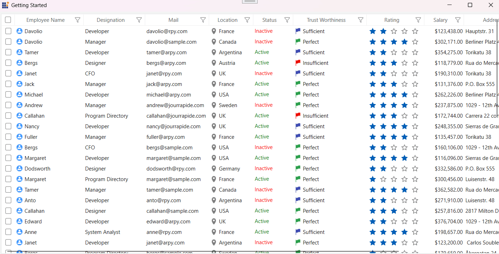
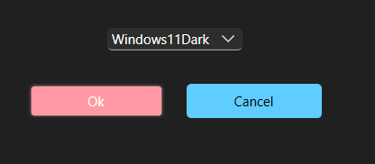

# Getting Started with WPF Skin Manager

The [SfSkinManager](https://help.syncfusion.com/cr/wpf/Syncfusion.SfSkinManager.SfSkinManager.html) helps you to apply the themes for both Syncfusion&reg; and Framework controls. 

## Themes list

The following table lists the available themes as well as the assembly or NuGet reference to be used in the application. 

<table>
<tr>
<th>
Styles</th><th>
Assembly</th><th>
NuGet package</th></tr>
<tr>
<td>
Windows11Light</td><td>
Syncfusion.Themes.Windows11Light.Wpf.dll</td><td>
{{'[Syncfusion.Themes.Windows11Light.WPF](https://www.nuget.org/packages/Syncfusion.Themes.Windows11Light.WPF/)'| markdownify }}
</td></tr>
<tr>
<td>
Windows11Dark</td><td>
Syncfusion.Themes.Windows11Dark.Wpf.dll</td><td>
{{'[Syncfusion.Themes.Windows11Dark.WPF](https://www.nuget.org/packages/Syncfusion.Themes.Windows11Dark.WPF/)'| markdownify }}
</td></tr>
<tr>
<td>
FluentLight</td><td>
Syncfusion.Themes.FluentLight.Wpf.dll</td><td>
{{'[Syncfusion.Themes.FluentLight.WPF](https://www.nuget.org/packages/Syncfusion.Themes.FluentLight.WPF/)'| markdownify }}
</td></tr>
<tr>
<td>
FluentDark</td><td>
Syncfusion.Themes.FluentDark.Wpf.dll</td><td>
{{'[Syncfusion.Themes.FluentDark.WPF](https://www.nuget.org/packages/Syncfusion.Themes.FluentDark.WPF/)'| markdownify }}
</td></tr>
<tr>
<td>
Material3Light</td><td>
Syncfusion.Themes.Material3Light.Wpf.dll</td><td>
{{'[Syncfusion.Themes.Material3Light.WPF](https://www.nuget.org/packages/Syncfusion.Themes.Material3Light.WPF/)'| markdownify }}
</td></tr>
<tr>
<td>
Material3Dark</td><td>
Syncfusion.Themes.Material3Dark.Wpf.dll</td><td>
{{'[Syncfusion.Themes.Material3Dark.WPF](https://www.nuget.org/packages/Syncfusion.Themes.Material3Dark.WPF/)'| markdownify }}
</td></tr>
<tr>
<td>
MaterialLight</td><td>
Syncfusion.Themes.MaterialLight.Wpf.dll</td><td>
{{'[Syncfusion.Themes.MaterialLight.WPF](https://www.nuget.org/packages/Syncfusion.Themes.MaterialLight.WPF/)'| markdownify }}
</td></tr>
<tr>
<td>
MaterialDark</td><td>
Syncfusion.Themes.MaterialDark.Wpf.dll</td><td>
{{'[Syncfusion.Themes.MaterialDark.WPF](https://www.nuget.org/packages/Syncfusion.Themes.MaterialDark.WPF/)'| markdownify }}
</td></tr>
<tr>
<td>
MaterialLightBlue</td><td>
Syncfusion.Themes.MaterialLightBlue.Wpf.dll</td><td>
{{'[Syncfusion.Themes.MaterialLightBlue.WPF](https://www.nuget.org/packages/Syncfusion.Themes.MaterialLightBlue.WPF/)'| markdownify }}
</td></tr>
<tr>
<td>
MaterialDarkBlue</td><td>
Syncfusion.Themes.MaterialDarkBlue.Wpf.dll</td><td>
{{'[Syncfusion.Themes.MaterialDarkBlue.WPF](https://www.nuget.org/packages/Syncfusion.Themes.MaterialDarkBlue.WPF/)'| markdownify }}
</td></tr>
<tr>
<td>
Office2019Colorful</td><td>
Syncfusion.Themes.Office2019Colorful.Wpf.dll</td><td>
{{'[Syncfusion.Themes.Office2019Colorful.WPF](https://www.nuget.org/packages/Syncfusion.Themes.Office2019Colorful.WPF/)'| markdownify }}
</td></tr>
<tr>
<td>
Office2019Black</td><td>
Syncfusion.Themes.Office2019Black.Wpf.dll</td><td>
{{'[Syncfusion.Themes.Office2019Black.WPF](https://www.nuget.org/packages/Syncfusion.Themes.Office2019Black.WPF/)'| markdownify }}
</td></tr>
<tr>
<td>
Office2019White</td><td>
Syncfusion.Themes.Office2019White.Wpf.dll</td><td>
{{'[Syncfusion.Themes.Office2019White.WPF](https://www.nuget.org/packages/Syncfusion.Themes.Office2019White.WPF/)'| markdownify }}
</td></tr>
<tr>
<td>
Office2019DarkGray</td><td>
Syncfusion.Themes.Office2019DarkGray.Wpf.dll</td><td>
{{'[Syncfusion.Themes.Office2019DarkGray.WPF](https://www.nuget.org/packages/Syncfusion.Themes.Office2019DarkGray.WPF/)'| markdownify }}
</td></tr>
<tr>
<td>
Office2019HighContrast</td><td>
Syncfusion.Themes.Office2019HighContrast.Wpf.dll</td><td>
{{'[Syncfusion.Themes.Office2019HighContrast.WPF](https://www.nuget.org/packages/Syncfusion.Themes.Office2019HighContrast.WPF/)'| markdownify }}
</td></tr>
<tr>
<td>
Office2019HighContrastWhite</td><td>
Syncfusion.Themes.Office2019HighContrastWhite.Wpf.dll</td><td>
{{'[Syncfusion.Themes.Office2019HighContrastWhite.WPF](https://www.nuget.org/packages/Syncfusion.Themes.Office2019HighContrastWhite.WPF/)'| markdownify }}
</td></tr>
<tr>
<td>
SystemTheme</td><td>
Syncfusion.Themes.SystemTheme.Wpf.dll</td><td>
{{'[Syncfusion.Themes.SystemTheme.WPF](https://www.nuget.org/packages/Syncfusion.Themes.SystemTheme.WPF/)'| markdownify }}
</td></tr>
</table>

## Apply a theme to a control

### Add SkinManager reference

There are several ways to include the Syncfusion&reg; [SfSkinManager](https://help.syncfusion.com/cr/wpf/Syncfusion.SfSkinManager.SfSkinManager.html) reference in the Visual Studio WPF project. The following steps will help you to add `XAML` Code:

1) Add a reference to the `Syncfusion.SfSkinManager.WPF` assembly or [Syncfusion.SfSkinManager.WPF nuget package](https://www.nuget.org/packages/Syncfusion.SfSkinManager.WPF/) to the project.
2) Import Syncfusion&reg; WPF schema `http://schemas.syncfusion.com/wpf` or the assembly namespace `Syncfusion.SfSkinManager` into a XAML page.





<Window
    xmlns="http://schemas.microsoft.com/winfx/2006/xaml/presentation"
    xmlns:x="http://schemas.microsoft.com/winfx/2006/xaml"
    xmlns:syncfusionskin ="clr-namespace:Syncfusion.SfSkinManager;assembly=Syncfusion.SfSkinManager.WPF"
    xmlns:syncfusion="http://schemas.syncfusion.com/wpf" />





### Add a theme assembly reference

The [SfSkinManager](https://help.syncfusion.com/cr/wpf/Syncfusion.SfSkinManager.SfSkinManager.html) supports to apply themes listed in [themes list](https://help.syncfusion.com/wpf/themes/skin-manager#themes-list). To use a theme in the application, add Reference to the corresponding theme assembly. For example, to apply `Windows11Light` theme, attach `Syncfusion.Themes.Windows11Light.Wpf` assembly or [NuGet](https://www.nuget.org/packages/Syncfusion.Themes.Windows11Light.WPF/) reference to the project. While applying a theme to a Window, SkinManager inherits the same theme to all the elements inside the Window.

### Set theme

Themes will be applied to both Syncfusion&reg; and Framework controls by using [Theme](https://help.syncfusion.com/cr/wpf/Syncfusion.SfSkinManager.SfSkinManager.html#Syncfusion_SfSkinManager_SfSkinManager_ThemeProperty) attached property of the [SfSkinManager](https://help.syncfusion.com/cr/wpf/Syncfusion.SfSkinManager.SfSkinManager.html). Also Ensure that the `ApplyThemeAsDefaultStyle` property is set to `true` before calling the SetTheme method

N> While applying the theme to a Window or any element, `SkinManager` inherits the same theme to all its descendants.





<Window x:Class="DataGrid_Themes.MainWindow"
                             xmlns="http://schemas.microsoft.com/winfx/2006/xaml/presentation"
                             xmlns:x="http://schemas.microsoft.com/winfx/2006/xaml"
                             xmlns:local="clr-namespace:DataGrid_Themes"
                             xmlns:syncfusion="http://schemas.syncfusion.com/wpf"
							 xmlns:syncfusionskin ="clr-namespace:Syncfusion.SfSkinManager;assembly=Syncfusion.SfSkinManager.WPF"
                             Icon="App.ico"
                             Title="Getting Started"
                             WindowStartupLocation="CenterScreen"
                             syncfusionskin:SfSkinManager.Theme="{syncfusionskin:SkinManagerExtension ThemeName=Windows11Light}">

    <Grid DataContext="{StaticResource viewmodel}">
        <syncfusion:SfDataGrid Name="sfgrid" Margin="5"
                                       AutoGenerateColumns="False"
                                       AllowDraggingColumns="True"
                                       AllowEditing="True"
                                       LiveDataUpdateMode="AllowDataShaping"
                                       AllowFiltering="True"
                                       HeaderRowHeight="26"
                                       SelectionMode="Extended"
                                       ColumnSizer="Auto"
                                       ItemsSource="{Binding EmployeeDetails}">
        </syncfusion:SfDataGrid>
    </Grid>
<Window>





SfSkinManager.ApplyThemeAsDefaultStyle = true; 
SfSkinManager.SetTheme(this, new Theme("Windows11Light"));





N> [View sample in GitHub](https://github.com/SyncfusionExamples/wpf-themes-demo-using-skinmanager).

## Apply a theme globally in the application

To apply a theme globally in an application, set the theme using `ApplicationTheme` attached property of the SfSkinManager in the constructor of your MainWindow. This ensures that the selected theme is automatically applied to any new windows when they are loaded.

If you set the theme using the `ApplicationTheme` attached property of [SfSkinManager](https://help.syncfusion.com/cr/wpf/Syncfusion.SfSkinManager.SfSkinManager.html), you don’t need to set it again using the [Theme](https://help.syncfusion.com/cr/wpf/Syncfusion.SfSkinManager.SfSkinManager.html#Syncfusion_SfSkinManager_SfSkinManager_ThemeProperty) attached property in xaml or by using [SetTheme](https://help.syncfusion.com/cr/wpf/Syncfusion.SfSkinManager.SfSkinManager.html#Syncfusion_SfSkinManager_SfSkinManager_SetTheme_System_Windows_DependencyObject_Syncfusion_SfSkinManager_Theme_) in code behind.

Also ensure that the `ApplyThemeAsDefaultStyle` property is set to `true`

N> The `SfSkinManager.ApplicationTheme` static property should be set before `InitializeComponent` of the window or during application start up, when applying for multiple windows.





public partial class MainWindow : Window
{
    public MainWindow()
    {
       SfSkinManager.ApplyThemeAsDefaultStyle = true;
       SfSkinManager.ApplicationTheme = new Theme("Windows11Light");
       InitializeComponent();
    }
}





## Customization 

### Customize theme colors and fonts in the application

To customize the theme colors and fonts in the application, call [RegisterThemeSettings](https://help.syncfusion.com/cr/wpf/Syncfusion.SfSkinManager.SfSkinManager.html#Syncfusion_SfSkinManager_SfSkinManager_RegisterThemeSettings_System_String_Syncfusion_SfSkinManager_IThemeSetting_) method and pass the theme name and respective theme setting instance as parameters.

Each theme supported by the theme studio has its own theme settings class, which begins with the prefix of the themes' name. For example, if the theme name is `Windows11Light`, then there will be theme settings class called `Windows11LightThemeSettings`. 

N> Need to register theme settings before setting respective themes for window or control.

Please find the complete list of theme names, respective theme settings class, and supported palette.

<table>
<tr>
<th>
Styles/Theme name</th><th>
Respective theme settings class to customize</th>
<th>Supported palette</th>
</tr>
<tr>
<td>
Windows11Light</td><td>
{{'[Windows11LightThemeSettings](https://help.syncfusion.com/cr/wpf/Syncfusion.Themes.Windows11Light.WPF.Windows11LightThemeSettings.html)'| markdownify }}
</td>
<td>
{{'[Windows11Palette](https://help.syncfusion.com/cr/wpf/Syncfusion.Themes.Windows11Light.WPF.Windows11Palette.html)'| markdownify }}
</td>
</tr>
<tr>
<td>
Windows11Dark</td><td>
{{'[Windows11DarkThemeSettings](https://help.syncfusion.com/cr/wpf/Syncfusion.Themes.Windows11Dark.WPF.Windows11DarkThemeSettings.html)'| markdownify }}
</td>
<td>
{{'[Windows11Palette](https://help.syncfusion.com/cr/wpf/Syncfusion.Themes.Windows11Dark.WPF.Windows11Palette.html)'| markdownify }}
</td>
</tr>
<tr>
<td>
FluentLight</td><td>
{{'[FluentLightThemeSettings](https://help.syncfusion.com/cr/wpf/Syncfusion.Themes.FluentLight.WPF.FluentLightThemeSettings.html)'| markdownify }}
</td>
<td>
{{'[FluentPalette](https://help.syncfusion.com/cr/wpf/Syncfusion.Themes.FluentLight.WPF.FluentPalette.html)'| markdownify }}
</td>
</tr>
<tr>
<td>
FluentDark</td><td>
{{'[FluentDarkThemeSettings](https://help.syncfusion.com/cr/wpf/Syncfusion.Themes.FluentDark.WPF.FluentDarkThemeSettings.html)'| markdownify }}
</td>
<td>
{{'[FluentPalette](https://help.syncfusion.com/cr/wpf/Syncfusion.Themes.FluentDark.WPF.FluentPalette.html)'| markdownify }}
</td>
</tr>
<tr>
<td>
Material3Light</td><td>
{{'[Material3LightThemeSettings](https://help.syncfusion.com/cr/wpf/Syncfusion.Themes.Material3Light.WPF.Material3LightThemeSettings.html)'| markdownify }}
</td>
<td>
{{'[Material3Palette](https://help.syncfusion.com/cr/wpf/Syncfusion.Themes.Material3Light.WPF.Material3Palette.html)'| markdownify }}
</td>
</tr>
<tr>
<td>
Material3Dark</td><td>
{{'[Material3DarkThemeSettings](https://help.syncfusion.com/cr/wpf/Syncfusion.Themes.Material3Dark.WPF.Material3DarkThemeSettings.html)'| markdownify }}
</td>
<td>
{{'[Material3Palette](https://help.syncfusion.com/cr/wpf/Syncfusion.Themes.Material3Dark.WPF.Material3Palette.html)'| markdownify }}
</td>
</tr>
<tr>
<td>
MaterialLight</td><td>
{{'[MaterialLightThemeSettings](https://help.syncfusion.com/cr/wpf/Syncfusion.Themes.MaterialLight.WPF.MaterialLightThemeSettings.html)'| markdownify }}
</td>
<td>
{{'[MaterialPalette](https://help.syncfusion.com/cr/wpf/Syncfusion.Themes.MaterialLight.WPF.MaterialPalette.html)'| markdownify }}
</td></tr>
<tr>
<td>
MaterialDark</td><td>
{{'[MaterialDarkThemeSettings](https://help.syncfusion.com/cr/wpf/Syncfusion.Themes.MaterialDark.WPF.MaterialDarkThemeSettings.html)'| markdownify }}
</td>
<td>
{{'[MaterialPalette](https://help.syncfusion.com/cr/wpf/Syncfusion.Themes.MaterialDark.WPF.MaterialPalette.html)'| markdownify }}
</td></tr>
<tr>
<td>
MaterialLightBlue</td><td>
{{'[MaterialLightBlueThemeSettings](https://help.syncfusion.com/cr/wpf/Syncfusion.Themes.MaterialLightBlue.WPF.MaterialLightBlueThemeSettings.html)'| markdownify }}
</td>
<td>
{{'[MaterialPalette](https://help.syncfusion.com/cr/wpf/Syncfusion.Themes.MaterialLightBlue.WPF.MaterialPalette.html)'| markdownify }}
</td></tr>
<tr>
<td>
MaterialDarkBlue</td><td>
{{'[MaterialDarkBlueThemeSettings](https://help.syncfusion.com/cr/wpf/Syncfusion.Themes.MaterialDarkBlue.WPF.MaterialDarkBlueThemeSettings.html)'| markdownify }}
</td>
<td>
{{'[MaterialPalette](https://help.syncfusion.com/cr/wpf/Syncfusion.Themes.MaterialDarkBlue.WPF.MaterialPalette.html)'| markdownify }}
</td></tr>
<tr>
<td>
Office2019Colorful</td><td>
{{'[Office2019ColorfulThemeSettings](https://help.syncfusion.com/cr/wpf/Syncfusion.Themes.Office2019Colorful.WPF.Office2019ColorfulThemeSettings.html)'| markdownify }}
</td>
<td>
{{'[Office2019Palette](https://help.syncfusion.com/cr/wpf/Syncfusion.Themes.Office2019Colorful.WPF.Office2019Palette.html)'| markdownify }}
</td></tr>
<tr>
<td>
Office2019Black</td><td>
{{'[Office2019BlackThemeSettings](https://help.syncfusion.com/cr/wpf/Syncfusion.Themes.Office2019Black.WPF.Office2019BlackThemeSettings.html)'| markdownify }}
</td>
<td>
{{'[Office2019Palette](https://help.syncfusion.com/cr/wpf/Syncfusion.Themes.Office2019Black.WPF.Office2019Palette.html)'| markdownify }}
</td></tr>
<tr>
<td>
Office2019White</td><td>
{{'[Office2019WhiteThemeSettings](https://help.syncfusion.com/cr/wpf/Syncfusion.Themes.Office2019White.WPF.Office2019WhiteThemeSettings.html)'| markdownify }}
</td>
<td>
{{'[Office2019Palette](https://help.syncfusion.com/cr/wpf/Syncfusion.Themes.Office2019White.WPF.Office2019Palette.html)'| markdownify }}
</td></tr>
<tr>
<td>
Office2019DarkGray</td><td>
{{'[Office2019DarkGrayThemeSettings](https://help.syncfusion.com/cr/wpf/Syncfusion.Themes.Office2019DarkGray.WPF.Office2019DarkGrayThemeSettings.html)'| markdownify }}
</td>
<td>
{{'[Office2019Palette](https://help.syncfusion.com/cr/wpf/Syncfusion.Themes.Office2019DarkGray.WPF.Office2019Palette.html)'| markdownify }}
</td></tr>
<tr>
<td>
Office2019HighContrast</td><td>
{{'[Office2019HighContrastThemeSettings](https://help.syncfusion.com/cr/wpf/Syncfusion.Themes.Office2019HighContrast.WPF.Office2019HighContrastThemeSettings.html)'| markdownify }}
</td>
<td>
{{'[HighContrastPalette](https://help.syncfusion.com/cr/wpf/Syncfusion.Themes.Office2019HighContrast.WPF.HighContrastPalette.html)'| markdownify }}
</td></tr>
<tr>
<td>
Office2019HighContrastWhite</td><td>
{{'[Office2019HighContrastWhiteThemeSettings](https://help.syncfusion.com/cr/wpf/Syncfusion.Themes.Office2019HighContrastWhite.WPF.Office2019HighContrastWhiteThemeSettings.html)'| markdownify }}
</td>
<td>
{{'[HighContrastPalette](https://help.syncfusion.com/cr/wpf/Syncfusion.Themes.Office2019HighContrastWhite.WPF.HighContrastPalette.html)'| markdownify }}
</td></tr>
<tr>
<td>
SystemTheme</td><td>
{{'[SystemThemeThemeSettings](https://help.syncfusion.com/cr/wpf/Syncfusion.Themes.SystemTheme.WPF.SystemThemeThemeSettings.html)'| markdownify }}
</td>
<td>-</td>
</tr>
</table>

Customize theme colors and fonts in the application





Windows11LightThemeSettings themeSettings = new Windows11LightThemeSettings();
themeSettings.PrimaryBackground = new SolidColorBrush(Colors.Red);
themeSettings.PrimaryForeground = new SolidColorBrush(Colors.AntiqueWhite); 
themeSettings.BodyFontSize = 15;
themeSettings.HeaderFontSize = 18;
themeSettings.SubHeaderFontSize = 17;
themeSettings.TitleFontSize = 17;
themeSettings.SubTitleFontSize = 16;
themeSettings.BodyAltFontSize = 15;
themeSettings.FontFamily = new FontFamily("Callibri");
SfSkinManager.RegisterThemeSettings("Windows11Light", themeSettings);
SfSkinManager.ApplyThemeAsDefaultStyle = true;
SfSkinManager.SetTheme(this, new Theme("Windows11Light")); 





Customize theme colors using the predefined palette





Windows11LightThemeSettings themeSettings = new Windows11LightThemeSettings();
themeSettings.Palette = FluentPalette.PinkRed;
SfSkinManager.RegisterThemeSettings("Windows11Light", themeSettings);
SfSkinManager.ApplyThemeAsDefaultStyle = true;
SfSkinManager.SetTheme(this, new Theme("Windows11Light")); 





N> [View sample in GitHub](https://github.com/SyncfusionExamples/customize-themes-using-theme-settings).

### Styling with Dynamic Themes Using ThemeResource and ThemeKey
When a button is used in XAML, it automatically applies the base style associated with its control type. If you want to apply a different predefined style to the same target type (Button), you can use [ThemeResource](https://help.syncfusion.com/cr/wpf/Syncfusion.SfSkinManager.ThemeResourceExtension.html) and [ThemeKey](https://help.syncfusion.com/cr/wpf/Syncfusion.SfSkinManager.ThemeKey.html) to override the default appearance.[ThemeKey](https://help.syncfusion.com/cr/wpf/Syncfusion.SfSkinManager.ThemeKey.html) identifies a specific resource, such as a style or brush, within the theme library. It is typically mapped to a visual element, like a button style or a background color.

To dynamically apply different brush keys (for properties such as Background, Foreground, etc.) or to reference alternative styles for the same Button type, use the following code in `XAML`





xmlns:sfskin="clr-namespace:Syncfusion.SfSkinManager;assembly=Syncfusion.SfSkinManager.WPF"





Also, in your MainWindow constructor, set the `ApplyThemeAsDefaultStyle` API to `true`





public partial class MainWindow : Window
{
    public MainWindow()
    {
       SfSkinManager.ApplyThemeAsDefaultStyle = true;
       InitializeComponent();
    }
}





Applying Background Using `ErrorBackground` Brush:





Background="{sfskin:ThemeResource ThemeKey={sfskin:ThemeKey Key=ErrorBackground}}"





This sets the button’s background based on the themed `ErrorBackground` brush.

You can find the brushes for each theme in the `Brushes.xaml` file located in the Common folder after [exporting theme project](https://help.syncfusion.com/wpf/themes/theme-studio#exporting-theme-project).

Applying Style Using `WPFPrimaryButtonStyle`:





Style="{sfskin:ThemeResource ThemeKey={sfskin:ThemeKey Key=WPFPrimaryButtonStyle}}"





This applies the WPFPrimaryButtonStyle to the button, overriding its default style.

You can retrieve the styles for specific controls from the [Resource Key list](https://help.syncfusion.com/wpf/themes/skin-manager#resource-key-list) according to your requirements.

In the example below, a ComboBox is used to toggle between the Windows11Light and Windows11Dark themes. Two buttons are displayed: one applies a different style (WPFPrimaryButtonStyle), while the other uses a different background brush (ErrorBackground).





<StackPanel Orientation="Horizontal" >
    <Button Content="OK" Height="30" Width="120" Margin="10" Background="{sfskin:ThemeResource ThemeKey={sfskin:ThemeKey Key=ErrorBackground}}"></Button>
    <Button Content="Cancel" Height="30" Width="120" Margin="10" Style="{sfskin:ThemeResource ThemeKey={sfskin:ThemeKey Key=WPFPrimaryButtonStyle}}"></Button>          
</StackPanel>





This creates two buttons styled dynamically based on the active theme. One reflects an error state background; the other adopts the primary button style.

**Output Screenshots**

Light Theme:

Dark Theme:

## Resource Key List

### Framework Controls

<table>
<tr><th>Control Name</th><th>Key Name</th></tr>
<tr><td>Button</td><td>WPFButtonStyle</td></tr>
<tr><td>Calendar</td><td>WPFCalendarStyle</td></tr>
<tr><td>CheckBox</td><td>WPFCheckBoxStyle</td></tr>
<tr><td>ComboBox</td><td>WPFComboBoxStyle</td></tr>
<tr><td>DataGrid</td><td>WPFDataGridStyle</td></tr>
<tr><td>DatePicker</td><td>WPFDatePickerStyle</td></tr>
<tr><td>Expander</td><td>WPFExpanderStyle</td></tr>
<tr><td>FlatButton</td><td>WPFFlatButtonStyle</td></tr>
<tr><td>FlatPrimaryButton</td><td>WPFFlatPrimaryButtonStyle</td></tr>
<tr><td>FlatToggleButton</td><td>WPFFlatToggleButtonStyle</td></tr>
<tr><td>GlyphButton</td><td>WPFGlyphButtonStyle</td></tr>
<tr><td>GlyphDropdownExpander</td><td>WPFGlyphDropdownExpanderStyle</td></tr>
<tr><td>GlyphEditableDropdownExpander</td><td>WPFGlyphEditableDropdownExpanderStyle</td></tr>
<tr><td>GlyphPrimaryToggleButton</td><td>WPFGlyphPrimaryToggleButtonStyle</td></tr>
<tr><td>GlyphRepeatButton</td><td>WPFGlyphRepeatButtonStyle</td></tr>
<tr><td>GlyphToggleButton</td><td>WPFGlyphToggleButtonStyle</td></tr>
<tr><td>GlyphTreeExpander</td><td>WPFGlyphTreeExpanderStyle</td></tr>
<tr><td>GridSplitter</td><td>WPFGridSplitterStyle</td></tr>
<tr><td>GroupBox</td><td>WPFGroupBoxStyle</td></tr>
<tr><td>Hyperlink</td><td>WPFHyperlinkStyle</td></tr>
<tr><td>Label</td><td>WPFLabelStyle</td></tr>
<tr><td>ListBox</td><td>WPFListBoxStyle</td></tr>
<tr><td>ListView</td><td>WPFListViewStyle</td></tr>
<tr><td>Menu</td><td>WPFMenuStyle</td></tr>
<tr><td>PasswordBox</td><td>WPFPasswordBoxStyle</td></tr>
<tr><td>PrimaryButton</td><td>WPFPrimaryButtonStyle</td></tr>
<tr><td>ProgressBar</td><td>WPFProgressBarStyle</td></tr>
<tr><td>RadioButton</td><td>WPFRadioButtonStyle</td></tr>
<tr><td>RepeatButton</td><td>WPFRepeatButtonStyle</td></tr>
<tr><td>ResizeGrip</td><td>WPFResizeGripStyle</td></tr>
<tr><td>RichTextBox</td><td>WPFRichTextBoxStyle</td></tr>
<tr><td>ScrollViewer</td><td>WPFScrollViewerStyle</td></tr>
<tr><td>Separator</td><td>WPFSeparatorStyle</td></tr>
<tr><td>Slider</td><td>WPFSliderStyle</td></tr>
<tr><td>StatusBar</td><td>WPFStatusBarStyle</td></tr>
<tr><td>TabControl</td><td>WPFTabControlStyle</td></tr>
<tr><td>TextBlock</td><td>WPFTextBlockStyle</td></tr>
<tr><td>TextBox</td><td>WPFTextBoxStyle</td></tr>
<tr><td>ToggleButton</td><td>WPFToggleButtonStyle</td></tr>
<tr><td>ToolBar</td><td>WPFToolBarStyle</td></tr>
<tr><td>ToolTip</td><td>WPFToolTipStyle</td></tr>
<tr><td>TreeView</td><td>WPFTreeViewStyle</td></tr>
<tr><td>Window</td><td>WPFWindowStyle</td></tr>
</table>

### Syncfusion&reg; Controls

<table>
<tr><th>Control Name</th><th>Key Name</th></tr>
<tr><td>AutoComplete</td><td>SyncfusionAutoCompleteStyle</td></tr>
<tr><td>AssistView</td><td>SyncfusionChatStyle</td></tr>
<tr><td>AvartarView</td><td>SyncfusionAvatarViewStyle</td></tr>
<tr><td>BusyIndicator</td><td>SyncfusionBusyIndicatorStyle</td></tr>
<tr><td>ButtonAdv</td><td>SyncfusionButtonAdvStyle</td></tr>
<tr><td>CalendarEdit</td><td>SyncfusionCalendarEditStyle</td></tr>
<tr><td>CardView</td><td>SyncfusionCardViewStyle</td></tr>
<tr><td>CheckListBox</td><td>SyncfusionCheckListBoxStyle</td></tr>
<tr><td>ChromelessWindow</td><td>SyncfusionChromelessWindowStyle</td></tr>
<tr><td>Clock</td><td>SyncfusionClockStyle</td></tr>
<tr><td>ColorEdit</td><td>SyncfusionColorEditStyle</td></tr>
<tr><td>ColorPicker</td><td>SyncfusionColorPickerStyle</td></tr>
<tr><td>ColorPickerPalette</td><td>SyncfusionColorPickerPaletteStyle</td></tr>
<tr><td>ComboBoxAdv</td><td>SyncfusionComboBoxAdvStyle</td></tr>
<tr><td>CurrencyTextBox</td><td>SyncfusionCurrencyTextBoxStyle</td></tr>
<tr><td>DateTimeEdit</td><td>SyncfusionDateTimeEditStyle</td></tr>
<tr><td>DockingManager</td><td>SyncfusionDockingManagerStyle</td></tr>
<tr><td>DocumentContainer</td><td>SyncfusionDocumentContainerStyle</td></tr>
<tr><td>DoubleTextBox</td><td>SyncfusionDoubleTextBoxStyle</td></tr>
<tr><td>DropDownButtonAdv</td><td>SyncfusionDropDownButtonAdvStyle</td></tr>
<tr><td>EditControl</td><td>SyncfusionEditControlStyle</td></tr>
<tr><td>FontListBox</td><td>SyncfusionFontListBoxStyle</td></tr>
<tr><td>FontListComboBox</td><td>SyncfusionFontListComboBoxStyle</td></tr>
<tr><td>Gallery</td><td>SyncfusionGalleryStyle</td></tr>
<tr><td>GridPrintPreviewControl</td><td>SyncfusionGridPrintPreviewControlStyle</td></tr>
<tr><td>GroupBar</td><td>SyncfusionGroupBarStyle</td></tr>
<tr><td>HierarchyNavigator</td><td>SyncfusionHierarchyNavigatorStyle</td></tr>
<tr><td>IntegerTextBox</td><td>SyncfusionIntegerTextBoxStyle</td></tr>
<tr><td>MaskedTextBox</td><td>SyncfusionMaskedTextBoxStyle</td></tr>
<tr><td>MenuAdv</td><td>SyncfusionMenuAdvStyle</td></tr>
<tr><td>NotifyIcon</td><td>SyncfusionNotifyIconStyle</td></tr>
<tr><td>PdfViewerControl</td><td>SyncfusionPdfViewerControlStyle</td></tr>
<tr><td>PercentTextBox</td><td>SyncfusionPercentTextBoxStyle</td></tr>
<tr><td>PinnableListBox</td><td>SyncfusionPinnableListBoxStyle</td></tr>
<tr><td>PivotGridControl</td><td>SyncfusionPivotGridControlStyle</td></tr>
<tr><td>PrintPreview</td><td>SyncfusionPrintPreviewStyle</td></tr>
<tr><td>PrintPreviewControl</td><td>SyncfusionPrintPreviewControlStyle</td></tr>
<tr><td>PropertyGrid</td><td>SyncfusionPropertyGridStyle</td></tr>
<tr><td>Ribbon</td><td>SyncfusionRibbonStyle</td></tr>
<tr><td>SfAccordion</td><td>SyncfusionSfAccordionStyle</td></tr>
<tr><td>SfAreaSparkline</td><td>SyncfusionSfAreaSparklineStyle</td></tr>
<tr><td>SfBadge</td><td>SyncfusionSfBadgeStyle</td></tr>
<tr><td>SfBulletGraph</td><td>SyncfusionSfBulletGraphStyle</td></tr>
<tr><td>SfBusyIndicator</td><td>SyncfusionSfBusyIndicatorStyle</td></tr>
<tr><td>SfCalculator</td><td>SyncfusionSfCalculatorStyle</td></tr>
<tr><td>SfChart</td><td>SyncfusionSfChartStyle</td></tr>
<tr><td>SfChart3D</td><td>SyncfusionSfChart3DStyle</td></tr>
<tr><td>SfCircularGauge</td><td>SyncfusionSfCircularGaugeStyle</td></tr>
<tr><td>SfCircularProgressBar</td><td>SyncfusionSfCircularProgressBarStyle</td></tr>
<tr><td>SfColorPalette</td><td>SyncfusionSfColorPaletteStyle</td></tr>
<tr><td>SfColumnSparkline</td><td>SyncfusionSfColumnSparklineStyle</td></tr>
<tr><td>SfDataGrid</td><td>SyncfusionSfDataGridStyle</td></tr>
<tr><td>SfDataPager</td><td>SyncfusionSfDataPagerStyle</td></tr>
<tr><td>SfDatePicker</td><td>SyncfusionSfDatePickerStyle</td></tr>
<tr><td>SfDateSelector</td><td>SyncfusionSfDateSelectorStyle</td></tr>
<tr><td>SfDateTimeRangeNavigator</td><td>SyncfusionSfDateTimeRangeNavigatorStyle</td></tr>
<tr><td>SfDiagram</td><td>SyncfusionSfDiagramStyle</td></tr>
<tr><td>SfDiagramRibbon</td><td>SyncfusionSfDiagramRibbonStyle</td></tr>
<tr><td>SfDigitalGauge</td><td>SyncfusionSfDigitalGaugeStyle</td></tr>
<tr><td>SfDomainUpDown</td><td>SyncfusionSfDomainUpDownStyle</td></tr>
<tr><td>SfGridSplitter</td><td>SyncfusionSfGridSplitterStyle</td></tr>
<tr><td>SfHeatMap</td><td>SyncfusionSfHeatMapStyle</td></tr>
<tr><td>SfHubTile</td><td>SyncfusionSfHubTileStyle</td></tr>
<tr><td>SfImageEditor</td><td>SyncfusionSfImageEditorStyle</td></tr>
<tr><td>SfKanban</td><td>SyncfusionSfKanbanStyle</td></tr>
<tr><td>SfLineSparkline</td><td>SyncfusionSfLineSparklineStyle</td></tr>
<tr><td>SfLinearGauge</td><td>SyncfusionSfLinearGaugeStyle</td></tr>
<tr><td>SfLinearProgressBar</td><td>SyncfusionSfLinearProgressBarStyle</td></tr>
<tr><td>SfMap</td><td>SyncfusionSfMapStyle</td></tr>
<tr><td>SfMaskedEdit</td><td>SyncfusionSfMaskedEditStyle</td></tr>
<tr><td>SfMultiColumnDropDownControl</td><td>SyncfusionSfMultiColumnDropDownControlStyle</td></tr>
<tr><td>SfNavigationDrawer</td><td>SyncfusionSfNavigationDrawerStyle</td></tr>
<tr><td>SfPulsingTile</td><td>SyncfusionSfPulsingTileStyle</td></tr>
<tr><td>SfRadialMenu</td><td>SyncfusionSfRadialMenuStyle</td></tr>
<tr><td>SfRadialSlider</td><td>SyncfusionSfRadialSliderStyle</td></tr>
<tr><td>SfRangeSlider</td><td>SyncfusionSfRangeSliderStyle</td></tr>
<tr><td>SfRating</td><td>SyncfusionSfRatingStyle</td></tr>
<tr><td>SfRichTextBoxAdv</td><td>SyncfusionSfRichTextBoxAdvStyle</td></tr>
<tr><td>SfScheduler</td><td>SyncfusionSfSchedulerStyle</td></tr>
<tr><td>SfSmithChart</td><td>SyncfusionSfSmithChartStyle</td></tr>
<tr><td>SfSpreadsheet</td><td>SyncfusionSfSpreadsheetStyle</td></tr>
<tr><td>SfStepProgressBar</td><td>SyncfusionSfStepProgressBarStyle</td></tr>
<tr><td>SfSunburstChart</td><td>SyncfusionSfSunburstChartStyle</td></tr>
<tr><td>SfTextBoxExt</td><td>SyncfusionSfTextBoxExtStyle</td></tr>
<tr><td>SfTextInputLayout</td><td>SyncfusionSfTextInputLayoutStyle</td></tr>
<tr><td>SfTimePicker</td><td>SyncfusionSfTimePickerStyle</td></tr>
<tr><td>SfTimeSelector</td><td>SyncfusionSfTimeSelectorStyle</td></tr>
<tr><td>SfTreeGrid</td><td>SyncfusionSfTreeGridStyle</td></tr>
<tr><td>SfTreeMap</td><td>SyncfusionSfTreeMapStyle</td></tr>
<tr><td>SfTreeNavigator</td><td>SyncfusionSfTreeNavigatorStyle</td></tr>
<tr><td>SfTreeView</td><td>SyncfusionSfTreeViewStyle</td></tr>
<tr><td>SfWinLossSparkline</td><td>SyncfusionSfWinLossSparklineStyle</td></tr>
<tr><td>SplitButtonAdv</td><td>SyncfusionSplitButtonAdvStyle</td></tr>
<tr><td>Stencil</td><td>SyncfusionStencilStyle</td></tr>
<tr><td>TabControlExt</td><td>SyncfusionTabControlExtStyle</td></tr>
<tr><td>TabNavigationControl</td><td>SyncfusionTabNavigationControlStyle</td></tr>
<tr><td>TabSplitter</td><td>SyncfusionTabSplitterStyle</td></tr>
<tr><td>TaskBar</td><td>SyncfusionTaskBarStyle</td></tr>
<tr><td>TileViewControl</td><td>SyncfusionTileViewControlStyle</td></tr>
<tr><td>TimeSpanEdit</td><td>SyncfusionTimeSpanEditStyle</td></tr>
<tr><td>ToolBarAdv</td><td>SyncfusionToolBarAdvStyle</td></tr>
<tr><td>TreeViewAdv</td><td>SyncfusionTreeViewAdvStyle</td></tr>
<tr><td>UpDown</td><td>SyncfusionUpDownStyle</td></tr>
<tr><td>WizardControl</td><td>SyncfusionWizardControlStyle</td></tr>
</table>	

## Apply themes to the controls derived from Syncfusion&reg; controls

To apply themes to a derived control using `SfSkinManager`, assign the base control type to the DefaultStyleKey property in the constructor of your derived control.Also ensure that the `ApplyThemeAsDefaultStyle` property is set to `true` in the MainWindow Constructor. 





 <local:SfDataGridExt x:Name="grid"
                             AllowGrouping="True"
                             AutoGenerateColumns="False"
                             ItemsSource="{Binding EmployeeDetails}"
                             ShowGroupDropArea="True">
            <local:SfDataGridExt.Columns>
                <syncfusion:GridNumericColumn MappingName="EmployeeAge" />
                <syncfusion:GridTextColumn MappingName="EmployeeName" />
                <syncfusion:GridTextColumn MappingName="EmployeeGender" />
                <syncfusion:GridTextColumn AllowEditing="True" MappingName="Country" />
                <syncfusion:GridNumericColumn MappingName="EmployeeSalary" />
            </local:SfDataGridExt.Columns>
</local:SfDataGridExt>









public partial class MainWindow : Window
{
    public MainWindow()
    {
        SfSkinManager.ApplyThemeAsDefaultStyle = true;
        InitializeComponent();
    }
    
}
public class SfDataGridExt : SfDataGrid
{
    public SfDataGridExt()
    {
        this.DefaultStyleKey = typeof(SfDataGrid);
    }
}





### Apply customized theme from Theme Studio

Create custom themes by [modifying the existing themes from Theme studio](https://help.syncfusion.com/wpf/themes/theme-studio#creating-custom-theme). To apply a custom theme in the application by using the following reference.





xmlns:syncfusion="http://schemas.syncfusion.com/wpf"
xmlns:syncfusionskin="clr-namespace:Syncfusion.SfSkinManager;assembly=Syncfusion.SfSkinManager.WPF"
syncfusionskin:SfSkinManager.Theme="{syncfusionskin:SkinManagerExtension ThemeName=Windows11LightYellow}"





SfSkinManager.SetTheme(this, new Theme("Windows11LightYellow"));





### Apply custom style to active theme

You can customize the theme by setting the `ApplyThemeAsDefaultStyle` property to `true`, which applies the theme based on each control’s default style.





SfSkinManager.ApplyThemeAsDefaultStyle = true;





N>The `SfSkinManager.ApplyThemeAsDefaultStyle` static property should be set before `InitializeComponent` of the window or during application start up.

Enabling this setting allows you to override default theme styles. Follow the steps below to implement this behavior: 

**Step 1:** In your MainWindow constructor, set the `ApplyThemeAsDefaultStyle` API to `true`:





public partial class MainWindow : Window
{
    public MainWindow()
    {
        SfSkinManager.ApplyThemeAsDefaultStyle = true;
        InitializeComponent();
    }
}





**Step 2:** Declare styles for the controls you wish to customize. Below is an example of a Button style override.





 





**Step 3:** You can now add controls to your `XAML`. The applied theme along with the custom style modifications will be applied to all instances of the target control type





<StackPanel Orientation="Horizontal">
    <Button Content="Ok" Height="30" Width="120" Margin="10"></Button>
    <Button Content="Cancel" Height="30" Width="120" Margin="10"></Button> 
</StackPanel>





You can also change a theme dynamically with custom styles. 

In the following example, a ComboBox is used to toggle between the Windows11Light and Windows11Dark themes. Here we customize the foreground color of the Button to red. 





private void ComboBox_SelectionChanged(object sender, SelectionChangedEventArgs e)
{
   switch (combo.SelectedIndex)
   {
      case 0: SfSkinManager.SetTheme(this, new Theme("Windows11Light"));
           break;
      case 1: SfSkinManager.SetTheme(this, new Theme("Windows11Dark"));
           break;                
    }
 }





At runtime, the applied theme along with any custom style modifications will reflect on the Button control 

**Output Screenshots**

Light Theme:

Dark Theme:

## Clearing SkinManager instance in an application

The `SfSkinManager` will hold some instances to use it further when applying the theme. However, this can be cleared using the function named `Dispose(object)`, which must be called when the theme applied by `SfSkinManager` is to be cleared, as shown in the following code. **Object** refers to the element whose instance needs to be cleared.





private void Window_Closed(object sender, EventArgs e) 
{ 
   SfSkinManager.Dispose(this); 
} 



