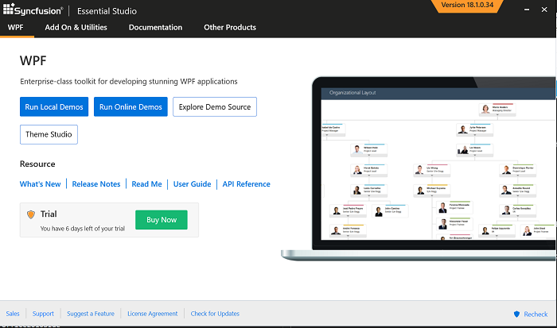
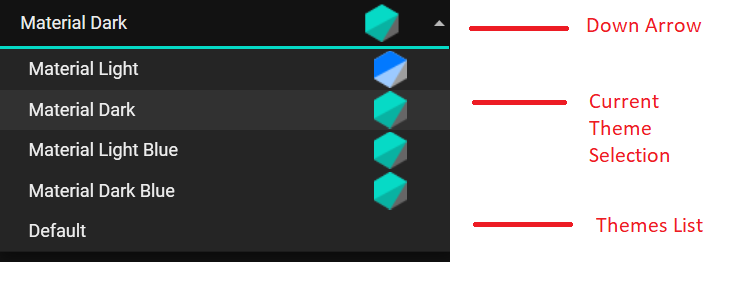
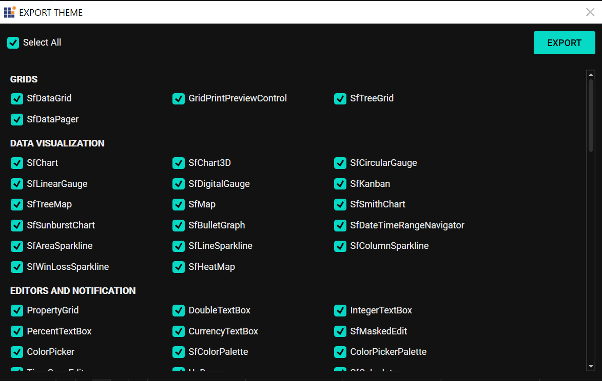
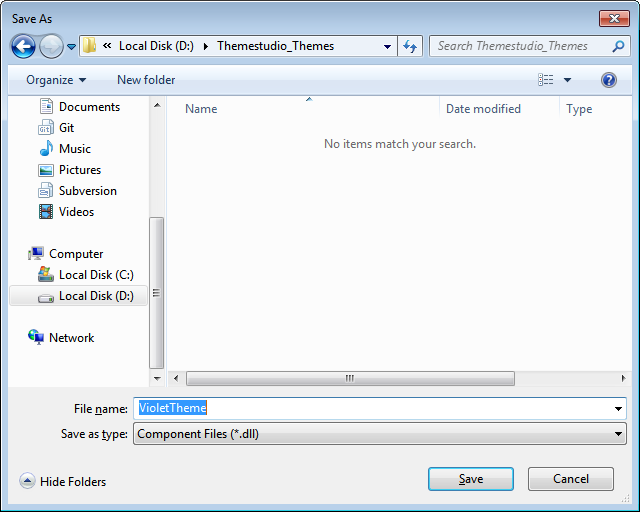
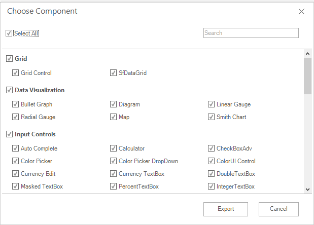
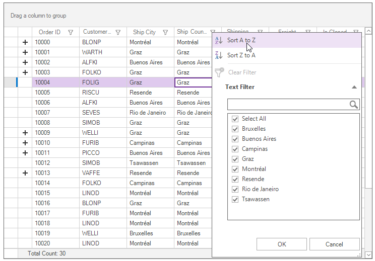

# Overview

Theme Studio for WPF can be used to create and apply new theme for Syncfusion controls from an existing theme. The primary goal here is to deliver an appearance rich Syncfusion controls that suits bests for every user application, based on their needs. 

## Customizing theme color from theme studio

In theme studio utility, each theme has a unique common variable list. When user change the common variable color code value, it will reflect in all the Syncfusion WPFcontrols. All Syncfusion WPF control styles are derived from these theme-based common variables. This common variable list is handled inside the theme studio application for customizing theme-based colors. 

Let us now see the step-by-step procedure to launch and work with the theme studio utility below.

**Step 1:**

On installing the "Syncfusion WPF" suite, lunch and select "Theme Studio" from the start-up panel.

**Step 2:**

The theme studio application form has been divided into two sections: the controls preview section on the right, and the theme customization section on the left.

**Step 3:**

To apply predefined themes, we need to choose the needed themes from Themes List available in ComboBox in the TopLeft Corner. 

The following list of predefined themes are currently provided in theme studio,
* Material Light
* Material Dark
* Material Light Blue
* Material Dark Blue
* Default

**Step 4:**

Click the color pickers in the theme customization section to select the desired color.

**Step 5:**

The Syncfusion WPF controls will be rendered with the newly selected colors in the preview section, after selecting the desired color. 

## Export the customized theme
 
You can export the custom theme after changing the theme colors.

**Step 1:**

Click the Export button in the top right corner below the exit of the theme studio application. 

**Step 2:**

Now the export dialog appears with an option to select either entire controls or just the desired control(s). This option is useful when you have integrated a selective list of Syncfusion WPF controls in your application. The theme studio will filter only the selected controls and customize the final output for those controls alone thereby reducing the final output assembly size. 

**Step 3:**

The download theme will come as an assembly (*.dll) file that contains color codes for the selected Syncfusion WPF controls. 

N> You can enter the assembly name of your own choice while exporting. But remember that the assembly (*.dll) name will be custom theme name, when you refer it in your WPF application. 

## Using customized theme in a WPF application

You can now add the exported assembly in your WPF application and set the custom theme to the appropriate controls. In this illustration, we are going to witness the custom theme set for SfDataGrid. 

**Step 1:**

Attach the exported assembly (*.dll) in your Windows Forms project.

**Step 2:**

Load the Theme assembly in Program.cs of your application and the initialize a SfDataGrid control in the main form and set it’s "ThemeName" property exactly to the assembly name.




    static class Program
    {
        /// 

        /// The main entry point for the application.
        /// 

        [STAThread]
        static void Main()
        {
			Syncfusion.Licensing.SyncfusionLicenseProvider.RegisterLicense(DemoCommon.FindLicenseKey());
            SkinManager.LoadAssembly(typeof(VioletTheme).Assembly);
            Application.EnableVisualStyles();
            Application.SetCompatibleTextRenderingDefault(false);
            Application.Run(new Form1());
        }
    }
	
sfDataGrid1.ThemeName = "VioletTheme";
	



Module Program
    <STAThread>
    Private Sub Main()
        Syncfusion.Licensing.SyncfusionLicenseProvider.RegisterLicense(DemoCommon.FindLicenseKey())
        SkinManager.LoadAssembly(GetType(VioletTheme).Assembly)
        Application.EnableVisualStyles()
        Application.SetCompatibleTextRenderingDefault(False)
        Application.Run(New Form1())
    End Sub
End Module

sfDataGrid1.ThemeName = "VioletTheme"




**Step 3:**

Compile and run the WPF application and you can now witness the custom theme applied to SfDataGrid control at run-time. 

