# Overview

The Theme Studio is a desktop-based, intuitive UI customization tool for easy customization of skins and themes for the Syncfusion control suite.

It comprises of many features such as predefined themes, Import and Export option to facilitate your process of getting custom skins for matching your visual representation of app.

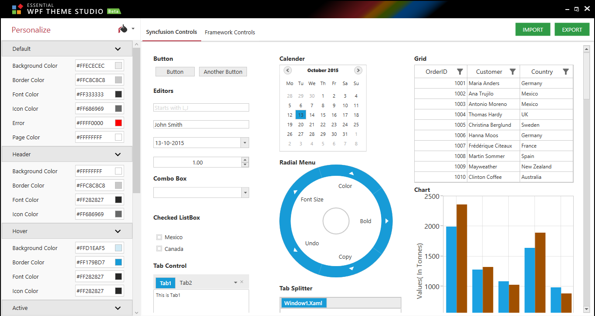

## Applying predefined themes in Theme Studio

To apply predefined themes, we need to choose the needed themes from Themes List available in drop down near `Personalize` Heading. 

The following list of predefined themes are currently provided in theme studio,

*   Metro

*   Blend

*	Office2010Blue

*	Office2010Black

*	Office2010Silver

*	Office2013White

*	Office2013LightGray

*	Office2013DarkGray

*	VisualStudio2013

*	Lime

*	Saffron

*   Office365

*   Office2016Colorful

*   Office2016White

*   Office2016DarkGray

*   VisualStudio2015

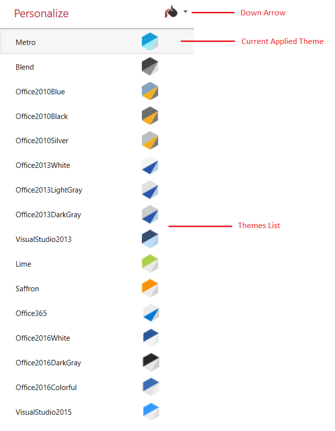

## Applying customized skin in Theme Studio

We are currently providing 7 set of categories to customize the control colors. Each category containing different collection of color properties.

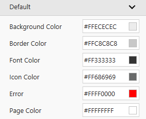

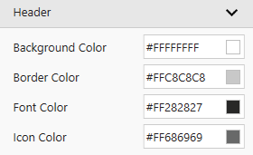

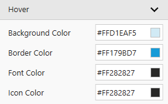

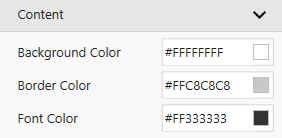

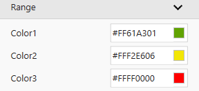

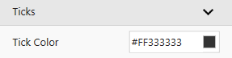

The hexadecimal color code can be given as input in Text area and press enter to apply the custom skin color.

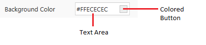

To select desired color, click the colored button to display a popup with solid color palettes, gradient check box and Advance option.

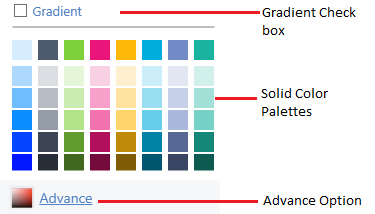

Color Palette 
{:.caption}

*	`Solid Color Palettes`: Provides set of color palettes with 8 variants.

*	`Advance Option`: To choose wide range of colors, click Advance button option.

Advance Color Picker 
{:.caption}

*   `Gradient Check Box`: To choose gradient colors, select the “Gradient” check box to display a popup with 24 gradient palettes.

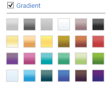

Gradient Palette 
{:.caption}

N> Gradient Support has been provided only for Background color properties residing in Default, Header, Hover and Active categories.

## Exporting Custom theme from Theme Studio

To export custom theme, click `Export` button to display a popup containing option to select the controls to be exported. 

Select the control by checking the desired control’s check box or check `Select All` option in the popup to select all the controls. 

Click the `Export` button once selected the desired controls and provide a name for the customized theme. 

N> To obtain the customized themes for multiple controls in a single XAML file, check the `Merge and Export` option before clicking `Export` button.

The color values for customized theme will be saved in `*.wpft` format file. Along with `*.wpft` file, two folders `Framework Controls` and `Syncfusion Controls` are also generated.

*   `Framework Controls`: This folder contains the resource dictionary XAML files of Framework controls.

*	`Syncfusion Controls`: This folder contains the resource dictionary XAML files of selected Syncfusion controls.

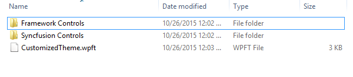

Output Folder 
{:.caption}

## Importing Custom theme to Theme Studio

To import custom theme, click `Import` button for choosing `*.wpft` file containing customized skin color values. After importing, we can visualize the loaded custom skin color applied to controls.

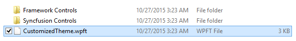

## Applying generated resource XAML in application

To [export](#exporting-custom-theme-from-theme-studio) the customized skin, click the `Export` button. The exported custom skin contains resource dictionary XAML files of Syncfusion controls and Framework Controls.

### Adding the XAML files to WPF Application

*	Open Visual Studio 20xx and create a WPF project.

*	Add the necessary dll's for the controls used.

For example, add SfRadialMenu Control to the application. The `SfRadialMenu` control requires `Syncfusion.SfRadialMenu.WPF` assembly and dependency assembly `Syncfusion.SfShared.WPF`.

*	The exported XAML file of controls can be obtained from the Output folder as described in the [export](#exporting-custom-theme-from-theme-studio) topic.

*	To add the exported file from Output folder to application, right click on application and click the add existing item. Now, browse the Output folder.

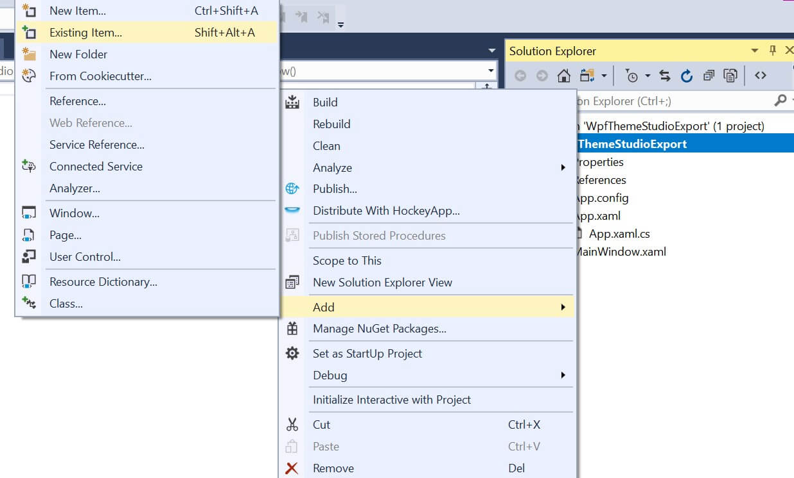

*	The Output folder contains `Syncfusion Controls`  folder and `Framework Controls` folder. 

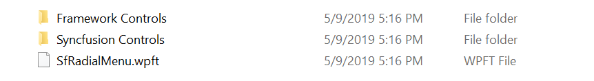

*	From `Syncfusion Controls` folder, browse the required XAML file and add to the project. Confirm the file filter selection has All files or Xaml file.

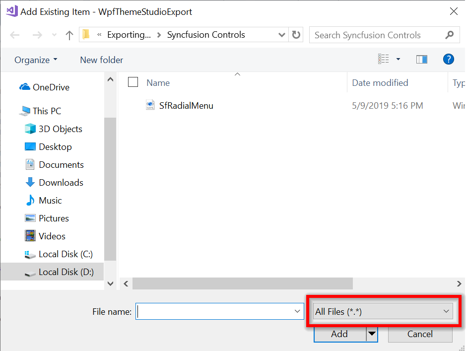

*	Now, the exported XAML file added to the project.

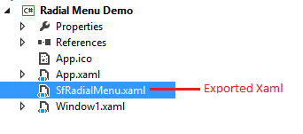

*	Now, initialize the SfRadialMenu control in the `MainWindow.xaml` as below:



        <syncfusion:SfRadialMenu x:Name="RadialMenu">
            <syncfusion:SfRadialMenuItem Header="Cut">
                <syncfusion:SfRadialMenuItem Header="Cut"/>
            </syncfusion:SfRadialMenuItem>
            <syncfusion:SfRadialMenuItem Header="Copy">
                <syncfusion:SfRadialMenuItem Header="Copy"/>
            </syncfusion:SfRadialMenuItem>
            <syncfusion:SfRadialMenuItem Header="Paste">
                <syncfusion:SfRadialMenuItem Header="Paste"/>
            </syncfusion:SfRadialMenuItem>
        </syncfusion:SfRadialMenu>



*	Merge the `SfRadialMenu.xaml` in the application resources using `MergedDictionaries`.



        <Application.Resources> 
    		<ResourceDictionary>
        		<ResourceDictionary.MergedDictionaries>
            		<ResourceDictionary Source="SfRadialMenu.xaml"/>
        		</ResourceDictionary.MergedDictionaries>
    		</ResourceDictionary>
		</Application.Resources>



*	Run the sample and the below output will be obtained:

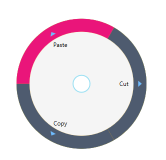

*	To apply this theme to MS control, get the MS control.xaml file from `Framework Controls` folder. 

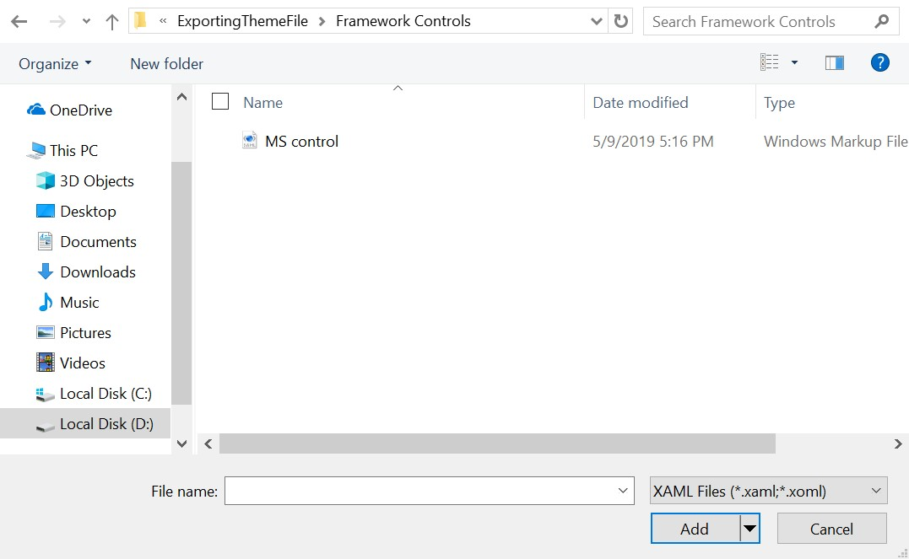

*	Do the above steps, to add this file to the project. 

*   Now, initialize the any MS control in the `MainWindow.xaml`

*   Here, custom theme applied for MS ComboBox.

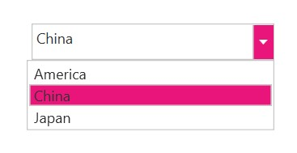

