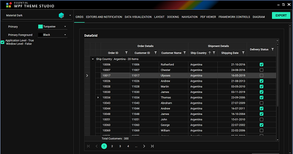
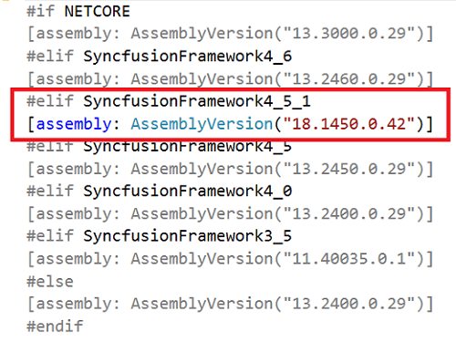
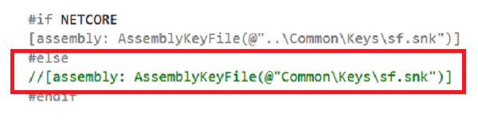
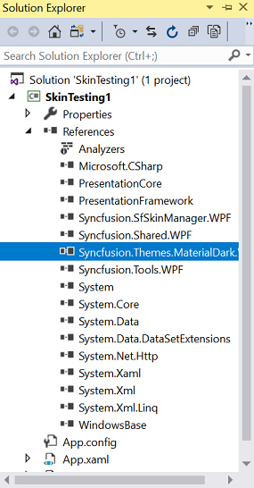

# Overview

Theme Studio for WPF can be used to create and apply new theme for Syncfusion controls from an existing theme. The primary goal here is to deliver an appearance rich Syncfusion controls that suits bests for every user application, based on their needs. 

# Supported themes

The following list of predefined themes are currently provided in theme studio,
* Material Light
* Material Dark
* Material Light Blue
* Material Dark Blue

# Creating custom theme

## Customizing theme color from theme studio

In theme studio utility, each theme has a unique common variable list.  When user changes the common variable color code value, it will be reflected  in all the Syncfusion WPF controls. All Syncfusion WPF control styles are derived from these theme-based common variables. This common variable list is handled inside the theme studio application for customizing theme-based colors. 

Let us now see the step-by-step procedure to launch and work with the theme studio utility below.

**Step 1:**

On installing the "Syncfusion WPF" suite, launch and select "Theme Studio" from the start-up panel.

**Step 2:**

The theme studio application has been divided into two sections: the controls preview section on the right, and the theme customization section on the left.

**Step 3:**

To apply predefined themes, we need to select the appropriate themes from Themes List available in ComboBox in the TopLeft Corner. 

**Step 4:**

Click the color pickers in the theme customization section to select the desired color.

**Step 5:**

The Syncfusion WPF controls will be rendered with the newly selected colors in the preview section, after selecting the desired color. 

## Exporting theme project
 
Let us see the step-by-step procedure for exporting theme project from theme studio.

**Step 1:**

Click the Export button in the top right corner below the exit of the theme studio application. 

**Step 2:**

Now the export dialog appears with the option to select either the entire controls or just the desired control(s). This option is useful only for selective list of Syncfusion WPF controls in the application. The theme studio will filter only the selected controls and customize the final output for those controls alone. 

**Step 3:**

 Select the required folder for Theme Export to be selected. When exporting, the download theme will come as a Theme Project that contains color codes for the selected Syncfusion WPF controls. 

## Ensuring version and generating theme assembly

Let us see the step by step procedure for ensuring version and generating theme assembly for exported theme project.

**Step 1:**

The following exported theme project should be attached for corresponding target frameworks into the WPF application.

<table>
<tr>
<th>
Target Framework</th><th>
Solution Project</th></tr>
<tr>
<td>
.Net Framework 4.6</td><td>
Syncfusion.Themes.MaterialDark.WPF_2015.csproj</td></tr>
<tr>
<td>
.Net Framework 4.5.1</td><td>
Syncfusion.Themes.MaterialDark.WPF_2013.csproj</td></tr>
<tr>
<td>
.Net Framework 4.5 </td><td>
Syncfusion.Themes.MaterialDark.WPF_2012.csproj</td></tr>
<tr>
<td>
.Net Framework 4.0</td><td>
Syncfusion.Themes.MaterialDark.WPF_2010.csproj</td></tr>
<tr>
<td>
.Net Core 3</td><td>
Syncfusion.Themes.MaterialDark.WPF_NETCore.csproj</td><tr>
</table>

**Step 2:**

Ensure the version of the exported theme project with the Syncfusion assembly(.dll) by checking the version of the Assemblyinfo.cs file inside the properties. For example, exported theme project `Syncfusion.Themes.MaterialDark.WPF_2013.csproj` is attached to the existing sample with the target framework `.NET Framework 4.5.1` and version is set in the Assemblyinfo.cs.

Ensure that common Keys are to be commented out, as the private keys files (.snk) are used to generate assembly which is located below the assembly version in Assemblyinfo.cs.

**Step 3:**

To generate theme assembly, if private key pair is already created then add it to the exported theme project in signing tab inside the properties. If the key pair is not created [create a new key pair](https://docs.microsoft.com/en-us/dotnet/standard/assembly/create-public-private-key-pair) through visual studio. Ensure that exported theme project should rebuild through release mode to generate theme assembly.

 

## Integrating custom theme to application

Let us see the step by step procedure for adding exported theme project as assembly(.dll) and witness the custom theme set for Docking Manager.  

 **Step 1:**

 Now add the exported theme project as an assembly (.dll) from the release folder of the export theme project into the WPF project.

 

**Step 2:**

`SfSkinManager` control helps to apply the built-in themes to the Syncfusion UI controls for WPF.
 There are several ways to add `SfSkinManager` in to Visual Studio WPF project.
The following steps help to add through XAML Code

1) Create a WPF project in Visual Studio and refer to the SfSkinManager assembly (Syncfusion.SfSkinManager.Wpf)
2) Include an XML namespace for the assembly to the Main window.





    <Window
    xmlns="http://schemas.microsoft.com/winfx/2006/xaml/presentation"
    xmlns:x="http://schemas.microsoft.com/winfx/2006/xaml"
    xmlns:syncfusionskin="clr-namespace:Syncfusion.SfSkinManager;assembly=Syncfusion.SfSkinManager.WPF"
    xmlns:syncfusion="http://schemas.syncfusion.com/wpf"/>





**Step 3:**

Any built-in themes can applied to the required control by `VisualStyle` attached property of the SfSkinManager. Now, apply the value as `MaterialDark` to the VisualStyle property of the SfSkinManager for the Docking Manager control.





    <syncfusion:DockingManager x:Name="SyncDockingManager" UseDocumentContainer="True"
    PersistState="True" syncfusionskin:SfSkinManager.VisualStyle="MaterialDark">
                           
    <ContentControl x:Name="SolutionExplorer" syncfusion:DockingManager.Header="Solution Explorer"
    syncfusion:DockingManager.SideInDockedMode="Right"/>

    <ContentControl x:Name="ToolBox" syncfusion:DockingManager.Header="Toolbox"
    syncfusion:DockingManager.State="AutoHidden" />
    
    <ContentControl x:Name="Output" syncfusion:DockingManager.Header="Output"
    syncfusion:DockingManager.SideInDockedMode="Tabbed"
	syncfusion:DockingManager.TargetNameInDockedMode="SolutionExplorer"/>

    <ContentControl x:Name="StartPage" syncfusion:DockingManager.Header="Start Page"
     syncfusion:DockingManager.State="Document" >
       <TextBlock Text="Any built-in themes can applied to the required control by VisualStyle attached property of the SfSkinManager." />                           
    </ContentControl>
    </syncfusion:DockingManager>







**Step 4:**

Compile and run the WPF application and witness the custom theme being applied to DockingManager control at run-time. 

