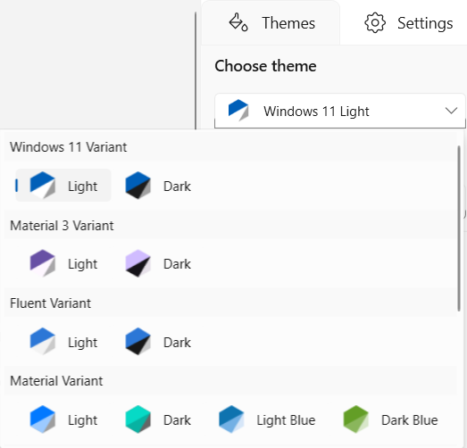
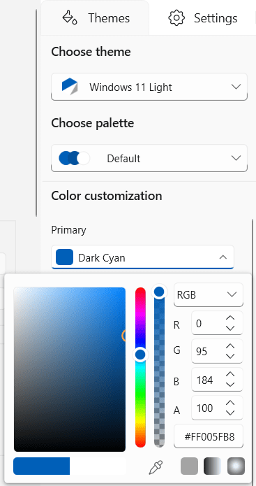

# Overview

Theme Studio for WPF can be used to create and apply new theme for Syncfusion controls from an existing theme. The primary goal here is to deliver an appearance rich Syncfusion controls that suits bests for every user application, based on their needs. 

## Supportive Themes in Theme Studio

The following list of predefined themes are currently provided in theme studio,
* Material Light
* Material Dark
* Material Light Blue
* Material Dark Blue

## Creating Custom Theme

### Customizing theme color from Theme Studio

In theme studio utility, each theme has a unique common variable list.  When user changes the common variable color code value, it will be reflected  in all the Syncfusion WPF controls. All Syncfusion WPF control styles are derived from these theme-based common variables. This common variable list is handled inside the theme studio application for customizing theme-based colors. 

Let us now see the step-by-step procedure to launch and work with the theme studio utility below.

**Step 1:**

On installing the "Syncfusion WPF" suite, launch and select "Theme Studio" from the start-up panel.

**Step 2:**

The theme studio application has been divided into two sections: the controls preview section on the right, and the theme customization section on the left.

**Step 3:**

To apply predefined themes, we need to select the appropriate themes from Themes List available in ComboBox in the TopLeft Corner. 

**Step 4:**

Click the color pickers in the theme customization section to select the desired color.

**Step 5:**

The Syncfusion WPF controls will be rendered with the newly selected colors in the preview section, after selecting the desired color. 

### Export the customized theme
 
You can export the custom theme after changing the theme colors.

**Step 1:**

Click the Export button in the top right corner below the exit of the theme studio application. 

**Step 2:**

Now the export dialog appears with an option to select either entire controls or just the desired control(s). This option is useful when you have integrated a selective list of Syncfusion WPF controls in your application. The theme studio will filter only the selected controls and customize the final output for those controls alone. 

**Step 3:**

You may select the required folder for Theme Export to be selected. On exporting, the download theme will come as a Theme Project that contains color codes for the selected Syncfusion WPF controls. 

### Ensuring Version and Key

Let us now see the step by step procedure for the setting the target framework, version and key for refering Exported theme Project.

**Step 1:**

The following Target Framework should be set for corresponding exported theme project.

<table>
<tr>
<th>
Target Framework</th><th>
Solution Project</th></tr>
<tr>
<td>
.Net Framework 4.6</td><td>
Syncfusion.Themes.MaterialDark.WPF_2015.csproj</td></tr>
<tr>
<td>
.Net Framework 4.5.1</td><td>
Syncfusion.Themes.MaterialDark.WPF_2013.csproj</td></tr>
<tr>
<td>
.Net Framework 4.5 </td><td>
Syncfusion.Themes.MaterialDark.WPF_2012.csproj</td></tr>
<tr>
<td>
.Net Framework 4.0</td><td>
Syncfusion.Themes.MaterialDark.WPF_2010.csproj</td></tr>
<tr>
<td>
.Net Framework 3.0</td><td>
Syncfusion.Themes.MaterialDark.WPF_NETCore.csproj</td><tr>
<tr>
<td>
</table>

**Step 2:**

Generate the strong named assemblies by creating a KeyPair     in the exported theme project by clicking the properties, select the signing tab and click the `Sign the assembly` checkbox to create a key pair through visual studio or just add if key pair is already generated.

 

**Step 3:**

Ensure the version of an assembly with the exported theme project by checking the version in Assemblyinfo.cs file in Properties. After ensuring, commented out the key file in Assemblyinfo.cs below the assembly version and run the project through `Release` mode.

**Step 4:**

 Now add the exported theme project as an assembly (.dll) from the release folder of the export theme project into your WPF project.

 

### Integrating custom theme into a WPF application

You can now add the exported theme project in your WPF application and set the custom theme to the appropriate controls. In this illustration, we are going to witness the custom theme set for DockingManager.
 
**Step 1:**

`SfSkinManager` control helps to apply the built-in themes to the Syncfusion UI controls for WPF.
 There are several ways to add `SfSkinManager` in to Visual Studio WPF project.
The following steps help to add through XAML Code

1) Create a WPF project in Visual Studio and refer to the SfSkinManager assembly (Syncfusion.SfSkinManager.Wpf)
2) Include an XML namespace for the assembly to the Main window.





    <Window
    xmlns="http://schemas.microsoft.com/winfx/2006/xaml/presentation"
    xmlns:x="http://schemas.microsoft.com/winfx/2006/xaml"
    xmlns:syncfusionskin="clr-namespace:Syncfusion.SfSkinManager;assembly=Syncfusion.SfSkinManager.WPF"
    xmlns:syncfusion="http://schemas.syncfusion.com/wpf"/>





**Step 2:**

Any built-in themes can applied to the required control by `VisualStyle` attached property of the SfSkinManager.  Now, apply the value as `MaterialDark` to the VisualStyle property of the SfSkinManager for the Docking Manager control.





    <syncfusion:DockingManager x:Name="SyncDockingManager" UseDocumentContainer="True"
    PersistState="True" syncfusionskin:SfSkinManager.VisualStyle="MaterialDark">
                           
    <ContentControl x:Name="SolutionExplorer" syncfusion:DockingManager.Header="Solution Explorer"
    syncfusion:DockingManager.SideInDockedMode="Right"/>

    <ContentControl x:Name="ToolBox" syncfusion:DockingManager.Header="Toolbox"
    syncfusion:DockingManager.State="AutoHidden" />
    
    <ContentControl x:Name="Output" syncfusion:DockingManager.Header="Output"
    syncfusion:DockingManager.SideInDockedMode="Tabbed"
	syncfusion:DockingManager.TargetNameInDockedMode="SolutionExplorer"/>

    <ContentControl x:Name="StartPage" syncfusion:DockingManager.Header="Start Page"
     syncfusion:DockingManager.State="Document" >
       <TextBlock Text="Any built-in themes can applied to the required control by VisualStyle attached property of the SfSkinManager." />                           
    </ContentControl>
    </syncfusion:DockingManager>







**Step 3:**

Compile and run the WPF application in `Release` mode and you can now witness the custom theme applied to DockingManager control at run-time. 

